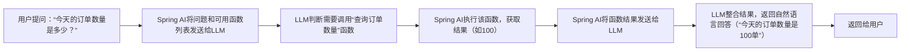

# 3.3 LLM核心功能实现

LLM的核心功能是Spring AI落地的核心场景，涵盖**对话交互（单轮/多轮）、文本生成（代码/文案/文档）、函数调用（LLM调用业务接口）**三大模块。Spring AI通过统一接口和工程化封装，让这些功能的实现变得标准化、低耦合，同时支持流式响应、上下文管理等企业级需求，还能通过Spring AI Alibaba适配国内大模型（如通义千问）。

## 一、功能一：对话交互（单轮/多轮）
对话交互是LLM最基础也最常用的功能，分为**单轮对话**（一次性提问回答）和**多轮对话**（保留上下文的连续交互），Spring AI的`ChatClient`接口提供了完整的实现方案，还支持**流式响应**（前端实时接收回复，如ChatGPT的打字机效果）。

### 1. 单轮对话（基础版）
单轮对话是最简化的交互模式，直接向模型发送问题并获取回答，适合简单的一次性查询场景（如“什么是Spring AI？”）。

#### 实现步骤
##### （1）基础代码（基于Spring AI + 通义千问）
```java
import org.springframework.ai.chat.ChatClient;
import org.springframework.ai.chat.prompt.Prompt;
import org.springframework.ai.chat.prompt.SystemMessage;
import org.springframework.ai.chat.prompt.UserMessage;
import org.springframework.beans.factory.annotation.Autowired;
import org.springframework.web.bind.annotation.GetMapping;
import org.springframework.web.bind.annotation.RequestParam;
import org.springframework.web.bind.annotation.RestController;

import java.util.List;

@RestController
public class ChatController {

    // 自动注入Spring AI的ChatClient（已适配通义千问）
    @Autowired
    private ChatClient chatClient;

    /**
     * 单轮对话接口
     * @param question 用户问题
     * @return 模型回答
     */
    @GetMapping("/ai/chat/single")
    public String singleChat(@RequestParam String question) {
        // 1. 构建Prompt：包含系统消息（定义模型角色）和用户消息（问题）
        Prompt prompt = new Prompt(List.of(
                new SystemMessage("你是一个专业的Java开发顾问，回答简洁明了，只讲核心要点"),
                new UserMessage(question)
        ));

        // 2. 调用ChatClient的同步方法，获取完整响应
        return chatClient.call(prompt).getResult().getOutput().getContent();
    }
}
```

##### （2）关键说明
- **`SystemMessage`**：用于定义模型的角色和行为规则，是提示词工程的核心，能显著提升回答质量。
- **同步调用**：`chatClient.call()`会等待模型返回完整结果后再响应，适合对实时性要求不高的场景。

### 2. 多轮对话（进阶版）
多轮对话需要**维护上下文**（历史消息），让模型能理解连续的对话逻辑（如“什么是Spring AI？”→“它和原生SDK的区别是什么？”）。Spring AI本身不存储上下文，需结合Redis/数据库实现持久化。

#### 实现步骤
##### （1）引入Redis依赖（用于存储上下文）
```xml
<dependency>
    <groupId>org.springframework.boot</groupId>
    <artifactId>spring-boot-starter-data-redis</artifactId>
</dependency>
```

##### （2）多轮对话代码
```java
import com.fasterxml.jackson.core.type.TypeReference;
import com.fasterxml.jackson.databind.ObjectMapper;
import org.springframework.ai.chat.ChatClient;
import org.springframework.ai.chat.prompt.Prompt;
import org.springframework.ai.chat.prompt.SystemMessage;
import org.springframework.ai.chat.messages.Message;
import org.springframework.ai.chat.messages.UserMessage;
import org.springframework.ai.chat.messages.AssistantMessage;
import org.springframework.beans.factory.annotation.Autowired;
import org.springframework.data.redis.core.StringRedisTemplate;
import org.springframework.web.bind.annotation.GetMapping;
import org.springframework.web.bind.annotation.RequestParam;
import org.springframework.web.bind.annotation.RestController;

import java.util.ArrayList;
import java.util.List;
import java.util.concurrent.TimeUnit;

@RestController
public class MultiChatController {

    @Autowired
    private ChatClient chatClient;
    @Autowired
    private StringRedisTemplate redisTemplate;
    @Autowired
    private ObjectMapper objectMapper; // Spring Boot自动配置的JSON工具

    // 上下文存储的Redis Key前缀
    private static final String SESSION_KEY_PREFIX = "ai:chat:session:";

    /**
     * 多轮对话接口
     * @param question 用户问题
     * @param sessionId 会话ID（前端传入，用于区分不同用户的对话）
     * @return 模型回答
     */
    @GetMapping("/ai/chat/multi")
    public String multiChat(@RequestParam String question, @RequestParam String sessionId) {
        // 1. 从Redis获取历史消息（上下文）
        String historyJson = redisTemplate.opsForValue().get(SESSION_KEY_PREFIX + sessionId);
        List<Message> messages = new ArrayList<>();

        // 2. 初始化或加载历史消息
        if (historyJson == null) {
            // 首次对话：添加系统消息
            messages.add(new SystemMessage("你是一个专业的Java开发顾问，回答简洁明了，只讲核心要点"));
        } else {
            // 非首次对话：加载历史消息
            try {
                messages = objectMapper.readValue(historyJson, new TypeReference<List<Message>>() {});
            } catch (Exception e) {
                // 解析失败时重新初始化
                messages.add(new SystemMessage("你是一个专业的Java开发顾问，回答简洁明了，只讲核心要点"));
            }
        }

        // 3. 添加新的用户消息
        messages.add(new UserMessage(question));

        // 4. 调用模型获取回答
        Prompt prompt = new Prompt(messages);
        String answer = chatClient.call(prompt).getResult().getOutput().getContent();

        // 5. 将模型回答添加到上下文（用于下一轮对话）
        messages.add(new AssistantMessage(answer));

        // 6. 将更新后的上下文保存到Redis（设置24小时过期）
        try {
            String newHistoryJson = objectMapper.writeValueAsString(messages);
            redisTemplate.opsForValue().set(SESSION_KEY_PREFIX + sessionId, newHistoryJson, 24, TimeUnit.HOURS);
        } catch (Exception e) {
            throw new RuntimeException("保存对话上下文失败", e);
        }

        return answer;
    }
}
```

##### （3）关键说明
- **`sessionId`**：由前端生成（如UUID），用于区分不同用户的对话，避免上下文混淆。
- **上下文持久化**：使用Redis存储序列化后的`Message`列表，生产环境中可根据需求调整过期时间。
- **token控制**：生产环境中需添加token计数逻辑，当上下文的token数超过模型上限（如通义千问plus的8k token）时，删除最早的历史消息，避免模型报错。

### 3. 流式响应（企业级必备）
流式响应是指模型逐字返回结果，前端通过SSE（Server-Sent Events）实时接收并展示（如ChatGPT的打字机效果），提升用户体验。Spring AI的`chatClient.stream()`方法支持流式调用。

#### 实现步骤
##### （1）流式对话代码
```java
import org.springframework.ai.chat.ChatClient;
import org.springframework.ai.chat.prompt.Prompt;
import org.springframework.ai.chat.prompt.UserMessage;
import org.springframework.beans.factory.annotation.Autowired;
import org.springframework.http.MediaType;
import org.springframework.web.bind.annotation.GetMapping;
import org.springframework.web.bind.annotation.RequestParam;
import org.springframework.web.bind.annotation.RestController;
import reactor.core.publisher.Flux;

@RestController
public class StreamChatController {

    @Autowired
    private ChatClient chatClient;

    /**
     * 流式对话接口（SSE）
     * @param question 用户问题
     * @return 流式响应的字符串流
     */
    @GetMapping(value = "/ai/chat/stream", produces = MediaType.TEXT_EVENT_STREAM_VALUE)
    public Flux<String> streamChat(@RequestParam String question) {
        // 1. 构建Prompt
        Prompt prompt = new Prompt(new UserMessage(question));

        // 2. 调用流式方法，返回Flux<ChatResponse>
        return chatClient.stream(prompt)
                // 提取每个响应的内容
                .map(response -> response.getResult().getOutput().getContent())
                // 异常处理：返回错误信息
                .onErrorResume(e -> Flux.just("对话出错：" + e.getMessage()));
    }
}
```

##### （2）前端对接示例（Vue3）
```vue
<template>
  <div>
    <input v-model="question" placeholder="请输入问题" />
    <button @click="sendMessage">发送</button>
    <div>{{ answer }}</div>
  </div>
</template>

<script setup>
import { ref } from 'vue';

const question = ref('');
const answer = ref('');

const sendMessage = () => {
  answer.value = '';
  // 建立SSE连接
  const eventSource = new EventSource(`/ai/chat/stream?question=${encodeURIComponent(question.value)}`);
  // 接收流式数据
  eventSource.onmessage = (e) => {
    answer.value += e.data;
  };
  // 连接关闭
  eventSource.onerror = () => {
    eventSource.close();
  };
};
</script>
```

##### （3）关键说明
- **`MediaType.TEXT_EVENT_STREAM_VALUE`**：告诉浏览器这是SSE流响应。
- **`Flux`**：Spring WebFlux的响应式类型，支持异步流式处理，无需额外配置（Spring Boot已自动支持）。

## 二、功能二：文本生成（代码/文案/文档）
文本生成是LLM的核心能力之一，包括生成Java代码、电商商品文案、接口文档、测试用例等。Spring AI结合**PromptTemplate**（提示词模板）能实现参数化的文本生成，提升复用性。

### 1. 核心实现思路
1. 定义**参数化提示词模板**：将生成逻辑中的可变部分设为参数（如生成的语言、功能、字数）。
2. 填充参数并生成Prompt：使用`PromptTemplate`将参数填充到模板中。
3. 调用`ChatClient`获取生成结果：根据需求选择同步或流式调用。

### 2. 实战示例1：生成Spring Boot代码
```java
import org.springframework.ai.chat.ChatClient;
import org.springframework.ai.chat.prompt.Prompt;
import org.springframework.ai.chat.prompt.PromptTemplate;
import org.springframework.beans.factory.annotation.Autowired;
import org.springframework.web.bind.annotation.GetMapping;
import org.springframework.web.bind.annotation.RequestParam;
import org.springframework.web.bind.annotation.RestController;

import java.util.Map;

@RestController
public class CodeGenController {

    @Autowired
    private ChatClient chatClient;

    /**
     * 生成Spring Boot代码接口
     * @param function 接口功能（如“用户查询”）
     * @return 生成的代码
     */
    @GetMapping("/ai/gen/code")
    public String genCode(@RequestParam String function) {
        // 1. 定义代码生成模板（参数化）
        String template = """
                生成一个Spring Boot的RESTful API接口，实现{function}功能，要求：
                1. 包含Controller、Service、Mapper三层结构
                2. 使用MyBatis-Plus操作数据库
                3. 包含完整的注释和参数校验
                4. 返回JSON格式的响应
                """;

        // 2. 创建PromptTemplate并填充参数
        PromptTemplate promptTemplate = new PromptTemplate(template);
        Prompt prompt = promptTemplate.create(Map.of("function", function));

        // 3. 调用模型生成代码
        return chatClient.call(prompt).getResult().getOutput().getContent();
    }
}
```

### 3. 实战示例2：生成电商商品文案
```java
import org.springframework.ai.chat.ChatClient;
import org.springframework.ai.chat.prompt.Prompt;
import org.springframework.ai.chat.prompt.PromptTemplate;
import org.springframework.beans.factory.annotation.Autowired;
import org.springframework.web.bind.annotation.GetMapping;
import org.springframework.web.bind.annotation.RequestParam;
import org.springframework.web.bind.annotation.RestController;

import java.util.Map;

@RestController
public class CopyGenController {

    @Autowired
    private ChatClient chatClient;

    /**
     * 生成电商商品文案
     * @param productName 商品名称
     * @param keywords 核心卖点（如“轻薄、长续航”）
     * @param wordCount 字数限制
     * @return 生成的文案
     */
    @GetMapping("/ai/gen/copy")
    public String genCopy(
            @RequestParam String productName,
            @RequestParam String keywords,
            @RequestParam int wordCount) {

        // 1. 定义文案生成模板
        String template = """
                为{productName}生成电商商品详情页文案，要求：
                1. 突出核心卖点：{keywords}
                2. 字数控制在{wordCount}字左右
                3. 语言风格活泼，适合年轻用户
                4. 包含促销引导语
                """;

        // 2. 填充参数
        PromptTemplate promptTemplate = new PromptTemplate(template);
        Prompt prompt = promptTemplate.create(Map.of(
                "productName", productName,
                "keywords", keywords,
                "wordCount", wordCount
        ));

        // 3. 调用模型
        return chatClient.call(prompt).getResult().getOutput().getContent();
    }
}
```

### 4. 关键说明
- **模板复用**：生产环境中可将模板存储在classpath文件或Nacos配置中心，避免硬编码，支持动态更新。
- **输出格式控制**：在模板中明确要求模型返回特定格式（如Markdown、JSON），便于前端展示或后续处理。

## 三、功能三：函数调用（Function Calling）
函数调用是LLM的高阶能力，指模型能根据用户问题**自动判断是否需要调用外部工具/业务接口**（如查询数据库、调用天气API、查询订单数量），并将调用结果整合后返回给用户。这是实现AI Agent（智能体）的核心基础。

### 1. 函数调用的核心流程


### 2. 实现步骤（基于Spring AI + 通义千问）
#### （1）定义业务函数（如查询订单数量）
```java
import org.springframework.stereotype.Component;

// 订单服务：模拟查询订单数量
@Component
public class OrderService {

    /**
     * 查询指定日期的订单数量
     * @param date 日期（格式：yyyy-MM-dd）
     * @return 订单数量
     */
    public Integer getOrderCount(String date) {
        // 模拟数据库查询，生产环境中替换为真实业务逻辑
        if ("2025-12-20".equals(date)) {
            return 125;
        } else {
            return 0;
        }
    }
}
```

#### （2）注册函数并实现调用逻辑
```java
import org.springframework.ai.chat.ChatClient;
import org.springframework.ai.chat.ChatResponse;
import org.springframework.ai.chat.function.FunctionCallingOptions;
import org.springframework.ai.chat.prompt.Prompt;
import org.springframework.ai.chat.prompt.UserMessage;
import org.springframework.ai.chat.messages.Message;
import org.springframework.ai.chat.messages.ToolMessage;
import org.springframework.ai.function.FunctionCallback;
import org.springframework.ai.function.FunctionContext;
import org.springframework.ai.function.FunctionResult;
import org.springframework.beans.factory.annotation.Autowired;
import org.springframework.context.annotation.Bean;
import org.springframework.web.bind.annotation.GetMapping;
import org.springframework.web.bind.annotation.RequestParam;
import org.springframework.web.bind.annotation.RestController;

import java.util.List;
import java.util.Map;

@RestController
public class FunctionCallController {

    @Autowired
    private ChatClient chatClient;
    @Autowired
    private OrderService orderService;

    // 1. 注册函数回调：将业务函数封装为LLM可调用的函数
    @Bean
    public FunctionCallback orderCountFunction() {
        return new FunctionCallback() {
            // 函数名称：需唯一，LLM通过该名称调用
            @Override
            public String getName() {
                return "getOrderCount";
            }

            // 函数描述：告诉LLM该函数的作用和参数，关键！
            @Override
            public String getDescription() {
                return "查询指定日期的订单数量，参数为date（字符串，格式：yyyy-MM-dd）";
            }

            // 函数执行逻辑：调用业务方法并返回结果
            @Override
            public FunctionResult apply(FunctionContext context) {
                // 获取LLM传入的参数
                String date = context.getArguments().get("date").toString();
                // 调用业务方法
                Integer count = orderService.getOrderCount(date);
                // 返回结果（需封装为FunctionResult）
                return new FunctionResult(Map.of("count", count), context);
            }
        };
    }

    /**
     * 函数调用接口
     * @param question 用户问题
     * @return 整合后的回答
     */
    @GetMapping("/ai/function/call")
    public String functionCall(@RequestParam String question) {
        // 2. 构建用户消息
        Message userMessage = new UserMessage(question);

        // 3. 配置函数调用选项：启用函数调用并指定可用函数
        FunctionCallingOptions options = FunctionCallingOptions.builder()
                .functions("getOrderCount") // 指定可调用的函数名称
                .build();

        // 4. 第一次调用：让LLM判断是否需要调用函数
        Prompt prompt = new Prompt(List.of(userMessage), options.toChatOptions());
        ChatResponse response = chatClient.call(prompt);

        // 5. 处理响应：如果LLM要求调用函数，则执行并二次调用
        List<Message> messages = List.of(userMessage);
        if (response.getResult().getOutput().getToolCalls() != null && !response.getResult().getOutput().getToolCalls().isEmpty()) {
            // 遍历LLM要求调用的函数
            for (var toolCall : response.getResult().getOutput().getToolCalls()) {
                // 执行函数并获取结果
                FunctionCallback callback = this.orderCountFunction();
                FunctionContext context = new FunctionContext(toolCall.getName(), toolCall.getArguments());
                FunctionResult result = callback.apply(context);
                // 将函数结果封装为ToolMessage，添加到消息列表
                messages.add(new ToolMessage(result.getResult().toString(), toolCall.getId()));
            }

            // 6. 第二次调用：将函数结果发送给LLM，让其生成最终回答
            prompt = new Prompt(messages, options.toChatOptions());
            response = chatClient.call(prompt);
        }

        // 7. 返回最终结果
        return response.getResult().getOutput().getContent();
    }
}
```

### 3. 关键说明
- **函数注册**：通过`FunctionCallback`接口封装业务函数，需明确函数名称、描述和参数，这是LLM能正确调用的关键。
- **两次调用**：函数调用通常需要两次与LLM的交互：第一次让LLM判断是否调用函数，第二次将函数结果传给LLM生成最终回答。
- **多函数支持**：可注册多个`FunctionCallback`（如查询天气、查询库存），LLM会根据用户问题自动选择合适的函数。

## 四、本土化适配：基于Spring AI Alibaba调用通义千问
以上所有功能都能无缝适配国内大模型（如通义千问），仅需**替换依赖和配置**，业务代码无需修改。

### 1. 引入Spring AI Alibaba依赖
```xml
<dependency>
    <groupId>com.alibaba.cloud</groupId>
    <artifactId>spring-ai-alibaba-dashscope-spring-boot-starter</artifactId>
    <version>0.1.0</version> <!-- 使用最新版本 -->
</dependency>
```

### 2. 配置通义千问API Key
```yaml
spring:
  ai:
    alibaba:
      dashscope:
        api-key: 你的阿里云DashScope API Key # 从阿里云百炼平台获取
        chat:
          model: qwen-plus # 通义千问模型（可选qwen-turbo/qwen-max等）
          temperature: 0.7 # 生成温度，值越大越随机
```

### 3. 业务代码无改动
直接使用之前的`ChatClient`注入和调用逻辑，Spring AI Alibaba会自动适配通义千问的API和参数。

---

### 总结
1. **LLM核心功能分为三大类**：对话交互（单轮/多轮/流式）、文本生成（代码/文案/文档）、函数调用（LLM调用业务接口），覆盖了大部分企业级AI场景。
2. **Spring AI的实现逻辑标准化**：通过`ChatClient`统一调用，结合`PromptTemplate`实现参数化提示词，结合Redis实现上下文管理，结合`FunctionCallback`实现函数调用。
3. **本土化适配无缝衔接**：通过Spring AI Alibaba替换依赖和配置，即可将上述功能切换到通义千问等国内大模型，业务代码无需修改。
4. **企业级落地要点**：需关注上下文的token控制、函数调用的异常处理、提示词模板的配置化管理，以及流式响应的前端对接。

掌握这些功能的实现方式，你就能在Java全栈项目中灵活落地各类AI功能，为项目赋予智能能力。