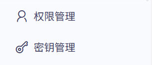
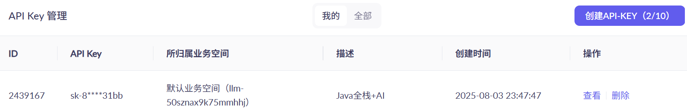
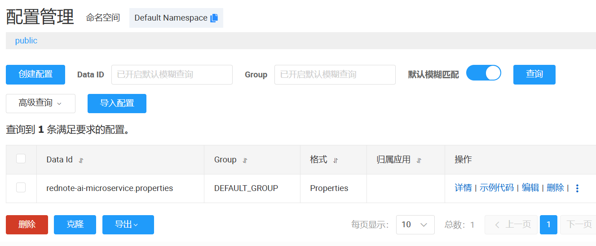
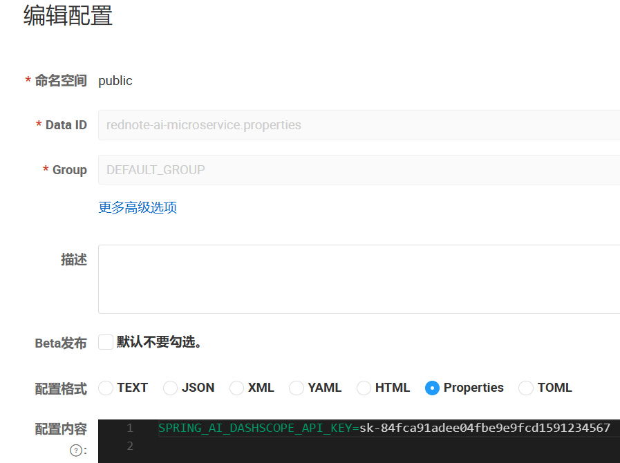

## 2.2 获取大模型API调用权限


本文以阿里云通义千问为例，引导完成大模型API调用。

### 注册阿里云账号


如果没有阿里云账号，需要先注册阿里云账号。访问<https://account.aliyun.com/register/qr_register.htm>


### 开通百炼的模型服务

前往百炼控制台<https://bailian.console.aliyun.com/console?tab=model#/model-market>，选择要使用的模型。如果页面顶部显示以下消息，需要开通百炼的模型服务，以获得免费额度。如果未显示该消息，则表示已经开通。


 
### 获取API Key

在控制台的左下角选择“密钥管理”，然后创建API Key，用于通过API调用大模型。
 





 

可以查看并复制该API Key。




 
有了该API Key之后，就能调用阿里云通义千问所提供的模型了。


建议把API Key配置到环境变量或者是配置中心，从而避免在代码里显式地配置API Key，降低泄漏风险。


### 把API Key配置配置中心

在Nacos配置中心针对rednote-ai-microservice模块，新增一个Data Id为rednote-ai-microservice.properties的配置，如下图所示。





在上述配置的配置内容里面，新增SPRING_AI_DASHSCOPE_API_KEY配置，其值为阿里云通义千问API Key，如下图所示。




### 应用配置


修改rednote-ai-microservice模块的配置文件，增加如下配置

```
# Spring AI配置
spring.ai.dashscope.api-key=${SPRING_AI_DASHSCOPE_API_KEY}
logging.level.org.springframework.ai=debug
logging.level.com.alibaba.dashscope.api=debug
logging.level.com.alibaba.cloud.ai.dashscope.chat=debug
```