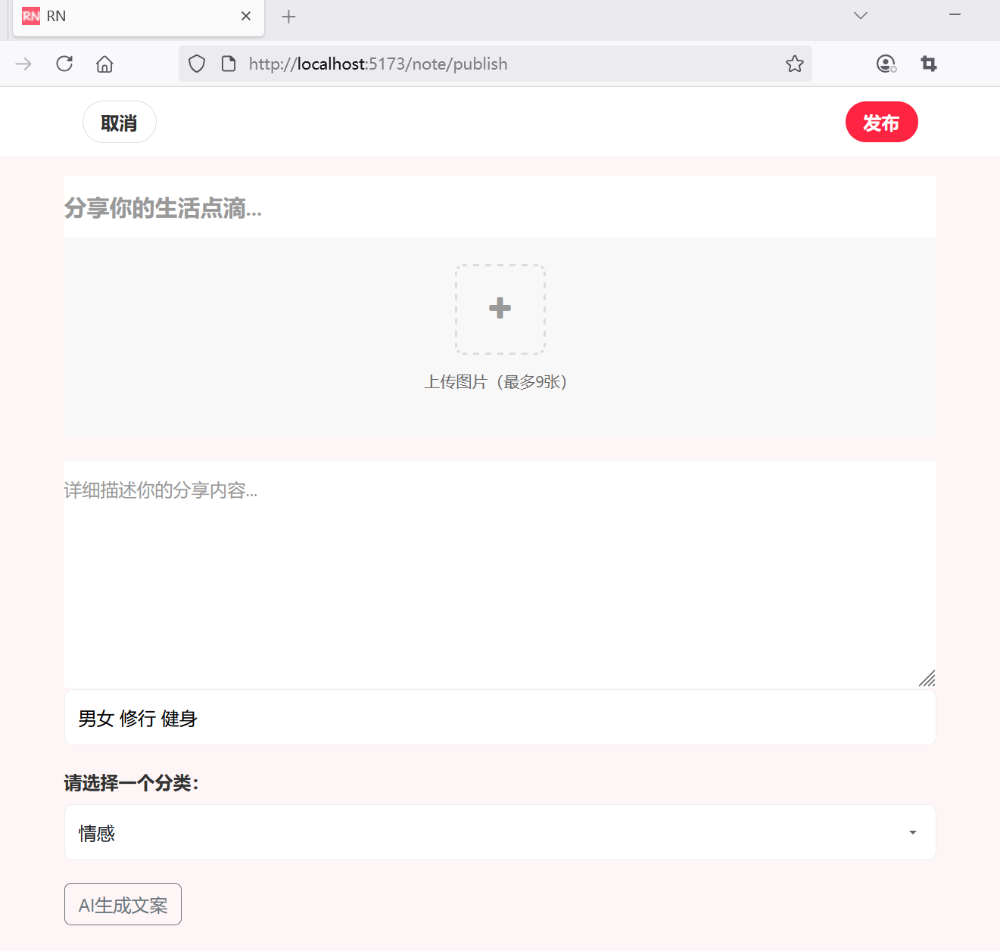
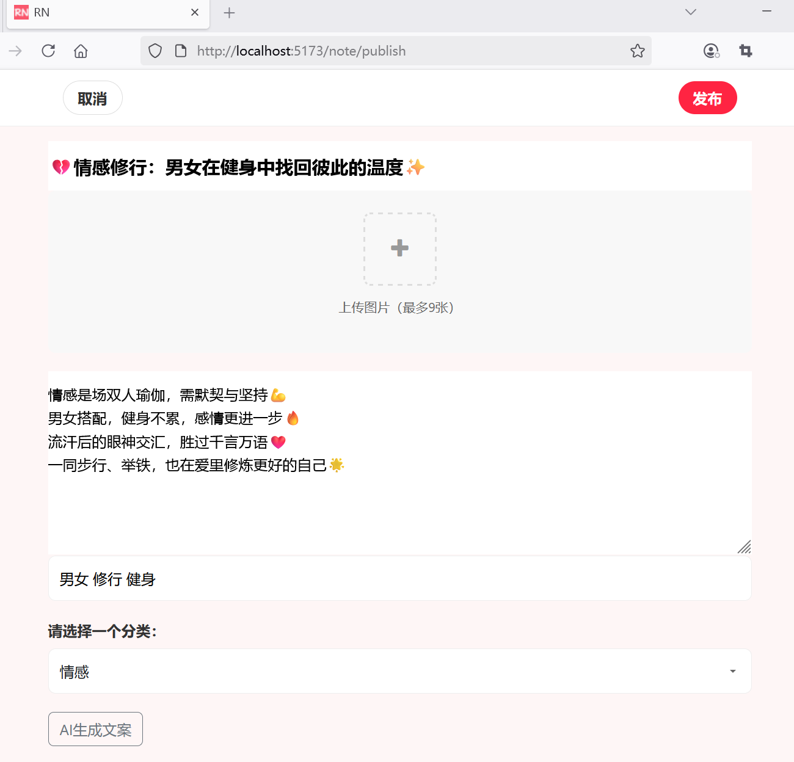

## 2.6 笔记发布界面适配调用AI文案生成服务功能


### 增加“AI生成文案”按钮

在发布笔记页面添加“AI生成文案”按钮：


```html
<!-- 内容区域 -->
<div class="content container">
    <!-- 笔记发布表单 -->
    <form id="noteForm" ref="noteFormRef" method="post" enctype="multipart/form-data" action="/note/publish">
        <!-- ...为节约篇幅，此处省略非核心内容 -->
    </form>

    <!-- AI生成文案 -->
    <button class="btn btn-outline-secondary" @click="generateByAI">AI生成文案</button>

</div>
```

### “AI生成文案”按钮点击事件处理、


```js
import { CopywritingRequestDto } from '@/dto/copywriting-request-dto';
import type { CopywritingResponseDto } from '@/dto/copywriting-response-dto';

// ...为节约篇幅，此处省略非核心内容

const generateByAI = async () => {
    if (note.value) {
        if (note.value.category && note.value.topics) {
            try {
                // 发送请求
                let copywritingRequestDto = new CopywritingRequestDto();
                copywritingRequestDto.type = note.value.category;
                copywritingRequestDto.keywords = note.value.topics;

                const response = await axios.post('/api/ai/copywriting', copywritingRequestDto);

                // 请求结果
                console.log('请求结果' + response);

                const copywritingResponseDto = response.data as CopywritingResponseDto;
                note.value.title = copywritingResponseDto.title;
                note.value.content = copywritingResponseDto.content;
            } catch (error) {
                // 处理错误响应
                const axiosError = error as AxiosError<ApiValidationError>;
                if (axiosError.response?.status === 400 && axiosError.response.data) {
                    // 绑定后端返回的错误信息
                    errors.value = axiosError.response.data;
                }
            }
        } else {
            alert(`调用AI服务请提供话题和分类`);
        }

    }
};
```


其中请求前后的数据分别用CopywritingRequestDto、CopywritingResponseDto类型表示。


### 新建DTO

新建`src\dto\copywriting-request-dto.ts`


```ts
export class CopywritingRequestDto {
  type: string = '';
  keywords: string = '';
}
```


新建`src\dto\copywriting-response-dto.ts`


```ts
export interface CopywritingResponseDto {
  title: string;
  content: string;
}
```


### 运行调测


“AI生成文案”按钮界面效果如下图2-6所示。




点击“AI生成文案”按钮之后，自动生成的文案效果如下图2-7所示。

