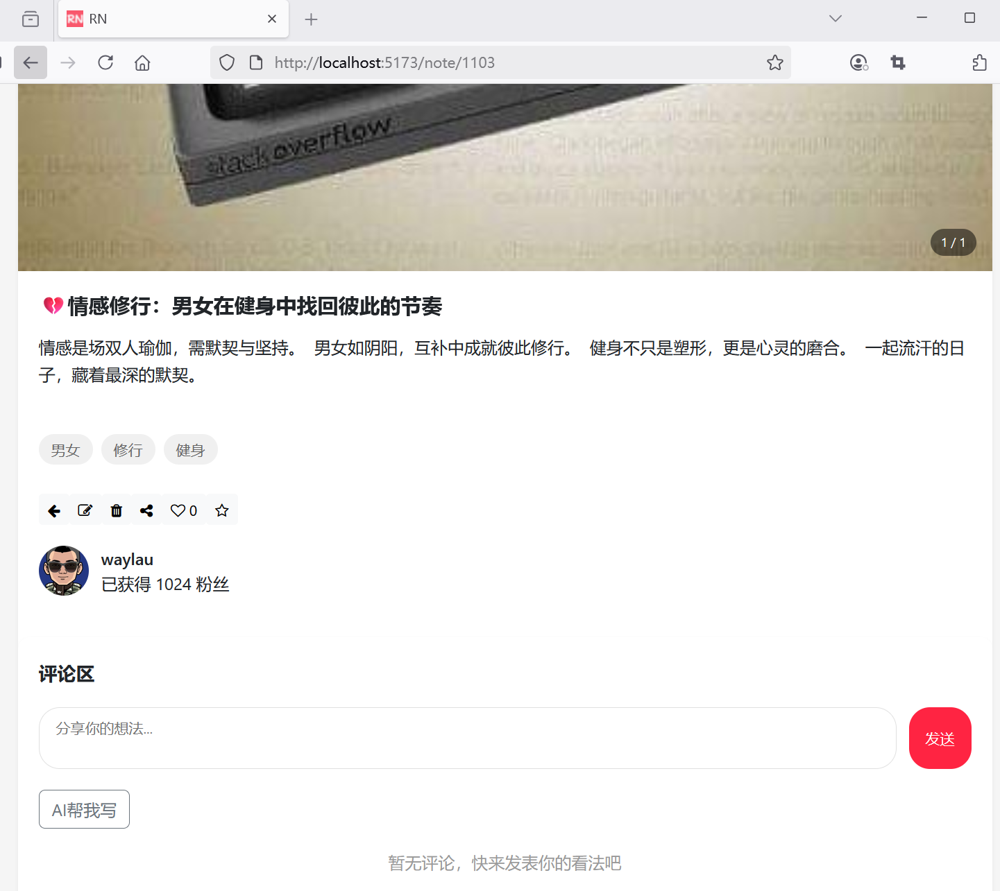
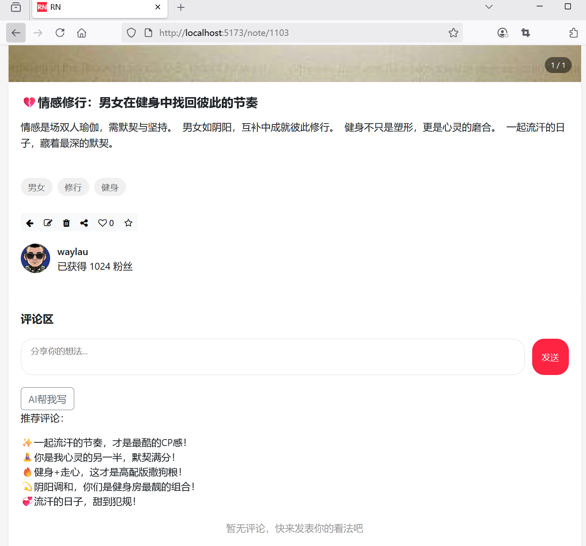
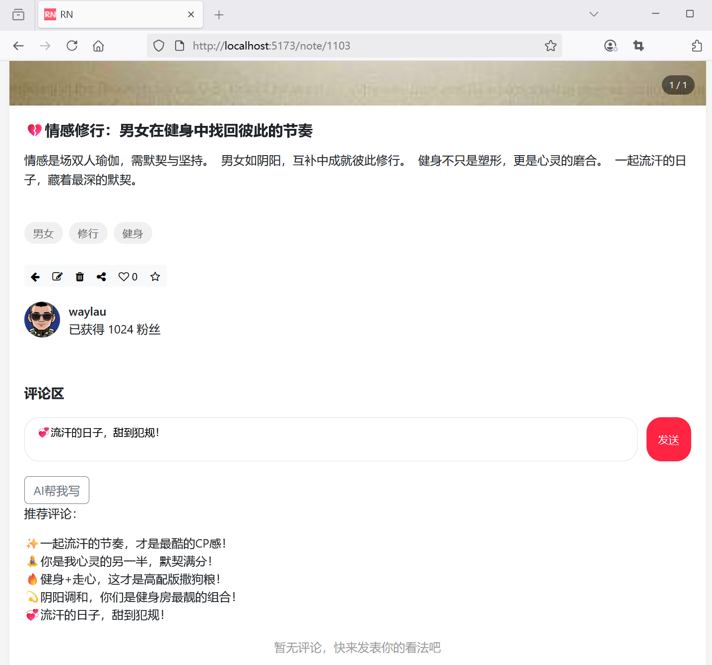

## 3.4 评论界面适配调用AI评论生成服务功能


### 增加“AI帮我写”按钮

在笔记评论页面添加“AI帮我写”按钮：


```html
<!-- 评论区 -->
<div class="comments-section">

    <!-- 评论输入框 -->

    <!-- ...为节约篇幅，此处省略非核心内容 -->

    <!-- AI帮我写按钮 -->
    <button class="btn btn-outline-secondary" @click="showSuggestions">AI帮我写</button>

    <!-- AI评论建议列表 -->
    <div class="suggestions" v-if="commentSuggestions.length > 0">
        <p>推荐评论：</p>
        <div v-for="s in commentSuggestions" :key="s" @click="useSuggestion(s)">
        {{ s }}
        </div>
    </div>

    <!-- ...为节约篇幅，此处省略非核心内容 -->

</div>
```

### “AI帮我写”按钮点击事件处理、


```js
import { CommentSuggestionRequestDto } from '@/dto/comment-suggestion-request-dto';
import type { CommentSuggestionResponseDto } from '@/dto/comment-suggestion-response-dto';

// ...为节约篇幅，此处省略非核心内容

// AI评论生成建议
const commentSuggestions = ref<Array<string>>([]);

const showSuggestions = async () => {
    if (note.value) {
        if (note.value.category && note.value.content) {
            try {
                // 发送请求
                let commentSuggestionRequestDto = new CommentSuggestionRequestDto();
                commentSuggestionRequestDto.type = note.value.category;
                commentSuggestionRequestDto.content = note.value.content;

                const response = await axios.post('/api/ai/comment', commentSuggestionRequestDto);

                // 请求结果
                console.log('请求结果' + response);

                const commentSuggestionResponseDto = response.data as CommentSuggestionResponseDto;
                commentSuggestions.value = commentSuggestionResponseDto.commentSuggestions;
            } catch (error) {
                // 处理错误响应
                alert(error);
            }
        } else {
            alert(`调用AI服务请提供话题和分类`);
        }

    }
};

 // 使用AI建议的评论
function useSuggestion(text: string) {
    newComment.value = text;
}
```


其中请求前后的数据分别用CommentSuggestionRequestDto、CommentSuggestionResponseDto类型表示。


### 新建DTO

新建`src\dto\comment-suggestion-request-dto.ts`


```ts
export class CommentSuggestionRequestDto {
  type: string = '';
  content: string = '';
}
```


新建`src\dto\comment-suggestion-response-dto.ts`


```ts
export interface CommentSuggestionResponseDto {
  commentSuggestions: string[];
}
```


### 运行调测


“AI帮我写”按钮界面效果如下图3-1所示。




点击“AI帮我写”按钮之后，自动生成的评论建议列表效果如下图3-2所示。




点击评论建议列表中的条目的效果如下图3-3所示。

