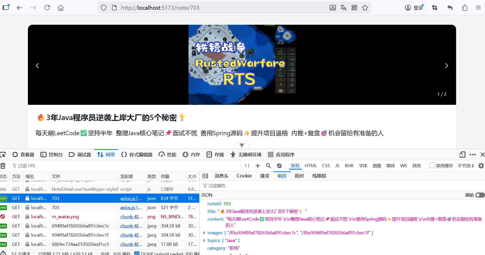
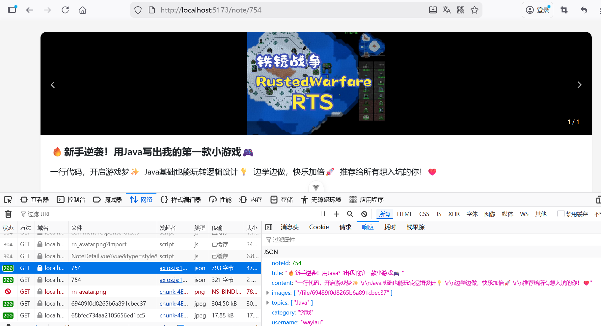

## 3.5 AI辅助编程解决笔记发布时图片重复的问题


笔记发布时，发现插入一张图片，但最后查询笔记详情时是两张重复图片，如下图3-4所示。




### 问题排查


在`com/waylau/rednote/contentmicroservice/interfaces/controller/NoteController.java`中的publishNote方法添加了如下调试日志：

```java
@PostMapping("/publish")
public ResponseEntity<?> publishNote(@Valid @ModelAttribute("note") NotePublishDto notePublishDto,
                                      BindingResult bindingResult,
                                      HttpServletRequest request) {
    // 添加调试信息
    log.info("Content-Type: {}", request.getContentType());

    if (request instanceof MultipartHttpServletRequest) {
        MultipartHttpServletRequest multipartRequest = (MultipartHttpServletRequest) request;
        log.info("Multipart parameter names: {}", multipartRequest.getParameterNames());
        if (multipartRequest.getFileMap().containsKey("images")) {
            log.info("Number of 'images' files: {}", multipartRequest.getFiles("images").size());
        }
    }

    log.info("Images count: {}", notePublishDto.getImages().size());
    for (int i = 0; i < notePublishDto.getImages().size(); i++) {
        MultipartFile file = notePublishDto.getImages().get(i);
        log.info("Image {}: name={}, size={}", i, file.getOriginalFilename(), file.getSize());
    }

    // ...为节约篇幅，此处省略非核心内容

}    
```

运行结果如下：


```
2025-12-22T09:22:20.566+08:00  INFO 72768 --- [rednote-content-microservice] [nio-9030-exec-1] c.w.r.c.i.controller.NoteController      : Content-Type: multipart/form-data;boundary=----geckoformboundary31459ba76b56162cdb425fcc28c882d2;charset=UTF-8
2025-12-22T09:22:20.566+08:00  INFO 72768 --- [rednote-content-microservice] [nio-9030-exec-1] c.w.r.c.i.controller.NoteController      : Multipart parameter names: java.util.Collections$3@1401e564
2025-12-22T09:22:20.568+08:00  INFO 72768 --- [rednote-content-microservice] [nio-9030-exec-1] c.w.r.c.i.controller.NoteController      : Number of 'images' files: 2
2025-12-22T09:22:20.568+08:00  INFO 72768 --- [rednote-content-microservice] [nio-9030-exec-1] c.w.r.c.i.controller.NoteController      : Images count: 2
2025-12-22T09:22:20.569+08:00  INFO 72768 --- [rednote-content-microservice] [nio-9030-exec-1] c.w.r.c.i.controller.NoteController      : Image 0: name=939eefff8de5cdbde23d82afb3022fd90a783380.jpg, size=304190
2025-12-22T09:22:20.569+08:00  INFO 72768 --- [rednote-content-microservice] [nio-9030-exec-1] c.w.r.c.i.controller.NoteController      : Image 1: name=939eefff8de5cdbde23d82afb3022fd90a783380.jpg, size=304190
```


根据调试输出结果，问题已经明确了：前端确实发送了两个相同的文件，这不是后端的问题。从网络请求来看，发送了两个相同的文件。


从日志可以看出：

* 请求中有两个名为 images 的文件部分
* 两个文件具有完全相同的文件名和大小（304190字节）


### 问题原因

检查前端 HTML 表单结构，HTML 表单中已经包含了一个文件输入字段 images ，而 TypeScript 又额外添加了一次文件。

HTML 表单代码如下：

```html
<input type="file" id="imageUpload" name="images" multiple style="display: none;" accept="image/*"
          v:field="note.images" ref="imageUploadRef">
```

TypeScript 添加文件方式如下：


```ts
// 获取表单数据
const formData = new FormData(noteFormRef.value)


// 创建DataTransfer对象
const dataTransfer = new DataTransfer()

// 将选中的图片添加到DataTransfer对象中
for (let i = 0; i < selectedFiles.length; i++) {
  dataTransfer.items.add(selectedFiles[i])
}

// 将DataTransfer对象设置给表单数据
if (imageUploadRef.value && dataTransfer.files) {
  imageUploadRef.value.files = dataTransfer.files

  for (const file of imageUploadRef.value.files) {
    formData.append('images', file)
  }
}

// 调用API发布笔记
try {
  await axios.post(`/api/note/publish`, formData)

  // ...为节约篇幅，此处省略非核心内容
} catch (err) {
  // ...为节约篇幅，此处省略非核心内容
}
```

### 解决方法

```ts
// 获取表单数据
const formData = new FormData(noteFormRef.value)

/**
// 创建DataTransfer对象
const dataTransfer = new DataTransfer()

// 将选中的图片添加到DataTransfer对象中
for (let i = 0; i < selectedFiles.length; i++) {
  dataTransfer.items.add(selectedFiles[i])
}

// 将DataTransfer对象设置给表单数据
if (imageUploadRef.value && dataTransfer.files) {
  imageUploadRef.value.files = dataTransfer.files

  for (const file of imageUploadRef.value.files) {
    formData.append('images', file)
  }
}
*/

// 直接将选中的图片添加到表单数据中
// 移除之前可能存在的 images 数据
// 这里假设 selectedFiles 包含了所有需要上传的图片
console.info(`selectedFiles count: ${selectedFiles.length}`)

// 删除已有的图片数据
formData.delete('images')

for (let i = 0; i < selectedFiles.length; i++) {
  formData.append('images', selectedFiles[i])
}

// 调用API发布笔记
try {
  await axios.post(`/api/note/publish`, formData)

  // ...为节约篇幅，此处省略非核心内容
} catch (err) {
  // ...为节约篇幅，此处省略非核心内容
}
```


验证问题已经解决，图片不会重复了，如下图3-5所示。


