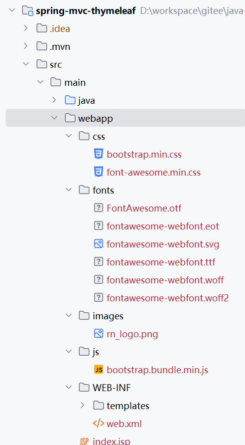

## 5.1 实现数据看板控制器，深入理解模型数据绑定


通过实际案例，来深入理解重定向及模板片段开发功能。


### 项目初始化


执行以下命令进行初始化项目原型：


```
mvn archetype:generate -DgroupId=com.waylau.spring.mvc -DartifactId=spring-mvc-thymeleaf -DarchetypeArtifactId=maven-archetype-webapp -DarchetypeVersion=1.5 -DinteractiveMode=false
```

此时会创建一个名为“spring-mvc-thymeleaf”的Web应用程序。


在 `pom.xml` 中添加必要的依赖，包括 Servlet API、JSON 处理库（如 Jackson）、Spring MVC、内嵌Tomcat、Thymeleaf等：
```xml
<dependencyManagement>
  <dependencies>
    <dependency>
      <groupId>org.springframework</groupId>
      <artifactId>spring-framework-bom</artifactId>
      <version>6.2.9</version>
      <type>pom</type>
      <scope>import</scope>
    </dependency>

    <!-- ...为节约篇幅，此处省略非核心内容 -->
  </dependencies>
</dependencyManagement>

<dependencies>
    <!-- Servlet API -->
    <dependency>
        <groupId>jakarta.servlet</groupId>
        <artifactId>jakarta.servlet-api</artifactId>
        <version>6.1.0</version>
        <scope>provided</scope>
    </dependency>
    <!-- Jackson JSON 处理库 -->
    <dependency>
        <groupId>com.fasterxml.jackson.core</groupId>
        <artifactId>jackson-databind</artifactId>
        <version>2.19.2</version>
    </dependency>
    <!-- Spring MVC -->
    <dependency>
        <groupId>org.springframework</groupId>
        <artifactId>spring-webmvc</artifactId>
    </dependency>
    <!-- Tomcat Embed -->
    <dependency>
      <groupId>org.apache.tomcat.embed</groupId>
      <artifactId>tomcat-embed-core</artifactId>
      <version>11.0.10</version>
    </dependency>
    <dependency>
      <groupId>org.apache.tomcat.embed</groupId>
      <artifactId>tomcat-embed-jasper</artifactId>
      <version>11.0.10</version>
    </dependency>
		<!-- Thymeleaf -->
    <dependency>
      <groupId>org.thymeleaf</groupId>
      <artifactId>thymeleaf</artifactId>
      <version>3.1.3.RELEASE</version>
    </dependency>
    <dependency>
      <groupId>org.thymeleaf</groupId>
      <artifactId>thymeleaf-spring6</artifactId>
      <version>3.1.3.RELEASE</version>
    </dependency>

    <!-- ...为节约篇幅，此处省略非核心内容 -->
</dependencies>
```

使用maven-shade-plugin，在pom.xml中添加如下内容：


```xml
<build>
    <finalName>spring-mvc-thymeleaf</finalName>
    <plugins>
      <plugin>
        <groupId>org.apache.maven.plugins</groupId>
        <artifactId>maven-shade-plugin</artifactId>
        <version>3.6.0</version>
        <configuration>
          <createDependencyReducedPom>true</createDependencyReducedPom>
          <filters>
            <filter>
              <artifact>*:*</artifact>
              <excludes>
                <exclude>module-info.class</exclude>
                <exclude>META-INF/*.SF</exclude>
                <exclude>META-INF/*.DSA</exclude>
                <exclude>META-INF/*.RSA</exclude>
              </excludes>
            </filter>
          </filters>
        </configuration>
        <executions>
          <execution>
            <phase>package</phase>
            <goals>
              <goal>shade</goal>
            </goals>
            <configuration>
              <transformers>
                <!-- 设置主类 -->
                <transformer implementation="org.apache.maven.plugins.shade.resource.ManifestResourceTransformer">
                  <mainClass>com.waylau.spring.mvc.App</mainClass>
                </transformer>
              </transformers>
            </configuration>
          </execution>
        </executions>
      </plugin>
    </plugins>
</build>    
```


修改打包的格式为jar：

```xml
<!--<packaging>war</packaging>-->
<packaging>jar</packaging>
```


### 创建数据模型

和之前一样，创建一个简单的 `User` 类作为数据模型：


```java
package com.waylau.spring.mvc.model;

/**
 * User 用户模型
 *
 * @author <a href="https://waylau.com">Way Lau</a>
 * @version 2025/08/08
 **/
public class User {
    private Long id;
    private String name;
    private String email;

    public User() {
    }

    public User(Long id, String name, String email) {
        this.id = id;
        this.name = name;
        this.email = email;
    }

    // Getters and Setters
    public Long getId() {
        return id;
    }

    public void setId(Long id) {
        this.id = id;
    }

    public String getName() {
        return name;
    }

    public void setName(String name) {
        this.name = name;
    }

    public String getEmail() {
        return email;
    }

    public void setEmail(String email) {
        this.email = email;
    }
}
```


### Spring MVC 配置


创建 Spring MVC 的配置类，配置组件扫描、消息转换器、试图解析器等：

```java
package com.waylau.spring.mvc.config;

import org.springframework.beans.BeansException;
import org.springframework.context.ApplicationContext;
import org.springframework.context.ApplicationContextAware;
import org.springframework.context.annotation.Bean;
import org.springframework.context.annotation.ComponentScan;
import org.springframework.context.annotation.Configuration;
import org.springframework.http.converter.json.MappingJackson2HttpMessageConverter;
import org.springframework.web.servlet.config.annotation.EnableWebMvc;
import org.springframework.web.servlet.config.annotation.ResourceHandlerRegistry;
import org.springframework.web.servlet.config.annotation.WebMvcConfigurer;
import org.thymeleaf.spring6.SpringTemplateEngine;
import org.thymeleaf.spring6.templateresolver.SpringResourceTemplateResolver;
import org.thymeleaf.spring6.view.ThymeleafViewResolver;
import org.thymeleaf.templatemode.TemplateMode;

/**
 * WebConfig Web配置
 *
 * @author <a href="https://waylau.com">Way Lau</a>
 * @version 2025/08/11
 **/
@Configuration
@EnableWebMvc
@ComponentScan(basePackages = "com.waylau.spring.mvc")
public class WebConfig implements WebMvcConfigurer, ApplicationContextAware {
    private ApplicationContext applicationContext;

    /**
     * 设置上下文
     *
     * @param applicationContext
     * @throws BeansException
     */
    @Override
    public void setApplicationContext(ApplicationContext applicationContext) throws BeansException {
        this.applicationContext = applicationContext;
    }

    /**
     * 设置静态资源
     *
     * @param registry
     */
    @Override
    public void addResourceHandlers(ResourceHandlerRegistry registry) {
        WebMvcConfigurer.super.addResourceHandlers(registry);
        registry.addResourceHandler("/images/**").addResourceLocations("/images/");
        registry.addResourceHandler("/css/**").addResourceLocations("/css/");
        registry.addResourceHandler("/js/**").addResourceLocations("/js/");
        registry.addResourceHandler("/fonts/**").addResourceLocations("/fonts/");
    }

    @Bean
    public MappingJackson2HttpMessageConverter mappingJackson2HttpMessageConverter() {
        return new MappingJackson2HttpMessageConverter();
    }

    @Bean
    public SpringResourceTemplateResolver stringResourceTemplateResolver() {
        SpringResourceTemplateResolver stringResourceTemplateResolver = new SpringResourceTemplateResolver();
        stringResourceTemplateResolver.setApplicationContext(this.applicationContext);
        stringResourceTemplateResolver.setPrefix("/WEB-INF/templates/");
        stringResourceTemplateResolver.setSuffix(".html");

        // 默认是HTML
        stringResourceTemplateResolver.setTemplateMode(TemplateMode.HTML);

        // 启用Template缓存，默认是true
        stringResourceTemplateResolver.setCacheable(true);

        return stringResourceTemplateResolver;
    }

    @Bean
    public SpringTemplateEngine springTemplateEngine() {
        // SpringTemplateEngine自动应用SpringStandardDialect，并启用Spring自己的MessageSource消息解析机制
        SpringTemplateEngine springTemplateEngine = new SpringTemplateEngine();
        springTemplateEngine.setTemplateResolver(stringResourceTemplateResolver());

        // 在Spring 4.2.4或更新版本中启用SpringEL编译器可以在大多数情况下加快执行速度，
        // 但在一个模板中的表达式跨不同数据类型重用的特定情况下可能不兼容，
        // 因此为了更安全的向后兼容性，默认情况下此标志为false。
        springTemplateEngine.setEnableSpringELCompiler(true);

        return springTemplateEngine;
    }

    @Bean
    public ThymeleafViewResolver thymeleafViewResolver() {
        ThymeleafViewResolver thymeleafViewResolver = new ThymeleafViewResolver();
        thymeleafViewResolver.setTemplateEngine(springTemplateEngine());

        // 设置字符集
        thymeleafViewResolver.setCharacterEncoding("UTF-8");

        return thymeleafViewResolver;
    }
}
```


在`src/main/webapp`目录下，新建images、css、js、fonts等目录，将静态资源按照类别分别放置到上述目录，比如Bootstrap、Font Awesome及应用中的图片资源。

在`src/main/webapp/WEB-INF`目录下，新建`templates`目录，用于放置Thymeleaf模板页面。

最终应用目录结构如图5-1 所示：



### Web应用初始化

创建一个 `WebInitializer` 类来初始化 Spring MVC 应用：


```java
package com.waylau.spring.mvc.config;

import jakarta.servlet.ServletContext;
import jakarta.servlet.ServletException;
import jakarta.servlet.ServletRegistration;
import org.springframework.web.WebApplicationInitializer;
import org.springframework.web.context.ContextLoaderListener;
import org.springframework.web.context.support.AnnotationConfigWebApplicationContext;
import org.springframework.web.servlet.DispatcherServlet;

/**
 * WebInitializer Web应用初始化
 *
 * @author <a href="https://waylau.com">Way Lau</a>
 * @version 2025/08/10
 **/
public class WebInitializer implements WebApplicationInitializer {
    @Override
    public void onStartup(ServletContext servletContext) throws ServletException {
        AnnotationConfigWebApplicationContext rootContext = new AnnotationConfigWebApplicationContext();
        rootContext.register(WebConfig.class);

        servletContext.addListener(new ContextLoaderListener(rootContext));

        AnnotationConfigWebApplicationContext dispatcherContext = new AnnotationConfigWebApplicationContext();
        dispatcherContext.register(WebConfig.class);

        ServletRegistration.Dynamic dispatcher = servletContext.addServlet("dispatcher", new DispatcherServlet(dispatcherContext));
        dispatcher.setLoadOnStartup(1);
        dispatcher.addMapping("/");
    }
}
```

### Web应用程序入口

使用Tomcat作为内嵌Servlet容器启动：


```java
package com.waylau.spring.mvc;

import org.apache.catalina.LifecycleException;
import org.apache.catalina.startup.Tomcat;

import java.io.File;

/**
 * App Web应用程序入口
 *
 * @author <a href="https://waylau.com">Way Lau</a>
 * @version 2025/08/10
 **/
public class App {
    public static void main(String[] args) throws LifecycleException {
        // 创建Tomcat启动器
        Tomcat tomcat = new Tomcat();

        // 设置基础目录，许多其他位置（比如工作目录）的默认设置都是从基础目录派生出来的
        // 可以自定义目录，或者是使用缓存目录 System.getProperty("java.io.tmpdir")
        File baseDir = new File("/data/tomcat-embed");
        tomcat.setBaseDir(baseDir.getAbsolutePath());

        // 设置默认HTTP连接器端口号
        tomcat.setPort(8080);

        // 添加Web应用程序，这相当于将Web应用程序添加到主机的appBase（通常是Tomcat的webapps目录）。
        // contextPath - 要使用的上下文映射，""表示根上下文；
        // docBase - 上下文的基本目录，用于静态文件。必须存在且为绝对路径。
        String contextPath = "";
        String docBase = new File("src/main/webapp").getAbsolutePath();
        tomcat.addWebapp(contextPath, docBase);

        // 启动Tomcat
        tomcat.start();

        // 获取默认HTTP连接器
        tomcat.getConnector();
    }
}
```


### 创建控制器


创建一个控制器类来处理 HTTP 请求：

```java
package com.waylau.spring.mvc.controller;

import com.waylau.spring.mvc.model.User;
import org.springframework.http.ResponseEntity;
import org.springframework.stereotype.Controller;
import org.springframework.ui.Model;
import org.springframework.web.bind.annotation.*;

import java.util.*;
import java.util.concurrent.ConcurrentHashMap;
import java.util.concurrent.atomic.AtomicLong;

/**
 * AdminController 后台管理控制器
 *
 * @author <a href="https://waylau.com">Way Lau</a>
 * @version 2025/08/10
 **/
@Controller
@RequestMapping("/admin")
public class AdminController {

    // 用户存储
    private final ConcurrentHashMap<Long, User> users = new ConcurrentHashMap<>();
    private final AtomicLong counter = new AtomicLong(1);

    public AdminController() {
        // 初始化测试数据
        Long id1 = counter.getAndIncrement();
        users.put(id1, new User(id1, "John", "john@waylau.com"));

        Long id2 = counter.getAndIncrement();
        users.put(id2, new User(id2, "Smith", "smith@waylau.com"));
    }

    @GetMapping()
    public String goToAdmin() {
        return "redirect:/admin/dashboard";
    }

    @GetMapping("/dashboard")
    public String dashboard(Model model) {
        // 统计数据
        long userCount = generateRandomInt(1, 100);
        long noteCount = generateRandomInt(1, 100);
        long commentCount = generateRandomInt(1, 100);

        model.addAttribute("userCount", userCount);
        model.addAttribute("noteCount", noteCount);
        model.addAttribute("commentCount", commentCount);

        model.addAttribute("contentFragment", "admin-dashboard");

        return "admin";
    }

    private int generateRandomInt(int min, int max) {
        return (int)(Math.random() * (max - min)) + min;
    }
}
```

其中，

* 使用ConcurrentHashMap来存储用户数据。
* 当访问“/admin”路径时，会重定向到“/admin/dashboard”

