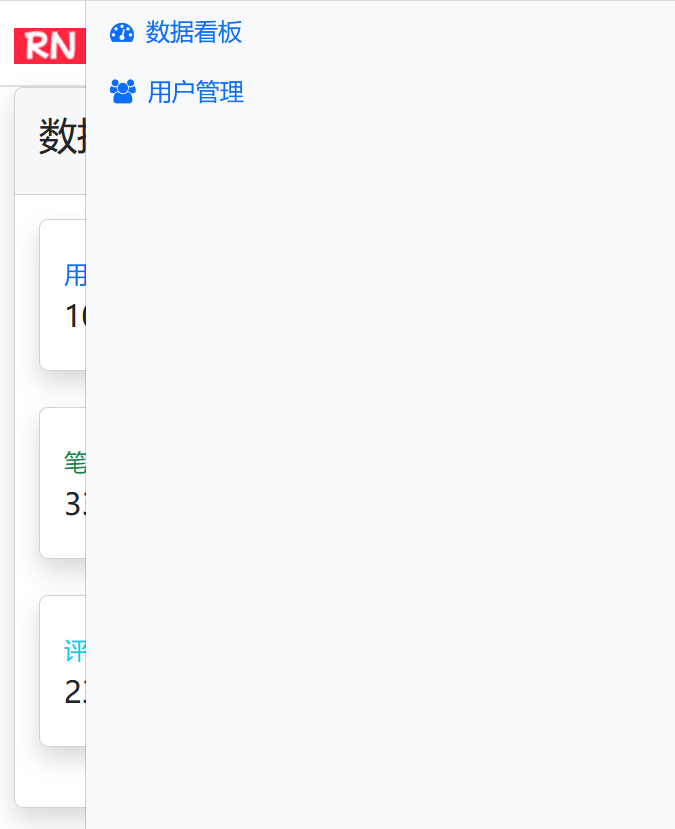

## 5.2 实现数据看板模板页面，深入理解重定向及模板片段开发


### 编写模板


#### 编写可重用的admin.html主模板

在`src/main/webapp/WEB-INF/templates`目录下新建admin.html主模板，实现了：

* 导航栏
* 菜单
* 内容区域

```html
<!DOCTYPE html>
<html lang="en" xmlns:th="http://www.thymeleaf.org">

<head>
    <meta charset="UTF-8">
    <meta name="viewport" content="width=device-width, initial-scale=1.0">
    <title>Thymeleaf后台管理</title>
    <!-- 引入 Bootstrap CSS -->
    <link href="https://cdn.jsdelivr.net/npm/bootstrap@5.3.6/dist/css/bootstrap.min.css"
        th:href="@{/css/bootstrap.min.css}" rel="stylesheet">
    <!-- 引入 Font Awesome -->
    <link href="https://cdn.jsdelivr.net/npm/font-awesome@4.7.0/css/font-awesome.min.css"
        th:href="@{/css/font-awesome.min.css}" rel="stylesheet">
</head>

<header class="navbar navbar-expand-lg">
    <div class="container">
        <a class="navbar-brand" href="#"></a>
        <button class="navbar-toggler" type="button" data-bs-toggle="collapse" data-bs-target="#sidebarMenu"
            aria-controls="navbarNav" aria-expanded="false" aria-label="Toggle navigation"> <span
                class="navbar-toggler-icon"></span> </button>
    </div>
</header>

<body>
    <div class="container">
        <div class="row">
            <div class="sidebar border border-right col-md-3 col-lg-2 p-0 bg-body-tertiary">
                <div class="offcanvas-md offcanvas-end bg-body-tertiary" tabindex="-1" id="sidebarMenu"
                    aria-labelledby="sidebarMenuLabel">

                    <div class="offcanvas-body d-md-flex flex-column p-0 pt-lg-3 overflow-y-auto">
                        <ul class="nav flex-column">
                            <li class="nav-item">
                                <a class="nav-link d-flex align-items-center gap-2 active" aria-current="page"
                                    href="/admin/dashboard" th:href="@{/admin/dashboard}">
                                    <i class="fa fa-tachometer"></i> 数据看板
                                </a>
                            </li>
                            <li class="nav-item">
                                <a class="nav-link d-flex align-items-center gap-2" href="/admin/user"
                                    th:href="@{/admin/user}">
                                    <i class="fa fa-users"></i> 用户管理
                                </a>
                            </li>
                        </ul>
                    </div>
                </div>
            </div>
            <main class="col-md-9 ms-sm-auto col-lg-10 px-md-4">
                <!-- 内容区域 -->
                <div th:replace="~{${contentFragment}}"></div>
            </main>
        </div>
    </div>
    <!-- Bootstrap JS -->
    <script src="https://cdn.jsdelivr.net/npm/bootstrap@5.3.6/dist/js/bootstrap.bundle.min.js"
        th:src="@{/js/bootstrap.bundle.min.js}"></script>

</body>

</html>
```

其中，菜单可以跳转到不同的子功能的页面。子功能的页面内容区域通过`th:replace="~{${contentFragment}}"`来实现动态替换不同的HTML片段。

#### 编写数据看板子功能页面

在`src/main/webapp/WEB-INF/templates`目录下新建admin-dashboard.html，实现数据看板功能。


```html
<!DOCTYPE html>
<html lang="en" xmlns:th="http://www.thymeleaf.org">

<body>
    <!-- 定义片段 -->
    <div th:fragment="admin-dashboard">
        <div class="card shadow mb-4">
            <div class="card-header py-3">
                <h2>数据看板</h2>
            </div>
            <div class="card-body">
                <!-- 统计卡片 -->
                <div class="col-xl-3 col-md-6 mb-4">
                    <div class="card border-left-primary shadow h-100 py-2">
                        <div class="card-body">
                            <div class="row no-gutters align-items-center">
                                <div class="col mr-2">
                                    <div class="text-xs font-weight-bold text-primary text-uppercase mb-1">用户总数</div>
                                    <div class="h5 mb-0 font-weight-bold text-gray-800" th:text="${userCount}">0</div>
                                </div>
                                <div class="col-auto">
                                    <i class="fa fa-users fa-2x text-gray-300"></i>
                                </div>
                            </div>
                        </div>
                    </div>
                </div>

                <div class="col-xl-3 col-md-6 mb-4">
                    <div class="card border-left-success shadow h-100 py-2">
                        <div class="card-body">
                            <div class="row no-gutters align-items-center">
                                <div class="col mr-2">
                                    <div class="text-xs font-weight-bold text-success text-uppercase mb-1">笔记总数</div>
                                    <div class="h5 mb-0 font-weight-bold text-gray-800" th:text="${noteCount}">0</div>
                                </div>
                                <div class="col-auto">
                                    <i class="fa fa-file-text fa-2x text-gray-300"></i>
                                </div>
                            </div>
                        </div>
                    </div>
                </div>

                <div class="col-xl-3 col-md-6 mb-4">
                    <div class="card border-left-info shadow h-100 py-2">
                        <div class="card-body">
                            <div class="row no-gutters align-items-center">
                                <div class="col mr-2">
                                    <div class="text-xs font-weight-bold text-info text-uppercase mb-1">评论总数</div>
                                    <div class="h5 mb-0 font-weight-bold text-gray-800" th:text="${commentCount}">0
                                    </div>
                                </div>
                                <div class="col-auto">
                                    <i class="fa fa-comments fa-2x text-gray-300"></i>
                                </div>
                            </div>
                        </div>
                    </div>
                </div>
            </div>
        </div>
    </div>
</body>

</html>
```
 


### 运行调测

使用 Maven 打包项目：

```bash
mvn clean package
```

生成了spring-mvc-thymeleaf.jar文件。该JAR文件可以直接通过以下方式启动：

```bash
java -jar spring-mvc-thymeleaf.jar
```


如下图5-2所示，是账号admin访问`/admin`页面路径的效果，重定向到了`/admin/dashboard`页面。


admin.html模版采用了响应式的布局，即便在移动设备上，也能能有很好的适配。如下图5-3所示，是在移动设备上访问`/admin`页面的效果。


点击右上角的按钮，也可以展示完整菜单，如下图5-4所示



