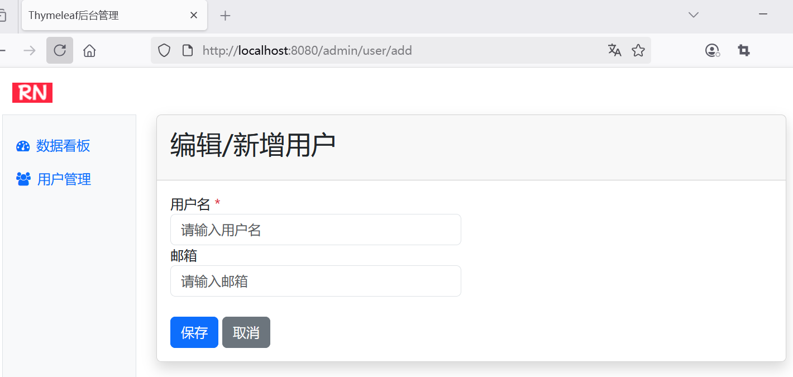

## 5.4 实现用户管理模板页面，深入理解标准方言

### 编写模板


#### 编写用户管理页面

在`src/main/webapp/WEB-INF/templates`目录下新建admin-user.html模板，实现了用户管理功能。

```html
<!DOCTYPE html>
<html lang="en" xmlns:th="http://www.thymeleaf.org">
<body>
    <!--定义片段-->
    <div th:fragment="admin-user">
        <div class="card shadow mb-4">
            <div class="card-header py-3">
                <h2>用户列表</h2>
            </div>
            <div class="card-body">
                <div class="table-responsive small">
                    <table class="table table-striped table-sm">
                        <thead>
                        <tr>
                            <th>ID</th>
                            <th>用户名</th>
                            <th>邮箱</th>
                            <th>操作</th>
                        </tr>
                        </thead>
                        <tbody>
                        <tr th:each="user : ${users}">
                            <td th:text="${user.id}">1</td>
                            <td th:text="${user.name}">Way</td>
                            <td th:text="${user.email}">wayatwaylau.com</td>
                            <td>
                                <button class="btn btn-sm btn-light"
                                    th:onclick="editUser([[${user.id}]])">
                                    编辑
                                </button>
                                <button class="btn btn-sm btn-danger"
                                    th:onclick="deleteUser([[${user.id}]])">
                                    删除
                                </button>
                            </td>
                        </tr>
                        </tbody>
                    </table>
                </div>


                <button class="btn btn-sm btn-primary"
                        th:onclick="addUser()">添加</button>
            </div>

        </div>

        <script th:inline="javascript">
            // 编辑用户
            function editUser(id) {
                // 重定向到编辑页面
                window.location.href = `/admin/user/${id}/edit`;
            }

            // 添加用户
            function addUser() {
                // 重定向到编辑页面
                window.location.href = `/admin/user/add`;
            }

            // 删除用户
            function deleteUser(id) {
                fetch(`/admin/user/${id}`, {
                    method: 'DELETE'
                })
                .then(response => {
                    if (response.ok) {
                        response.json().then(data => {
                            // 从响应中提取消息
                            alert(data.message || '删除成功');

                            // 从响应中提取URL
                            window.location.href = data.redirectUrl;
                        });
                    } else {
                        response.json().then(data => {
                            // 从响应中提取消息
                            alert(data.message || '删除失败');
                        });
                    }
                })
                .catch(error => {
                    console.error('Error: ', error);
                    alert('删除失败，请稍后再试');
                });
            }
        </script>
    </div>

</body>
</html>
```


#### 编写用户编辑页面

在`src/main/webapp/WEB-INF/templates`目录下新建admin-user-edit.html，实现用户编辑页面功能。


```html
<!DOCTYPE html>
<html lang="en" xmlns:th="http://www.thymeleaf.org">
<body>
<!--定义片段-->
<div th:fragment="admin-user-edit">
    <div class="card shadow mb-4">
        <div class="card-header py-3">
            <h2>编辑/新增用户</h2>
        </div>
        <div class="card-body">
            <form th:action="@{/admin/user}" method="post" th:object="${user}">
                <!--隐藏ID字段-->
                <input type="hidden" th:field="*{id}">

                <div class="row">
                    <div class="col-lg-6">
                        <div class="form-group">
                            <label for="name">用户名 <span class="text-danger">*</span></label>
                            <input type="text" id="name" th:field="*{name}" class="form-control"
                                   placeholder="请输入用户名"/>
                        </div>

                        <div class="form-group">
                            <label for="email">用户名 <span class="text-danger">*</span></label>
                            <input type="text" id="email" th:field="*{email}" class="form-control"
                                   placeholder="请输入邮箱"/>
                        </div>
                    </div>
                </div>

                <div class="mt-4">
                    <button type="submit" class="btn btn-primary mr-2">保存</button>
                    <button type="button" class="btn btn-secondary mr-2" th:onclick="history.back()">取消</button>
                </div>
            </form>
        </div>
    </div>
</div>
</body>
</html>
```
 


### 运行调测

使用 Maven 打包项目：

```bash
mvn clean package
```

生成了spring-mvc-thymeleaf.jar文件。该JAR文件可以直接通过以下方式启动：

```bash
java -jar spring-mvc-thymeleaf.jar
```


如下图5-5所示，是账号admin访问`/admin/user`页面路径的效果。


如下图5-6所示的是用户编辑页面。




用户管理页面采用了响应式的布局，即便在移动设备上，也能能有很好的适配。如下图5-7所示，是在移动设备上访问`/admin`页面的效果。


