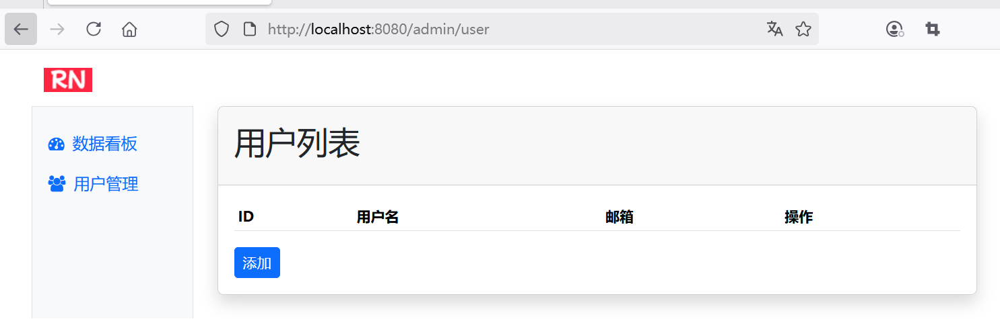
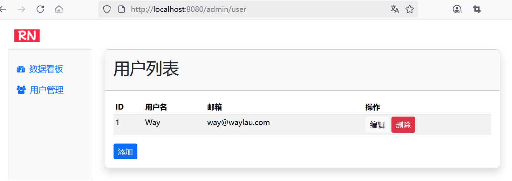

## 3.3 实战：快速掌握Spring Data JPA企业级应用开发


如果读者朋友对课程4的内容还有印象的话，应该还记得，我们用 Thymeleaf 实现了一个最简单的“后台管理”功能。为了简便，我们并没有使用数据库管理系统，而是将数据直接保存在了内存中，这样导致的后果是只要应用重启，数据就会丢失。本节，我们将通过 JPA 来将数据存储到关系型数据库中，这样就实现了数据的持久化。

我们在 `spring-mvc-thymeleaf` 项目的基础上复制出一个新项目`spring-data-jpa-h2`，来实现 JPA 功能。


### 如何使用 Spring Data JPA

在 `pom.xml` 中添加必要的依赖，包括Spring Data JPA、Hibernate、H2数据库等：


```xml
<dependencies>
    <!-- Spring Data JPA -->
    <dependency>
      <groupId>org.springframework.data</groupId>
      <artifactId>spring-data-jpa</artifactId>
      <version>3.5.2</version>
    </dependency>
    <!-- Hibernate -->
    <dependency>
      <groupId>org.hibernate.orm</groupId>
      <artifactId>hibernate-core</artifactId>
      <version>7.1.0.Final</version>
    </dependency>
    <!-- H2数据库 -->
    <dependency>
        <groupId>com.h2database</groupId>
        <artifactId>h2</artifactId>
        <version>2.3.232</version>
        <scope>runtime</scope>
    </dependency>

    <!-- ...为节约篇幅，此处省略非核心内容 -->
</dependencies>
```


### 定义实体


修改 User 类，参考 JPA 的规范，将其修改成为实体：

* User 类上增加了`@Entity`注解，以标识其为实体；
* `@Table`指明该类映射的表名为“users”；
* `@Id`标识id 字段为主键；
* `@GeneratedValue(strategy=GenerationType.IDENTITY)`标识 id 字段，以说使用数据库的自增长字段为新增加的实体的标识。这种情况下需要数据库提供对自增长字段的支持，一般的数据库如 HSQL、SQL Server、MySQL、DB2、Derby 等数据库都能够提供这种支持。


```java
package com.waylau.spring.mvc.model;

import jakarta.persistence.*;

/**
 * User 用户模型
 *
 * @author <a href="https://waylau.com">Way Lau</a>
 * @version 2025/08/08
 **/
// 实体
@Entity
@Table(name = "users")
public class User {
    // 主键
    @Id
    // 自增长策略
    @GeneratedValue(strategy = GenerationType.IDENTITY)
    // 实体唯一标识
    private Long id;
    private String name;
    private String email;

	// ...为节约篇幅，此处省略非核心内容
}
```

### 新增资源库

新增用户资源库的接口，继承自`CrudRepository`：

```java
package com.waylau.spring.mvc.repository;

import com.waylau.spring.mvc.model.User;
import org.springframework.data.repository.CrudRepository;

/**
 * UserRepository 用户资源库
 *
 * @author <a href="https://waylau.com">Way Lau</a>
 * @version 2025/08/13
 **/
public interface UserRepository extends CrudRepository<User, Long> {
}
```
 
由于，Spring Data JPA 已经帮我们做了实现，所以，我们自己不需要做任何实现，甚至都无需在 UserRepository 里面定义任何的方法。


### 修改控制器

AdminController也要做一些调整，将原来用户存储ConcurrentHashMap实现的方法，全部换成 JPA 的默认实现：

```java
package com.waylau.spring.mvc.controller;

import com.waylau.spring.mvc.model.User;
import com.waylau.spring.mvc.repository.UserRepository;
import org.springframework.beans.factory.annotation.Autowired;
import org.springframework.http.ResponseEntity;
import org.springframework.stereotype.Controller;
import org.springframework.ui.Model;
import org.springframework.web.bind.annotation.*;

import java.util.ArrayList;
import java.util.HashMap;
import java.util.Map;
import java.util.Optional;
import java.util.concurrent.ConcurrentHashMap;
import java.util.concurrent.atomic.AtomicLong;

/**
 * AdminController 后台管理控制器
 *
 * @author <a href="https://waylau.com">Way Lau</a>
 * @version 2025/08/11
 **/
@Controller
@RequestMapping("/admin")
public class AdminController {
    // 用户存储
    /*private final ConcurrentHashMap<Long, User> users = new ConcurrentHashMap<>();
    private final AtomicLong counter = new AtomicLong(1);

    public AdminController() {
        // 初始化测试数据
        Long id1 = counter.getAndIncrement();
        users.put(id1, new User(id1, "John", "john@waylau.com"));

        Long id2 = counter.getAndIncrement();
        users.put(id2, new User(id2, "Smith", "smith@waylau.com"));
    }*/
    @Autowired
    private UserRepository userRepository;

    @GetMapping
    public String goToAdmin() {
        return "redirect:/admin/dashboard";
    }

    @GetMapping("/dashboard")
    public String dashboard(Model model) {
        // 统计数据
        long userCount = generateRandomInt(1, 100);
        long noteCount = generateRandomInt(1, 100);
        long commentCount = generateRandomInt(1, 100);

        model.addAttribute("userCount", userCount);
        model.addAttribute("noteCount", noteCount);
        model.addAttribute("commentCount", commentCount);

        model.addAttribute("contentFragment", "admin-dashboard");

        return "admin";
    }

    private int generateRandomInt(int min, int max) {
        return (int) (Math.random() * (max - min)) + min;
    }

    @GetMapping("/user")
    public String getUsers(Model model) {
        /*model.addAttribute("users", new ArrayList<>(users.values()));*/
        model.addAttribute("users", userRepository.findAll());
        model.addAttribute("contentFragment", "admin-user");

        return "admin";
    }

    @GetMapping("user/{id}/edit")
    public String editUser(@PathVariable(name = "id", required = true) Long id, Model model) {
        /*User user = users.get(id);*/
        Optional<User> optionalUser = userRepository.findById(id);
        User user = optionalUser.get();

        model.addAttribute("user", user);
        model.addAttribute("contentFragment", "admin-user-edit");

        return "admin";
    }

    @PostMapping("/user")
    public String updateUser(@ModelAttribute User user) {
        // 更新或者新增
        /*if (user.getId() == null) {
            Long id = counter.getAndIncrement();
            user.setId(id);
        }

        users.put(user.getId(), user);*/
        userRepository.save(user);

        return "redirect:/admin/user";
    }

    @DeleteMapping("/user/{id}")
    public ResponseEntity<?> deleteUser(@PathVariable(name = "id", required = true) Long id) {
        /*users.remove(id);*/
        userRepository.deleteById(id);

        Map<String, String> response = new HashMap<>();
        response.put("message", "用户删除成功");
        response.put("redirectUrl", "/admin/user");

        return ResponseEntity.ok(response);
    }

    @GetMapping("/user/add")
    public String addUser(Model model) {
        model.addAttribute("user", new User());
        model.addAttribute("contentFragment", "admin-user-edit");

        return "admin";
    }

}
```


### 新增配置文件

新增应用的配置文件`src/main/java/com/waylau/spring/mvc/config/JpaConfig.java`，用于配置JPA相关的配置内容：

```java
package com.waylau.spring.mvc.config;

import jakarta.persistence.EntityManagerFactory;
import org.springframework.context.annotation.Bean;
import org.springframework.context.annotation.Configuration;
import org.springframework.data.jpa.repository.config.EnableJpaRepositories;
import org.springframework.jdbc.datasource.embedded.EmbeddedDatabaseBuilder;
import org.springframework.jdbc.datasource.embedded.EmbeddedDatabaseType;
import org.springframework.orm.jpa.JpaTransactionManager;
import org.springframework.orm.jpa.JpaVendorAdapter;
import org.springframework.orm.jpa.LocalContainerEntityManagerFactoryBean;
import org.springframework.orm.jpa.vendor.Database;
import org.springframework.orm.jpa.vendor.HibernateJpaVendorAdapter;
import org.springframework.transaction.annotation.EnableTransactionManagement;

import javax.sql.DataSource;

/**
 * JpaConfig JPA配置
 *
 * @author <a href="https://waylau.com">Way Lau</a>
 * @version 2025/08/13
 **/
@Configuration
// 启用JPA资源库
@EnableJpaRepositories(basePackages = "com.waylau.spring.mvc.repository")
// 开启事务管理
@EnableTransactionManagement
public class JpaConfig {

    // 定义数据源
    @Bean
    public DataSource dataSource() {
        return new EmbeddedDatabaseBuilder()
                .setType(EmbeddedDatabaseType.H2)
                .setName("testdb")
                .build();
    }

    // 定义JPA事务管理器
    @Bean("transactionManager")
    public JpaTransactionManager jpaTransactionManager(EntityManagerFactory entityManagerFactory) {
        return new JpaTransactionManager(entityManagerFactory);
    }

    // 定义JPA供应商适配器
    @Bean
    public JpaVendorAdapter jpaVendorAdapter() {
        HibernateJpaVendorAdapter hibernateJpaVendorAdapter = new HibernateJpaVendorAdapter();
        hibernateJpaVendorAdapter.setDatabase(Database.H2);

        // 自动生成DDL
        hibernateJpaVendorAdapter.setGenerateDdl(true);

        // 显示SQL
        hibernateJpaVendorAdapter.setShowSql(true);

        return hibernateJpaVendorAdapter;
    }

    // 定义实体管理器工厂
    @Bean("entityManagerFactory")
    public LocalContainerEntityManagerFactoryBean localContainerEntityManagerFactoryBean() {
        LocalContainerEntityManagerFactoryBean localContainerEntityManagerFactoryBean =
                new LocalContainerEntityManagerFactoryBean();
        localContainerEntityManagerFactoryBean.setDataSource(dataSource());
        localContainerEntityManagerFactoryBean.setJpaVendorAdapter(jpaVendorAdapter());

        // 设置实体类包路径
        localContainerEntityManagerFactoryBean.setPackagesToScan("com.waylau.spring.mvc.model");

        return localContainerEntityManagerFactoryBean;
    }
}
```

在配置文件中，我们定义了事务管理、DataSource、PlatformTransactionManager、EntityManagerFactory等。


### 运行查看效果

启动项目，可用在控制台可以看到 Hibernate 的执行情况：

```
Hibernate: create table users (id bigint generated by default as identity, email varchar(255), name varchar(255), primary key (id))
```

可用发现，Hibernate 并会自动在数据库中创建表 `users`。


浏览器访问  <http://localhost:8080/admin/user> 可以看到项目的运行效果。图3-1是访问用户管理界面效果。





图3-2是添加用户后的界面效果。





		
	
	