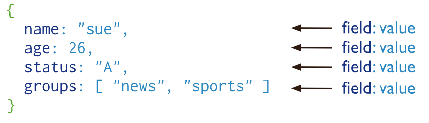
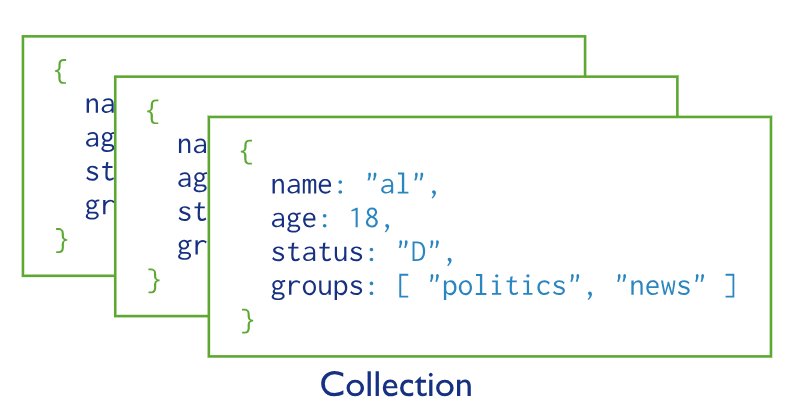

## 4.1 Spring Data MongoDB快速入门：掌握非关系型数据库开发


MongoDB （<https://www.mongodb.com/>）是一个介于关系型数据库和非关系型数据库之间的产品，是非关系型数据库当中功能最丰富，最像关系型数据库的，旨在为 WEB 应用提供可扩展的高性能数据存储解决方案。它支持的数据结构非常松散，是类似 JSON 的 BSON 格式，因此可以存储比较复杂的数据类型。MongoDB 最大的特点是他支持的查询语言非常强大，其语法有点类似于面向对象的查询语言，几乎可以实现类似关系型数据库单表查询的绝大部分功能，而且还支持对数据建立索引。

本文不会对 MongoDB 的概念、基本用法做过多的介绍，有兴趣的朋友可自行查阅其他文献，比如，笔者所著的 《分布式系统常用技术及案例分析》一书，对 MongoDB 方面也有所着墨。 

### MongoDB 特点

MongoDB Server 是用 C++ 编写的、开源的、面向文档的数据库（Document Database），它的特点是高性能、高可用性，以及可以实现自动化扩展，存储数据非常方便。其主要功能特性如下：

MongoDB 将数据存储为一个文档，数据结构由 field-value（字段-值）对组成。MongoDB 文档类似于 JSON 对象。字段的值可以包含其他文档、数组及文档数组。



使用文档的优点是：

* 文档（即对象），在许多编程语言里，可以对应于原生数据类型。
* 嵌入式文档和数组可以减少昂贵的连接操作。
* 动态模式支持流畅的多态性。

MongoDB 的特点是高性能、易部署、易使用，存储数据非常方便。主要功能特性有：

#### 1. 高性能

MongoDB 中提供高性能的数据持久化。尤其是：

* 对于嵌入式数据模型支持，减少了数据库系统的 I/O 活动。
* 支持索引，用于快速查询。其索引对象可以是嵌入文档或数组的 key。

#### 2. 丰富的查询语言

MongoDB 支持丰富的查询语言，包括读取和写入操作（CRUD）以及：

* 数据聚合
* 文本搜索和[地理空间查询

#### 3. 高可用

MongoDB 的复制设备，被称为 replica set，提供了：

* 自动故障转移
* 数据冗余

replica set 是一组保存相同数据集合的 MongoDB 服务器，提供了数据冗余并提高了数据的可用性。

#### 4. 横向扩展

MongoDB 的提供水平横向扩展作为其核心功能部分：

* 将数据分片到一组计算机集群上；
* tag aware sharding （标签意识分片）允许将数据传给到特定的碎片，比如在分片时考虑碎片的地理分布。


### MongoDB 核心概念

以下是 MongoDB 的核心概念。

#### 数据库和集合


MongoDB 存储 BSON 文档（即数据记录）在集合（collection）里面，而集合是在数据库（database）里面。





在 MongoDB，数据库保存文档的集合。

选择要使用的数据库，使用 mongo shell  的`use <db>`语句，示例如下：

```
use myDB
```


#### Capped Collection（限制集合）

Capped Collection（限制集合）是固定大小的集合，用于支持基于文档插入顺序的高吞吐率的插入和检索操作。Capped Collection 工作原理在某种程度上类似于 circular buffer（循环缓冲区）：一旦一个文档填满分配给它的空间，他将通过在 Capped Collection 中重写老文档来给新文档让出空间。

查阅`createCollection()`（网址<https://docs.mongodb.com/manual/reference/method/db.createCollection/#db.createCollection>） 或者 `create`（网址<https://docs.mongodb.com/manual/reference/command/create/#dbcmd.create>）了解关于创建 Capped Collection 的更多信息。

 
###### 插入顺序

Capped Collection 能够保留插入顺序。因此，查询是按照文档的插入顺序而不是使用索引确定插入位置，这样的话可以提高增添数据的效率，所以 Capped Collection 可以支持更高的插入吞吐。

###### 最旧文档的自动删除

为了为新文档腾出空间，在不需要脚本或显式删除操作的前提下，Capped Collection 会自动删除集合中最旧的文档。

###### `_id`索引

Capped Collection 有一个 `_id` 字段并且默认在 `_id` 字段上创建索引。
 

###### 更新

如果您打算更新 Capped Collection 中的文档，创建一个索引就可以保证这些更新操作不需要进行集合扫描。

###### 文档大小

在 MongoDB 3.2 版之后，如果一个更新或替换操作改变了文档大小，操作将会失败。

###### 文档删除

您不能从一个 Capped Collection 中删除文档，为了从一个集合中删除所有文档，使用 `drop()` 方法来删除集合然后重新创建 Capped Collection。

###### 分片（Sharding）

你不能对 Capped Collection 进行分片。

###### 查询效率

用自然顺序检索集合中大部分最近插入的元素。这类似于在查询日志文件的尾部内容。

聚合 `$out`

聚合管道操作器 `$out`不能将结果写入 Capped Collection。

###### 创建 Capped Collection

您必须使用 `db.createCollection()` 方法显示创建 Capped Collection，在 mongo shell 的 `create` 命令中可以查看帮助信息。当创建 Capped Collection 时，您必须指定以字节为单位的最大集合大小，而 MongoDB 将会预先分配集合。Capped Collection 的大小包括内部消耗的一小部分空间。

```
db.createCollection( "log", { capped: true, size: 100000 } )
```

如果 `size` 字段小于或等于4096，该集合将会有4096字节。否则的话，MongoDB 将会在给定大小的基础上增加为256的整数倍。

另外，你可以为集合指定最大文档数量，使用 `max` 字段，用法如下：

```
db.createCollection("log", { capped : true, size : 5242880, max : 5000 } )
```

`size` 参数始终是必需的，即使你指定的文件`max`数量。如果集合达到最大数量的限制，在没有达到最大文档计数之前，MongoDB 将删除旧文档。

###### 查询 Capped Collection

如果你在 Capped Collection 上执行一个没有指定排序的`find()`方法，MongoDB 将保证结果的顺序是和插入顺序相同。

若想实现用同插入相反的顺序来检索文档，使用`find()`连同`sort()`的方法，及将`$natural`参数设置为 -1 ，就像下面的例子：

```
db.cappedCollection.find().sort( { $natural: -1 } )
```

#### Document（文档）

MongoDB 将数据的记录作为 BSON 文档进行存储的。BSON 是 JSON 文档的二进制表示，但拥有比 JSON 更多的数据类型。如果想了解 BSON 规范的相关内容，可以参阅 <http://bsonspec.org/>，或者 <https://docs.mongodb.com/manual/reference/bson-types/>。


#### 文档的结构

MongoDB  文档由 field value（字段/值）对组成，如下所示：

```bson
{
   field1: value1,
   field2: value2,
   field3: value3,
   ...
   fieldN: valueN
}
```

字段的值可以是任意 BSON 数据类型，包括其他文档、数组及文档数组。
例如，下面的文档包含不同类型的值：

```
var mydoc = {
               _id: ObjectId("5099803df3f4948bd2f98391"),
               name: { first: "Alan", last: "Turing" },
               birth: new Date('Jun 23, 1912'),
               death: new Date('Jun 07, 1954'),
               contribs: [ "Turing machine", "Turing test", "Turingery" ],
               views : NumberLong(1250000)
            }            
```

上面字段，分别包括了以下数据类型：

* `_id` 是一个  ObjectId；
* name 是一个嵌入式的文档，包含了字段的 first 和  last；
* birth 和 death 保存的是 Date 类型的值；
* contribs 保存的是 string 的 array；
* views  保存的是 NumberLong 类型的值。

###### 字段名称

字段名称是字符串。文档中对于字段名称有如下限制：

* 字段名称`_id`被保留用于作为主键；其值必须是集合中唯一的，是不可变的，并且可以是除 array 以外的任何类型；
* 该字段名称不能以美元符号`$`字符开头；
* 字段名称不能包含点`.`字符；
* 字段名称不能包含空（null）字符。

BSON 文档可能有多个字段可以具有相同名称。大多数的 MongoDB 接口，用来代表一个 MongoDB 结构（例如，hash table），不支持重复的字段名称。如果你需要操纵包含具有相同名称的多个字段的文档，请参阅 MongoDB 驱动程序的相关内容，见 <https://docs.mongodb.com/manual/applications/drivers/>。

内部 MongoDB 的进程创建一些文件可能有重复的字段，但是 MongoDB  进程不会不断增加重复字段到现有用户的文档。

###### 字段值限制

索引的集合，其值受到字段值 Maximum Index Key Length 的限制。详情可以参阅 <https://docs.mongodb.com/manual/reference/limits/#Index-Key-Limit>。
