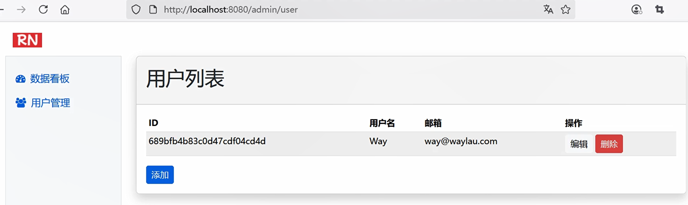

## 4.3 实战：快速掌握Spring Data MongoDB企业级应用开发

我们在 `spring-mvc-thymeleaf` 项目的基础上复制出一个新项目`spring-data-mongodb`，来实现关于 Spring Data MongoDB 企业级实战应用的功能演示。


### 如何使用 Spring Data JPA

在 `pom.xml` 中添加必要的依赖，包括Spring Data JPA、H2数据库等：


```xml
<dependencies>
    <!-- Spring Data MongoDB -->
    <dependency>
        <groupId>org.springframework.data</groupId>
        <artifactId>spring-data-mongodb</artifactId>
        <version>4.5.2</version>
    </dependency>
     <!-- MongoDB Driver -->
    <dependency>
        <groupId>org.mongodb</groupId>
        <artifactId>mongodb-driver-sync</artifactId>
      <version>5.5.1</version>
    </dependency>

    <!-- ...为节约篇幅，此处省略非核心内容 -->
</dependencies>
```


### 定义实体


修改 User 类，将其修改成为实体：

* User 类上增加了`@Document`注解，以标识其为MongoDB的文档。该类映射的文档名为“users”；
* `@Id`标识id字段为主键，注意它与JPA里面的`@Id`是不同的注解。其次，id类型只能是String，不能是Long。


```java
package com.waylau.spring.mvc.model;

import org.springframework.data.annotation.Id;
import org.springframework.data.mongodb.core.mapping.Document;

/**
 * User 用户模型
 *
 * @author <a href="https://waylau.com">Way Lau</a>
 * @version 2025/08/11
 **/
// 定义MongoDB的集合
@Document(collection = "users")
public class User {
    // 主键
    @Id
    // 实体唯一标识
    private String id;
    private String name;
    private String email;

    public User() {
    }

    public User(String id, String name, String email) {
        this.id = id;
        this.name = name;
        this.email = email;
    }

    // Getter、Setter方法
    public String getName() {
        return name;
    }

    public void setName(String name) {
        this.name = name;
    }

    public String getId() {
        return id;
    }

    public void setId(String id) {
        this.id = id;
    }

    public String getEmail() {
        return email;
    }

    public void setEmail(String email) {
        this.email = email;
    }
}
```

### 新增资源库

新增用户资源库的接口，继承自`CrudRepository`：

```java
package com.waylau.spring.mvc.repository;

import com.waylau.spring.mvc.model.User;
import org.springframework.data.repository.CrudRepository;

/**
 * UserRepository 用户资源库
 *
 * @author <a href="https://waylau.com">Way Lau</a>
 * @version 2025/08/13
 **/
public interface UserRepository extends CrudRepository<User, String> {
}
```
 
由于，Spring Data MongoDB 已经帮我们做了实现，所以，我们自己不需要做任何实现，甚至都无需在 UserRepository 里面定义任何的方法。


### 修改控制器

AdminController也要做一些调整，将原来用户存储ConcurrentHashMap实现的方法，全部换成 JPA 的默认实现：

```java
package com.waylau.spring.mvc.controller;

import com.waylau.spring.mvc.model.User;
import com.waylau.spring.mvc.repository.UserRepository;
import org.springframework.beans.factory.annotation.Autowired;
import org.springframework.http.ResponseEntity;
import org.springframework.stereotype.Controller;
import org.springframework.ui.Model;
import org.springframework.web.bind.annotation.*;

import java.util.*;
import java.util.concurrent.ConcurrentHashMap;
import java.util.concurrent.atomic.AtomicLong;

/**
 * AdminController 后台管理控制器
 *
 * @author <a href="https://waylau.com">Way Lau</a>
 * @version 2025/08/10
 **/
@Controller
@RequestMapping("/admin")
public class AdminController {

    // 用户存储
    /*private final ConcurrentHashMap<Long, User> users = new ConcurrentHashMap<>();
    private final AtomicLong counter = new AtomicLong(1);

    public AdminController() {
        // 初始化测试数据
        Long id1 = counter.getAndIncrement();
        users.put(id1, new User(id1, "John", "john@waylau.com"));

        Long id2 = counter.getAndIncrement();
        users.put(id2, new User(id2, "Smith", "smith@waylau.com"));
    }*/

    @Autowired
    private UserRepository userRepository;

    @GetMapping()
    public String goToAdmin() {
        return "redirect:/admin/dashboard";
    }

    @GetMapping("/dashboard")
    public String dashboard(Model model) {
        // 统计数据
        long userCount = generateRandomInt(1, 100);
        long noteCount = generateRandomInt(1, 100);
        long commentCount = generateRandomInt(1, 100);

        model.addAttribute("userCount", userCount);
        model.addAttribute("noteCount", noteCount);
        model.addAttribute("commentCount", commentCount);

        model.addAttribute("contentFragment", "admin-dashboard");

        return "admin";
    }

    private int generateRandomInt(int min, int max) {
        return (int) (Math.random() * (max - min)) + min;
    }

    @GetMapping("/user")
    public String getUsers(Model model) {
        /*model.addAttribute("users", new ArrayList<>(users.values()));*/
        model.addAttribute("users", userRepository.findAll());
        model.addAttribute("contentFragment", "admin-user");

        return "admin";
    }

    @GetMapping("/user/{id}/edit")
    /*public String editUser(@PathVariable(name = "id", required = true) Long id, Model model) {*/
    public String editUser(@PathVariable(name = "id", required = true) String id, Model model) {
        /*User user = users.get(id);*/

        Optional<User> userOptional = userRepository.findById(id);
        User user = userOptional.get();

        model.addAttribute("user", user);
        model.addAttribute("contentFragment", "admin-user-edit");

        return "admin";
    }

    @PostMapping("/user")
    public String updateUser(@ModelAttribute User user) {
        /*if (user.getId() == null) {
            Long id = counter.getAndIncrement();
            user.setId(id);
        }

        users.put(user.getId(), user);*/

        // 只有User的id是null时，才能被MongoDB自动生成_id
        // 需要处理前端传过来的“”，统一处理成null
        if ("".equals(user.getId())) {
            user.setId(null);
        }

        userRepository.save(user);

        return "redirect:/admin/user";
    }

    @DeleteMapping("/user/{id}")
    /*public ResponseEntity<?> deleteUser(@PathVariable(name = "id", required = true) Long id) {*/
    public ResponseEntity<?> deleteUser(@PathVariable(name = "id", required = true) String id) {
        /*users.remove(id);*/

        userRepository.deleteById(id);

        Map<String, String> response = new HashMap<>();
        response.put("message", "用户删除成功");
        response.put("redirectUrl", "/admin/user");

        return ResponseEntity.ok(response);
    }

    @GetMapping("/user/add")
    public String addUser(Model model) {
        model.addAttribute("user", new User());
        model.addAttribute("contentFragment", "admin-user-edit");

        return "admin";
    }

}
```


### 新增配置类


新增配置类`src/main/java/com/waylau/spring/mvc/config/MongoDBConfig.java`，配置内容如下：

```java
package com.waylau.spring.mvc.config;

import com.mongodb.client.MongoClient;
import com.mongodb.client.MongoClients;
import org.springframework.context.annotation.Bean;
import org.springframework.context.annotation.Configuration;
import org.springframework.data.mongodb.config.AbstractMongoClientConfiguration;
import org.springframework.data.mongodb.repository.config.EnableMongoRepositories;

/**
 * MongoDBConfig MongoDB配置
 *
 * @author <a href="https://waylau.com">Way Lau</a>
 * @version 2025/08/13
 **/
@Configuration
// 启用MongoDB资源库
@EnableMongoRepositories(basePackages = "com.waylau.spring.mvc.repository")
public class MongoDBConfig extends AbstractMongoClientConfiguration {
    @Override
    protected String getDatabaseName() {
        return "springdata";
    }

    @Override
    @Bean
    public MongoClient mongoClient() {
        // 连接MongoDB服务器（默认是在localhost:27017）
        return MongoClients.create("mongodb://localhost:27017");
    }
}
```

在配置文件中，我们启用了MongoDB资源库功能，定义了数据库名称、MongoClient等。


### 运行查看效果


首先，确保MongoDB服务器已启动。启动命令参考如下：

```

D:\dev\database\mongodb-win32-x86_64-windows-8.0.11\bin\mongod.exe --config "D:\dev\database\mongodb-win32-x86_64-windows-8.0.11\bin\mongod.cfg"
```

其中，mongod.cfg为MongoDB服务器的配置文件。


其次，启动项目，浏览器访问  <http://localhost:8080/admin/user> 可以看到项目的运行效果。图4-3是访问用户管理界面效果。


图4-4是添加用户后的界面效果。





