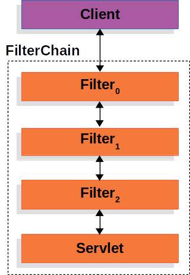
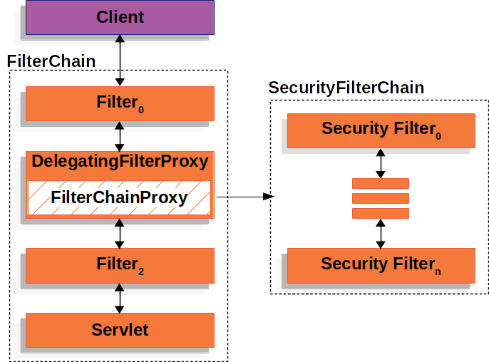
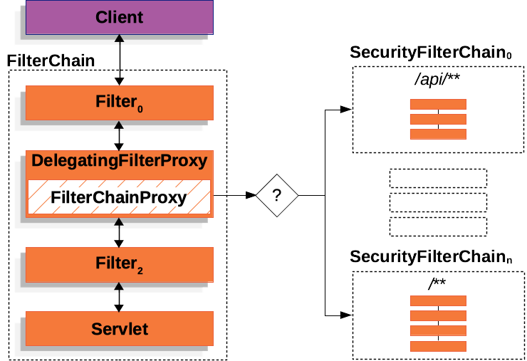

## 4.1 Spring Security高层架构深度解析

本节讨论基于Servlet的应用程序中Spring Security的高层架构。


### 过滤器回顾
Spring Security对Servlet的支持基于Servlet过滤器，因此，首先了解过滤器的一般作用会很有帮助。下图展示了单个HTTP请求的处理器的典型分层结构。





客户端向应用程序发送请求，容器基于请求URI的路径创建一个`FilterChain`，其中包含应该处理`HttpServletRequest`的`Filter`实例和`Servlet`。在Spring MVC应用程序中，该`Servlet`是`DispatcherServlet`的实例。最多只能有一个`Servlet`处理单个`HttpServletRequest`和`HttpServletResponse`。但是，可以使用多个`Filter`来实现以下功能：
- 阻止下游的`Filter`实例或`Servlet`被调用。在这种情况下，`Filter`通常会写入`HttpServletResponse`。
- 修改下游`Filter`实例和`Servlet`所使用的`HttpServletRequest`或`HttpServletResponse`。

`Filter`的强大之处在于传递给它的`FilterChain`。

#### FilterChain使用示例


```java
@Override
public void doFilter(ServletRequest request, ServletResponse response,
		FilterChain chain) throws IOException, ServletException {
	// 在应用程序的其他部分处理之前执行某些操作
	chain.doFilter(request, response); // 调用应用程序的其他部分
	// 在应用程序的其他部分处理之后执行某些操作
}
```

由于一个`Filter`仅影响下游的`Filter`实例和`Servlet`，因此每个`Filter`的调用顺序极为重要。

### DelegatingFilterProxy

Spring提供了一个名为`DelegatingFilterProxy`的`Filter`实现，它允许在Servlet容器的生命周期和Spring的`ApplicationContext`之间架起桥梁。Servlet容器允许通过其自身的标准注册`Filter`实例，但它并不知道Spring定义的Bean。你可以通过标准的Servlet容器机制注册`DelegatingFilterProxy`，但将所有工作委托给实现了`Filter`的Spring Bean。

下图展示了`DelegatingFilterProxy`在`Filter`实例和`FilterChain`中的位置。


`DelegatingFilterProxy`从`ApplicationContext`中查找Bean Filter0，然后调用Bean Filter0。下面的代码展示了`DelegatingFilterProxy`的伪代码：

#### DelegatingFilterProxy伪代码

```java
public void doFilter(ServletRequest request, ServletResponse response, FilterChain chain) {
	Filter delegate = getFilterBean(someBeanName);  // (1)
	delegate.doFilter(request, response);  // (2)
}
```


* (1)惰性获取注册为Spring Bean的Filter。在DelegatingFilterProxy的示例中，`delegate`是Bean Filter0的实例。 
* (2)将工作委托给Spring Bean。 

`DelegatingFilterProxy`的另一个好处是，它允许延迟查找`Filter` bean实例。这一点很重要，因为容器需要在启动之前注册`Filter`实例。然而，Spring通常使用`ContextLoaderListener`来加载Spring Bean，而这要在需要注册`Filter`实例之后才会进行。

### FilterChainProxy

Spring Security对Servlet的支持包含在`FilterChainProxy`中。`FilterChainProxy`是Spring Security提供的一个特殊`Filter`，它允许通过`SecurityFilterChain`委托给多个`Filter`实例。由于`FilterChainProxy`是一个Bean，它通常被包装在DelegatingFilterProxy中。

下图展示了`FilterChainProxy`的作用。


### SecurityFilterChain

`SecurityFilterChain`被FilterChainProxy用来确定对于当前请求应该调用哪些Spring Security`Filter`实例。

下图展示了`SecurityFilterChain`的作用。




`SecurityFilterChain`中的安全过滤器通常是Bean，但它们是注册到`FilterChainProxy`而不是DelegatingFilterProxy。与直接注册到Servlet容器或DelegatingFilterProxy相比，`FilterChainProxy`提供了许多优势。首先，它为Spring Security的所有Servlet支持提供了一个起点。因此，如果你尝试排查Spring Security的Servlet支持问题，在`FilterChainProxy`中添加一个调试点会是一个很好的开始。

其次，由于`FilterChainProxy`是Spring Security使用的核心，它可以执行一些必不可少的任务。例如，它会清除`SecurityContext`以避免内存泄漏。它还会应用Spring Security的`HttpFirewall`来保护应用程序免受某些类型的攻击。

此外，在确定何时应该调用`SecurityFilterChain`方面，它提供了更大的灵活性。在Servlet容器中，`Filter`实例仅根据URL被调用。然而，`FilterChainProxy`可以通过使用`RequestMatcher`接口，根据`HttpServletRequest`中的任何内容来确定是否调用。

下图展示了多个`SecurityFilterChain`实例：





在“多个SecurityFilterChain”图中，`FilterChainProxy`决定应该使用哪个`SecurityFilterChain`。只有第一个匹配的`SecurityFilterChain`会被调用。如果请求的URL是`/api/messages/`，它首先会与`SecurityFilterChain0`的`/api/**`模式匹配，因此只有`SecurityFilterChain0`会被调用，即使它也与`SecurityFilterChainn`匹配。如果请求的URL是`/messages/`，它与`SecurityFilterChain0`的`/api/**`模式不匹配，因此`FilterChainProxy`会继续尝试每个`SecurityFilterChain`。假设没有其他`SecurityFilterChain`实例匹配，则会调用`SecurityFilterChainn`。

注意，`SecurityFilterChain0`仅配置了三个安全`Filter`实例。而`SecurityFilterChainn`配置了四个安全`Filter`实例。需要注意的是，每个`SecurityFilterChain`都可以是独特的，并且可以独立配置。实际上，如果应用程序希望Spring Security忽略某些请求，`SecurityFilterChain`可以没有安全`Filter`实例。

### 安全过滤器
安全过滤器通过SecurityFilterChain API插入到FilterChainProxy中。这些过滤器可用于多种不同的目的，如漏洞防护、认证、授权等。过滤器按照特定的顺序执行，以确保它们在正确的时间被调用，例如，执行认证的`Filter`应该在执行授权的`Filter`之前被调用。通常情况下，没有必要了解Spring Security的`Filter`的顺序。但是，在某些时候，了解顺序是有益的，如果你想知道它们的顺序，可以查看`FilterOrderRegistration`代码。

这些安全过滤器通常使用`HttpSecurity`实例来声明。为了举例说明上面的内容，让我们考虑以下安全配置：


```java
@Configuration
@EnableWebSecurity
public class SecurityConfig {

    @Bean
    public SecurityFilterChain filterChain(HttpSecurity http) throws Exception {
        http
            .csrf(Customizer.withDefaults())
            .httpBasic(Customizer.withDefaults())
            .formLogin(Customizer.withDefaults())
            .authorizeHttpRequests(authorize -> authorize
                .anyRequest().authenticated()
            );

        return http.build();
    }

}
```


上述配置将产生以下`Filter`顺序：

| 过滤器 | 由以下方式添加 |
| ---- | ---- |
| CsrfFilter | `HttpSecurity#csrf` |
| BasicAuthenticationFilter | `HttpSecurity#httpBasic` |
| UsernamePasswordAuthenticationFilter | `HttpSecurity#formLogin` |
| AuthorizationFilter | `HttpSecurity#authorizeHttpRequests` |

首先，调用`CsrfFilter`以防止CSRF攻击。

其次，调用认证过滤器来认证请求。

第三，调用`AuthorizationFilter`来授权请求。

可能还有其他未在上面列出的`Filter`实例。如果你想查看针对特定请求调用的过滤器列表，可以将它们打印出来。

#### 打印安全过滤器
通常，查看针对特定请求调用的安全`Filter`列表是很有用的。例如，你想确保你添加的过滤器在安全过滤器列表中。

过滤器列表在应用程序启动时以DEBUG级别打印，因此你可以在控制台输出中看到类似以下的内容：

```
2025-08-14T08:55:22.321-03:00  DEBUG 76975 --- [           main] o.s.s.web.DefaultSecurityFilterChain     : Will secure any request with [ DisableEncodeUrlFilter, WebAsyncManagerIntegrationFilter, SecurityContextHolderFilter, HeaderWriterFilter, CsrfFilter, LogoutFilter, UsernamePasswordAuthenticationFilter, DefaultLoginPageGeneratingFilter, DefaultLogoutPageGeneratingFilter, BasicAuthenticationFilter, RequestCacheAwareFilter, SecurityContextHolderAwareRequestFilter, AnonymousAuthenticationFilter, ExceptionTranslationFilter, AuthorizationFilter]
```

这将让你很好地了解每个过滤器链配置的安全过滤器。

但这还不是全部，你还可以配置应用程序，为每个请求打印每个单独过滤器的调用情况。这有助于查看你添加的过滤器是否针对特定请求被调用，或者检查异常来自何处。要做到这一点，你可以配置应用程序来记录安全事件。

### 向过滤器链添加过滤器
大多数情况下，默认的安全过滤器足以为你的应用程序提供安全性。但是，有时你可能希望向SecurityFilterChain添加自定义的`Filter`。

`HttpSecurity`提供了三种添加过滤器的方法：
- `#addFilterBefore(Filter, Class<?>)` 在另一个过滤器之前添加你的过滤器
- `#addFilterAfter(Filter, Class<?>)` 在另一个过滤器之后添加你的过滤器
- `#addFilterAt(Filter, Class<?>)` 用你的过滤器替换另一个过滤器

#### 添加自定义过滤器
如果你要创建自己的过滤器，你需要确定它在过滤器链中的位置。请查看过滤器链中发生的以下关键事件：
- 从会话中加载`SecurityContext`
- 保护请求免受常见漏洞攻击；安全头、CORS、CSRF
- 认证请求
- 授权请求

考虑你需要哪些事件已经发生来确定你的过滤器的位置。以下是一个经验法则：

| 如果你的过滤器是 | 那么将其放置在之后 | 因为这些事件已经发生 |
| ---- | ---- | ---- |
| 漏洞防护过滤器 | SecurityContextHolderFilter | 1 |
| 认证过滤器 | LogoutFilter | 1、2 |
| 授权过滤器 | AnonymousAuthenticationFilter | 1、2、3 |

最常见的是，应用程序添加自定义认证。这意味着它们应该被放置在`LogoutFilter`之后。

例如，假设你想添加一个`Filter`，它获取租户ID头并检查当前用户是否有权访问该租户。

首先，让我们创建这个`Filter`：

```java
import java.io.IOException;
import jakarta.servlet.Filter;
import jakarta.servlet.FilterChain;
import jakarta.servlet.ServletException;
import jakarta.servlet.ServletRequest;
import jakarta.servlet.ServletResponse;
import jakarta.servlet.http.HttpServletRequest;
import jakarta.servlet.http.HttpServletResponse;

import org.springframework.security.access.AccessDeniedException;

public class TenantFilter implements Filter {

    @Override
    public void doFilter(ServletRequest servletRequest, ServletResponse servletResponse, FilterChain filterChain) throws IOException, ServletException {
        HttpServletRequest request = (HttpServletRequest) servletRequest;
        HttpServletResponse response = (HttpServletResponse) servletResponse;

        String tenantId = request.getHeader("X-Tenant-Id");  // (1)
        boolean hasAccess = isUserAllowed(tenantId);  // (2)
        if (hasAccess) {
            filterChain.doFilter(request, response);  // (3)
            return;
        }
        throw new AccessDeniedException("Access denied");  // (4)
    }

}
```

上面的示例代码做了以下事情：

* (1)从请求头中获取租户ID。
* (2)检查当前用户是否有权访问该租户ID。 
* (3)如果用户有权限，则调用链中的其余过滤器。
* (4)如果用户没有权限，则抛出`AccessDeniedException`。

你可以扩展OncePerRequestFilter而不是实现`Filter`，OncePerRequestFilter是仅为每个请求调用一次的过滤器的基类，并提供了带有`HttpServletRequest`和`HttpServletResponse`参数的`doFilterInternal`方法。

现在，你需要将过滤器添加到SecurityFilterChain。前面的描述已经给了我们关于在哪里添加过滤器的线索，因为我们需要知道当前用户，所以需要将它添加在认证过滤器之后。

根据经验法则，将其添加在`AnonymousAuthenticationFilter`之后，它是链中最后一个认证过滤器，如下所示：


```java
@Bean
SecurityFilterChain filterChain(HttpSecurity http) throws Exception {
    http
        // ...
        .addFilterAfter(new TenantFilter(), AnonymousAuthenticationFilter.class);  // (1)
    return http.build();
}
```


1. 使用`HttpSecurity#addFilterAfter`在`AnonymousAuthenticationFilter`之后添加`TenantFilter`。

通过将过滤器添加在`AnonymousAuthenticationFilter`之后，我们确保`TenantFilter`在认证过滤器之后被调用。

这样，`TenantFilter`将在过滤器链中被调用，并检查当前用户是否有权访问租户ID。

#### 将过滤器声明为Bean
当你将`Filter`声明为Spring bean时，无论是通过用`@Component`注解它，还是在你的配置中将它声明为bean，Spring Boot都会自动将它注册到嵌入式容器。这可能导致过滤器被调用两次，一次由容器调用，一次由Spring Security调用，而且顺序不同。

因此，过滤器通常不是Spring bean。

但是，如果你的过滤器需要是Spring bean（例如，为了利用依赖注入），你可以通过声明一个`FilterRegistrationBean` bean并将其`enabled`属性设置为`false`，来告诉Spring Boot不要将它注册到容器：

```java
@Bean
public FilterRegistrationBean<TenantFilter> tenantFilterRegistration(TenantFilter filter) {
    FilterRegistrationBean<TenantFilter> registration = new FilterRegistrationBean<>(filter);
    registration.setEnabled(false);
    return registration;
}
```

这使得只有`HttpSecurity`会添加它。

### 自定义Spring Security过滤器
通常，你可以使用过滤器的DSL方法来配置Spring Security的过滤器。例如，添加`BasicAuthenticationFilter`的最简单方法是让DSL来做：


```java
@Bean
SecurityFilterChain filterChain(HttpSecurity http) throws Exception {
	http
		.httpBasic(Customizer.withDefaults())
        // ...

	return http.build();
}
```


然而，如果你想自己构造一个Spring Security过滤器，你可以使用`addFilterAt`在DSL中指定它，如下所示：


```java
@Bean
SecurityFilterChain filterChain(HttpSecurity http) throws Exception {
	BasicAuthenticationFilter basic = new BasicAuthenticationFilter();
	// ... 配置

	http
		// ...
		.addFilterAt(basic, BasicAuthenticationFilter.class);

	return http.build();
}
```


注意，如果该过滤器已经被添加，Spring Security将抛出异常。例如，调用`HttpSecurity#httpBasic`会为你添加一个`BasicAuthenticationFilter`。因此，以下配置会失败，因为有两个调用都试图添加`BasicAuthenticationFilter`：


```java
@Bean
SecurityFilterChain filterChain(HttpSecurity http) throws Exception {
	BasicAuthenticationFilter basic = new BasicAuthenticationFilter();
	// ... 配置

	http
		.httpBasic(Customizer.withDefaults())
		// ... 哦不！BasicAuthenticationFilter被添加了两次！
		.addFilterAt(basic, BasicAuthenticationFilter.class);

	return http.build();
}
```

在本例中，删除对httpBasic的调用，因为您正在自己构造BasicAuthenticationFilter。