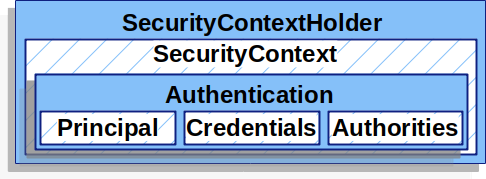
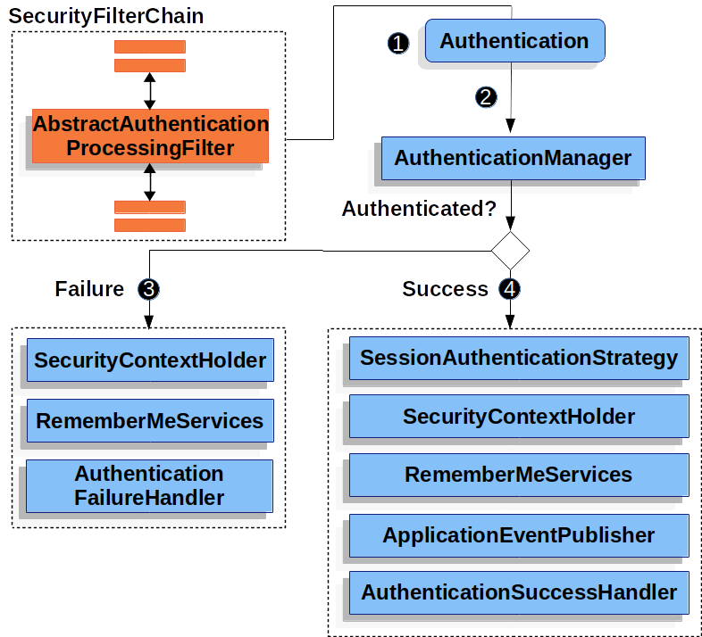

## 4.2 Spring Security认证架构深度解析

本节主要讨论 Spring Security 在 Servlet 认证中使用的主要架构组件。


- **SecurityContextHolder**：Spring Security 用于存储已认证用户详细信息的地方。
- **SecurityContext**：从 `SecurityContextHolder` 中获取，包含当前已认证用户的 `Authentication`。
- **Authentication**：既可以作为 `AuthenticationManager` 的输入，提供用户用于认证的凭据，也可以是来自 `SecurityContext` 的当前用户。
- **GrantedAuthority**：授予 `Authentication` 中主体的权限（即角色、范围等）。
- **AuthenticationManager**：定义 Spring Security 的过滤器如何执行认证的 API。
- **ProviderManager**：`AuthenticationManager` 最常见的实现。
- **AuthenticationProvider**：被 `ProviderManager` 用于执行特定类型的认证。
- **使用 `AuthenticationEntryPoint` 请求凭据**：用于从客户端请求凭据（例如，重定向到登录页面、发送 `WWW-Authenticate` 响应等）。
- **AbstractAuthenticationProcessingFilter**：用于认证的基础 `Filter`。这也很好地展示了认证的高层流程以及各组件如何协同工作。


### SecurityContextHolder
Spring Security 认证模型的核心是 `SecurityContextHolder`，它包含了 SecurityContext。下图展示了`SecurityContextHolder`、`SecurityContext`、`Authentication`、`Principal`、`Credentials`、`Authorities` 之间的关联关系。





`SecurityContextHolder` 是 Spring Security 存储已认证用户详细信息的地方。Spring Security 并不关心 `SecurityContextHolder` 是如何被填充的。如果它包含值，就会将其用作当前已认证的用户。

指示用户已认证的最简单方法是直接设置 `SecurityContextHolder`：


```java
SecurityContext context = SecurityContextHolder.createEmptyContext();  // (1)
Authentication authentication =
    new TestingAuthenticationToken("username", "password", "ROLE_USER");  // (2)
context.setAuthentication(authentication);
SecurityContextHolder.setContext(context);  // (3)
```

* (1)我们首先创建一个空的 `SecurityContext`。您应该创建一个新的 `SecurityContext` 实例，而不是使用 `SecurityContextHolder.getContext().setAuthentication(authentication)`，以避免多线程间的竞争条件。 
* (2)接下来，我们创建一个新的 `Authentication` 对象。Spring Security 并不关心 `SecurityContext` 上设置的是哪种 `Authentication` 实现。这里，我们使用 `TestingAuthenticationToken`，因为它非常简单。更常见的生产场景是 `UsernamePasswordAuthenticationToken(userDetails, password, authorities)`。
* (3)最后，我们将 `SecurityContext` 设置到 `SecurityContextHolder` 上。Spring Security 使用此信息进行授权。


要获取已认证主体的信息，可以访问 `SecurityContextHolder`：


```java
SecurityContext context = SecurityContextHolder.getContext();
Authentication authentication = context.getAuthentication();
String username = authentication.getName();
Object principal = authentication.getPrincipal();
Collection<? extends GrantedAuthority> authorities = authentication.getAuthorities();
```


默认情况下，`SecurityContextHolder` 使用 `ThreadLocal` 来存储这些细节，这意味着 `SecurityContext` 对于同一线程中的方法始终可用，即使 `SecurityContext` 没有作为参数显式地在这些方法之间传递。如果您注意在当前主体的请求处理完毕后清理线程，以这种方式使用 `ThreadLocal` 是相当安全的。Spring Security 的 `FilterChainProxy` 确保 `SecurityContext` 始终会被清理。

有些应用程序由于其处理线程的特定方式，并不完全适合使用 `ThreadLocal`。例如，Swing 客户端可能希望 Java 虚拟机中的所有线程都使用相同的安全上下文。您可以在启动时为 `SecurityContextHolder` 配置一个策略，以指定您希望如何存储上下文。对于独立应用程序，您可以使用 `SecurityContextHolder.MODE_GLOBAL` 策略。其他应用程序可能希望由安全线程生成的线程也承担相同的安全标识。您可以通过使用 `SecurityContextHolder.MODE_INHERITABLETHREADLOCAL` 来实现这一点。您可以通过两种方式从默认的 `SecurityContextHolder.MODE_THREADLOCAL` 更改模式：第一种是设置系统属性，第二种是调用 `SecurityContextHolder` 上的静态方法。大多数应用程序不需要从默认值更改。


### SecurityContext
`SecurityContext` 从 `SecurityContextHolder` 中获取，它包含一个 `Authentication` 对象。


### Authentication
`Authentication` 接口在 Spring Security 中有两个主要用途：
1. 作为 `AuthenticationManager` 的输入，提供用户为进行认证而提供的凭据。在这种情况下，`isAuthenticated()` 返回 `false`。
2. 表示当前已认证的用户。您可以从 `SecurityContext` 中获取当前的 `Authentication`。

`Authentication` 包含：
- `principal`：标识用户。当使用用户名/密码进行认证时，这通常是 `UserDetails` 的实例。
- `credentials`：通常是密码。在许多情况下，用户认证后会清除此信息，以确保其不会被泄露。
- `authorities`：`GrantedAuthority` 实例是授予用户的高级权限。例如角色和范围。


### GrantedAuthority
`GrantedAuthority` 实例是授予用户的高级权限，例如角色和范围。

您可以从 `Authentication.getAuthorities()` 方法获取 `GrantedAuthority` 实例，该方法提供 `GrantedAuthority` 对象的集合。显然，`GrantedAuthority` 是授予主体的权限。此类权限通常是“角色”，例如 `ROLE_ADMINISTRATOR` 或 `ROLE_HR_SUPERVISOR`。这些角色稍后会配置用于 Web 授权、方法授权和域对象授权。Spring Security 的其他部分会解释这些权限并期望它们存在。当使用基于用户名/密码的认证时，`GrantedAuthority` 实例通常由 `UserDetailsService` 加载。

通常，`GrantedAuthority` 对象是应用程序范围的权限，它们不特定于给定的域对象。因此，您不太可能有一个 `GrantedAuthority` 来表示对编号为 54 的 `Employee` 对象的权限，因为如果有数千个这样的权限，您很快就会耗尽内存（或者至少会导致应用程序在认证用户时花费很长时间）。当然，Spring Security 明确设计用于处理这一常见需求，但您应该使用该项目的域对象安全功能来实现此目的。


### AuthenticationManager
`AuthenticationManager` 是定义 Spring Security 的过滤器如何执行认证的 API。返回的 `Authentication` 随后由调用 `AuthenticationManager` 的控制器（即 Spring Security 的 `Filters` 实例）设置到 `SecurityContextHolder` 上。如果您不与 Spring Security 的 `Filters` 实例集成，您可以直接设置 `SecurityContextHolder`，而不需要使用 `AuthenticationManager`。

虽然 `AuthenticationManager` 的实现可以是任何形式，但最常见的实现是 `ProviderManager`。


### ProviderManager
`ProviderManager` 是 `AuthenticationManager` 最常用的实现。`ProviderManager` 委托给 `AuthenticationProvider` 实例的列表。每个 `AuthenticationProvider` 都有机会表明认证应该成功、失败，或者表明它无法做出决定并允许下游的 `AuthenticationProvider` 来决定。如果配置的 `AuthenticationProvider` 实例都不能进行认证，则认证失败，并抛出 `ProviderNotFoundException`，这是一种特殊的 `AuthenticationException`，表明 `ProviderManager` 未配置为支持传入的 `Authentication` 类型。


在实际应用中，每个 `AuthenticationProvider` 都知道如何执行特定类型的认证。例如，一个 `AuthenticationProvider` 可能能够验证用户名/密码，而另一个可能能够认证 SAML 断言。这使得每个 `AuthenticationProvider` 可以执行非常特定类型的认证，同时支持多种认证类型，并且只暴露一个 `AuthenticationManager` bean。

`ProviderManager` 还允许配置一个可选的父 `AuthenticationManager`，如果没有 `AuthenticationProvider` 能够进行认证，就会咨询该父 `AuthenticationManager`。父级可以是任何类型的 `AuthenticationManager`，但它通常是 `ProviderManager` 的实例。


实际上，多个 `ProviderManager` 实例可能共享同一个父 `AuthenticationManager`。这在存在多个 `SecurityFilterChain` 实例的场景中比较常见，这些实例有一些共同的认证（共享的父 `AuthenticationManager`），但也有不同的认证机制（不同的 `ProviderManager` 实例）。


默认情况下，`ProviderManager` 会尝试从成功认证请求返回的 `Authentication` 对象中清除任何敏感的凭据信息。这可以防止密码等信息在 `HttpSession` 中保留的时间超过必要。

`CredentialsContainer` 接口在认证过程中起着关键作用。它允许在不再需要凭据信息时擦除它们，从而通过确保敏感数据不会保留超过必要的时间来增强安全性。

当您使用用户对象的缓存时（例如，为了提高无状态应用程序的性能），这可能会导致问题。如果 `Authentication` 包含对缓存中对象（例如 `UserDetails` 实例）的引用，并且该对象的凭据被移除，那么就无法再根据缓存的值进行认证了。如果您使用缓存，需要考虑到这一点。一个明显的解决方案是首先复制对象，要么在缓存实现中，要么在创建返回的 `Authentication` 对象的 `AuthenticationProvider` 中。或者，您可以禁用 `ProviderManager` 上的 `eraseCredentialsAfterAuthentication` 属性。请参阅 `ProviderManager` 类的 Javadoc。


### AuthenticationProvider
您可以将多个 `AuthenticationProvider` 实例注入到 `ProviderManager` 中。每个 `AuthenticationProvider` 执行特定类型的认证。例如，`DaoAuthenticationProvider` 支持基于用户名/密码的认证，而 `JwtAuthenticationProvider` 支持认证 JWT 令牌。


### 使用 `AuthenticationEntryPoint` 请求凭据
`AuthenticationEntryPoint` 用于发送一个 HTTP 响应，以从客户端请求凭据。

有时，客户端会主动包含凭据（例如用户名和密码）来请求资源。在这些情况下，Spring Security 不需要提供从客户端请求凭据的 HTTP 响应，因为凭据已经包含在内了。

在其他情况下，客户端对其无权访问的资源发出未认证的请求。在这种情况下，`AuthenticationEntryPoint` 的实现会被用于从客户端请求凭据。`AuthenticationEntryPoint` 实现可能会执行重定向到登录页面、响应 `WWW-Authenticate` 头或采取其他操作。


### AbstractAuthenticationProcessingFilter
`AbstractAuthenticationProcessingFilter` 用作认证用户凭据的基础 `Filter`。在凭据能够被认证之前，Spring Security 通常会使用 `AuthenticationEntryPoint` 来请求凭据。

接下来，`AbstractAuthenticationProcessingFilter` 可以认证提交给它的任何认证请求。




1. 当用户提交其凭据时，`AbstractAuthenticationProcessingFilter` 从 `HttpServletRequest` 创建一个要认证的 `Authentication`。创建的 `Authentication` 类型取决于 `AbstractAuthenticationProcessingFilter` 的子类。例如，`UsernamePasswordAuthenticationFilter` 从 `HttpServletRequest` 中提交的用户名和密码创建一个 `UsernamePasswordAuthenticationToken`。
2. 接下来，`Authentication` 被传递到 `AuthenticationManager` 进行认证。
3. 如果认证失败：
     - `SecurityContextHolder` 被清空。
     - 调用 `RememberMeServices.loginFail`。如果未配置“记住我”功能，这将是一个空操作。请参阅 rememberme 包。
     - 调用 `AuthenticationFailureHandler`。请参阅 `AuthenticationFailureHandler` 接口。
4. 如果认证成功：
     - 通知 `SessionAuthenticationStrategy` 有新的登录。请参阅 `SessionAuthenticationStrategy` 接口。
     - 将 `Authentication` 设置到 `SecurityContextHolder` 上。之后，如果您需要保存 `SecurityContext` 以便在未来的请求中自动设置它，必须显式调用 `SecurityContextRepository#saveContext`。请参阅 `SecurityContextHolderFilter` 类。
     - 调用 `RememberMeServices.loginSuccess`。如果未配置“记住我”功能，这将是一个空操作。请参阅 rememberme 包。
     - `ApplicationEventPublisher` 发布 `InteractiveAuthenticationSuccessEvent`。
     - 调用 `AuthenticationSuccessHandler`。请参阅 `AuthenticationSuccessHandler` 接口。