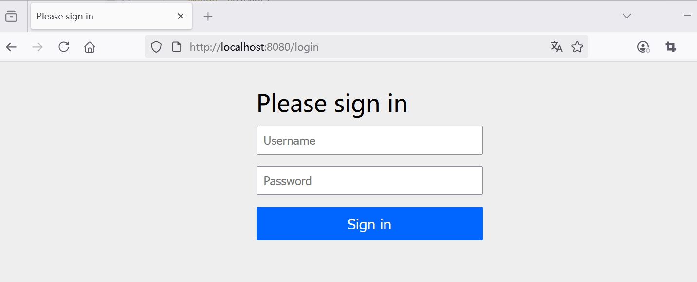
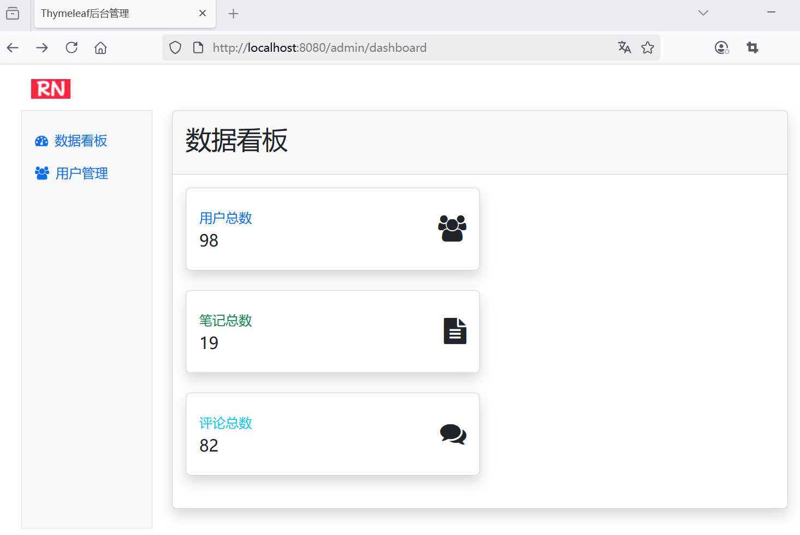
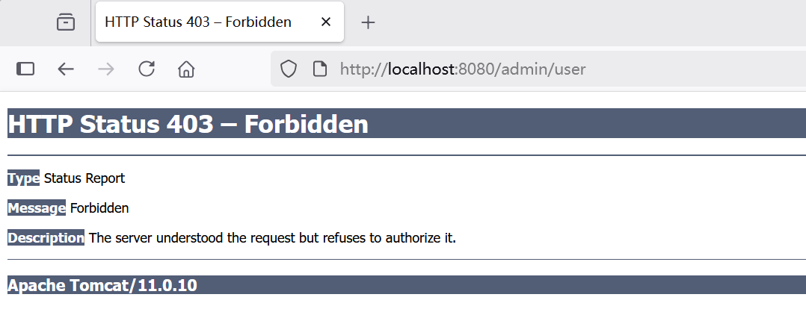
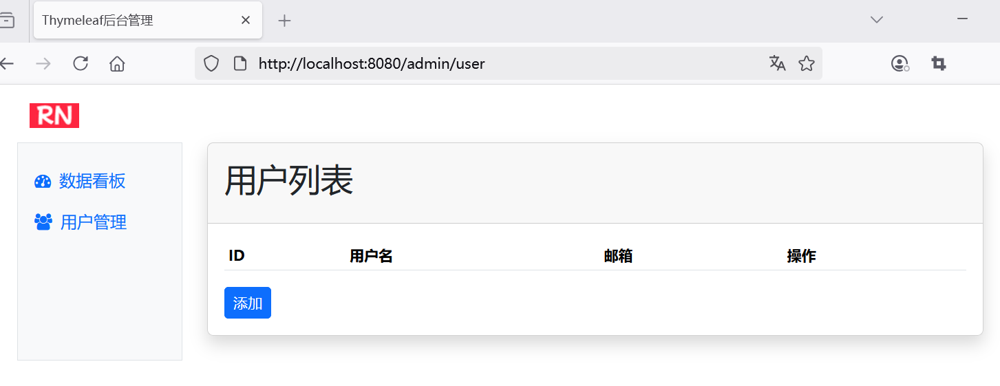

## 5.1 开箱即用，极简化Spring Security安全配置


我们在 `spring-data-jpa-h2` 项目的基础上复制出一个新项目`c`，来实现 Spring Security 功能。


### 如何使用 Spring Security

在 `pom.xml` 中添加必要的依赖，包括Spring Security等：


```xml
<dependencyManagement>
	<dependencies>
		<dependency>
			<groupId>org.springframework.security</groupId>
			<artifactId>spring-security-bom</artifactId>
			<version>6.5.2</version>
			<type>pom</type>
			<scope>import</scope>
		</dependency>

    <!-- ...为节约篇幅，此处省略非核心内容 -->
	</dependencies>
</dependencyManagement>

<dependencies>
    <!-- Spring Security -->
    <dependency>
        <groupId>org.springframework.security</groupId>
        <artifactId>spring-security-web</artifactId>
    </dependency>
    <dependency>
        <groupId>org.springframework.security</groupId>
        <artifactId>spring-security-config</artifactId>
    </dependency>

    <!-- ...为节约篇幅，此处省略非核心内容 -->
</dependencies>
```

### 创建安全配置类


```java
package com.waylau.spring.mvc.config;

import org.springframework.context.annotation.Bean;
import org.springframework.context.annotation.Configuration;
import org.springframework.security.config.Customizer;
import org.springframework.security.config.annotation.web.builders.HttpSecurity;
import org.springframework.security.config.annotation.web.configuration.EnableWebSecurity;
import org.springframework.security.core.userdetails.User;
import org.springframework.security.core.userdetails.UserDetailsService;
import org.springframework.security.provisioning.InMemoryUserDetailsManager;
import org.springframework.security.web.SecurityFilterChain;

/**
 * WebSecurityConfig 安全配置
 *
 * @author <a href="https://waylau.com">Way Lau</a>
 * @version 2025/08/14
 **/
@Configuration
// 启用Spring Security安全配置功能
@EnableWebSecurity
public class WebSecurityConfig {
    // 在内存中存储认证用户信息
    @Bean
    public UserDetailsService userDetailsService() {
        // 初始化2个认证用户信息，分别代表两个角色
        User.UserBuilder users = User.builder();
        InMemoryUserDetailsManager manager = new InMemoryUserDetailsManager();
        manager.createUser(users.username("waylau").password("{noop}123456").roles("USER").build());
        manager.createUser(users.username("admin").password("{noop}admin123").roles("ADMIN").build());

        return manager;
    }

    // 配置安全过滤器链
    @Bean
    public SecurityFilterChain securityFilterChain(HttpSecurity http) throws Exception {
        http
                .authorizeHttpRequests(authorize -> authorize
                        // 允许访问登录界面和静态资源
                        .requestMatchers("/login", "/css/**", "/js/**", "/fonts/**", "/images/**").permitAll()
                        // 允许USER和ADMIN角色访问
                        .requestMatchers("/admin", "/admin/dashborad").hasAnyRole("USER", "ADMIN")
                        // 允许ADMIN角色访问
                        .requestMatchers("/admin/user").hasRole("ADMIN")
                        // 其他请求需要认证
                        .anyRequest().authenticated()
                )
                .httpBasic(Customizer.withDefaults())
                .formLogin(Customizer.withDefaults());

        return http.build();
    }
}
```

其中密码加了`{noop}`前缀表明密码是以明文方式存储。

### WebInitializer启动器注册springSecurityFilterChain


修改WebInitializer启动器注册springSecurityFilterChain：


```java
import jakarta.servlet.FilterRegistration;
import jakarta.servlet.ServletRegistration;
import org.springframework.web.filter.DelegatingFilterProxy;

// ...为节约篇幅，此处省略非核心内容

/**
 * WebInitializer Web应用初始化
 *
 * @author <a href="https://waylau.com">Way Lau</a>
 * @version 2025/08/11
 **/
public class WebInitializer implements WebApplicationInitializer {
    @Override
    public void onStartup(ServletContext servletContext) throws ServletException {
        // ...为节约篇幅，此处省略非核心内容

        // 增加springSecurityFilterChain
        FilterRegistration.Dynamic springSecurityFilterChain =
                servletContext.addFilter("springSecurityFilterChain", new DelegatingFilterProxy("springSecurityFilterChain"));
        springSecurityFilterChain.addMappingForUrlPatterns(null, false, "/*");
    }
}
```


### 运行查看效果

启动项目，浏览器访问  <http://localhost:8080/admin> 可以看到项目会重定向到登录界面，界面效果如下图5-1所示。





先尝试使用角色为USER的账号waylau进行登录，可以看到能否正常访问数据看板功能页面，界面效果如下图5-2所示。




但如果试图访问用户管理功能页面，则会提示“Forbidden”。意味着没有权限，界面效果如下图5-3所示。





关闭浏览器，尝试使用角色为ADMIN的账号admin进行登录，可以看到能否正常访问用户管理功能页面，界面效果如下图5-4所示。




证明安全认证和授权功能已经起效了。

		
	
	