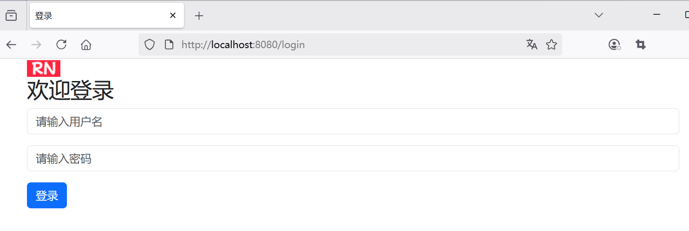
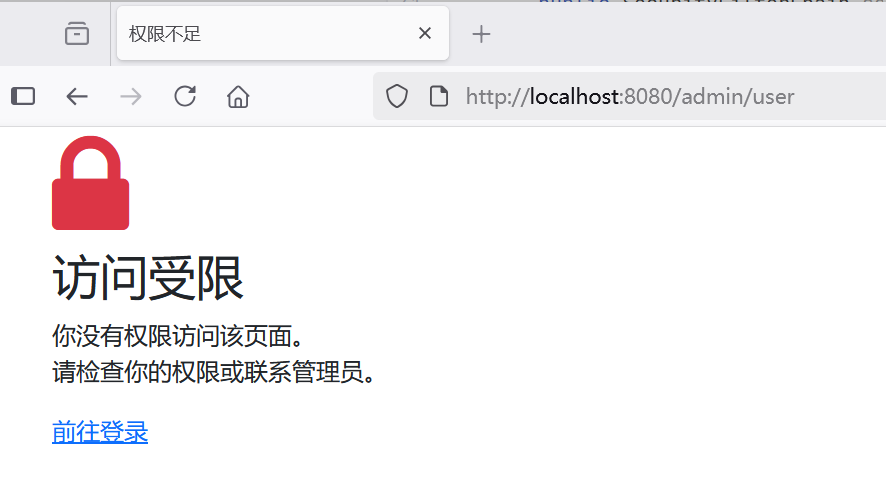
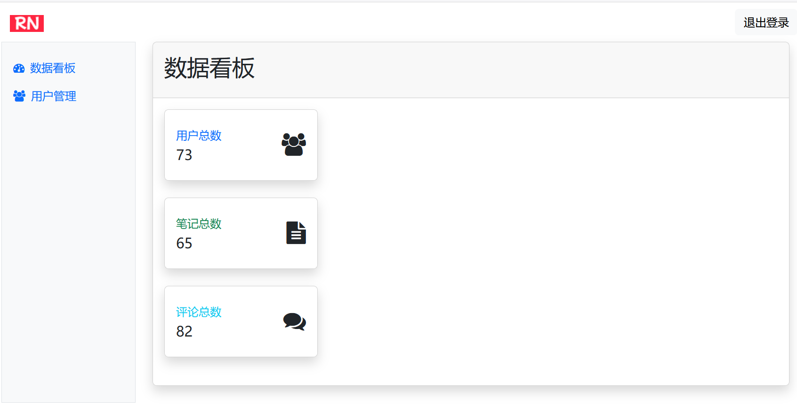
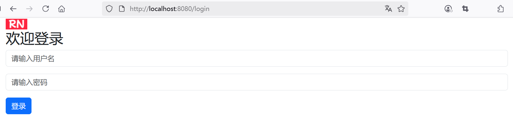

## 5.2 持续优化，构建更富人性化的安全防护体系

上一节，基本上已经实现了Spring Security安全配置，能够对访问资源进行了安全拦截和授权校验。

本节将持续优化以下内容：

* 自定义登录界面
* 如果没有权限，则提示的信息更加友好；
* 为了方便切换用户，提供注销的功能。


### 自定义登录界面


在`src/main/webapp/WEB-INF/templates`目录下新建登录界面login-form.html：


```html
<!DOCTYPE html>
<html lang="en" xmlns:th="http://www.thymeleaf.org">

<head>
    <meta charset="UTF-8">
    <meta name="viewport" content="width=device-width, initial-scale=1.0">
    <title>登录</title>
    <!-- 引入 Bootstrap CSS -->
    <link href="https://cdn.jsdelivr.net/npm/bootstrap@5.3.6/dist/css/bootstrap.min.css"
          th:href="@{/css/bootstrap.min.css}" rel="stylesheet">
    <!-- 引入 Font Awesome -->
    <link href="https://cdn.jsdelivr.net/npm/font-awesome@4.7.0/css/font-awesome.min.css"
          th:href="@{/css/font-awesome.min.css}" rel="stylesheet">
</head>
<body>
<div class="container">
    <!-- Logo -->
    

    <!-- 表单标题 -->
    <h2>欢迎登录</h2>

    <!-- 登录表单 -->
    <form action="/login" th:action="@{/login}" method="post">
        <!-- 用户名 -->
        <div class="mb-3">
            <input type="text" class="form-control" name="username" placeholder="请输入用户名" required>
        </div>

        <!-- 密码 -->
        <div class="mb-3">
            <input type="password" class="form-control" name="password" placeholder="请输入密码" required>
        </div>

        <!-- 登录按钮 -->
        <button class="btn btn-primary" type="submit">登录</button>
    </form>
</div>
<!-- Bootstrap JS -->
<script src="https://cdn.jsdelivr.net/npm/bootstrap@5.3.6/dist/js/bootstrap.bundle.min.js"
        th:src="@{/js/bootstrap.bundle.min.js}"></script>

</body>

</html>
```

登录请求接口`/login`是由Spring Security提供的。

### 登录控制器实现

新增LoginController，用于显示登录表单：

```java
package com.waylau.spring.mvc.controller;

import org.springframework.stereotype.Controller;
import org.springframework.web.bind.annotation.*;

/**
 * LoginController 登录控制器
 *
 * @author <a href="https://waylau.com">Way Lau</a>
 * @version 2025/08/13
 **/
@Controller
@RequestMapping("/login")
public class LoginController {
    /**
     * 显示登录表单
     */
    @GetMapping
    public String showLoginForm() {
        return "login-form";
    }

}
```


### 设置登录界面及重定向界面


```java
@Bean
public SecurityFilterChain securityFilterChain(HttpSecurity http) throws Exception {
    http
            // ...为节约篇幅，此处省略非核心内容

            /*.formLogin(withDefaults())*/
            .formLogin(form -> form
                    // 登录表单的页面
                    .loginPage("/login")
                    // 自定义执行登录的地址
                    .loginProcessingUrl("/login")
                    // 登录成功后跳转的页面
                    .defaultSuccessUrl("/admin")
                    .permitAll());
    return http.build();
}
```

自定义登录界面效果如下图所示。




登录成功之后，会重定向到`/admin`路径。


### 错误页面实现

下面是一个403错误页面。这个页面会在用户访问受保护资源而权限不足时显示，提供友好的提示和操作按钮。


403-error.html页面放置在`src/main/webapp/WEB-INF/templates`目录下，内容如下：


```html
<!DOCTYPE html>
<html lang="en" xmlns:th="http://www.thymeleaf.org">

<head>
    <meta charset="UTF-8">
    <meta name="viewport" content="width=device-width, initial-scale=1.0">
    <title>权限不足</title>
    <!-- 引入 Bootstrap CSS -->
    <link href="https://cdn.jsdelivr.net/npm/bootstrap@5.3.6/dist/css/bootstrap.min.css"
          th:href="@{/css/bootstrap.min.css}" rel="stylesheet">
    <!-- 引入 Font Awesome -->
    <link href="https://cdn.jsdelivr.net/npm/font-awesome@4.7.0/css/font-awesome.min.css"
          th:href="@{/css/font-awesome.min.css}" rel="stylesheet">
</head>
<body>
<div class="container">
    <!-- 错误图片 -->
    <div>
        <i class="fa fa-lock fa-5x text-danger"></i>
    </div>

    <!-- 错误标题 -->
    <h2>访问受限</h2>

    <!-- 错误信息 -->
    <p>
        你没有权限访问该页面。<br>
        请检查你的权限或者联系管理员。
    </p>

    <!-- 前往登录的链接 -->
    <div>
        <a href="/login" th:ref="@{/login}">前往登录</a>
    </div>
</div>
<!-- Bootstrap JS -->
<script src="https://cdn.jsdelivr.net/npm/bootstrap@5.3.6/dist/js/bootstrap.bundle.min.js"
        th:src="@{/js/bootstrap.bundle.min.js}"></script>

</body>

</html>
```


### 403错误页面集成到 Spring Security

要将此403错误页面集成到 Spring Security 中，需要在安全配置中添加以下内容：

```java
@Bean
public SecurityFilterChain securityFilterChain(HttpSecurity http) throws Exception {
    http

            // ...为节约篇幅，此处省略非核心内容

            // 异常处理
            .exceptionHandling(exception -> exception
                    // 指定403错误页面
                    .accessDeniedPage("/403")
            )
    ;
    return http.build();
}
```

### 错误控制器来处理 403 错误请求

同时，需要添加一个错误控制器来处理 `/403` 请求：

```java
package com.waylau.spring.mvc.controller;

import org.springframework.stereotype.Controller;
import org.springframework.web.bind.annotation.GetMapping;
import org.springframework.web.bind.annotation.RequestMapping;

/**
 * ErrorController 错误控制器
 *
 * @author <a href="https://waylau.com">Way Lau</a>
 * @version 2025/08/13
 **/
@Controller
@RequestMapping("/403")
public class ErrorController {

    @GetMapping
    public String accessDenied() {
        // 返回403错误页面
        return "403-error";
    }
}
```

这样，当用户访问受保护资源而权限不足时，就会显示这个精心设计的403错误页面，如下图5-6所示。





### 为了方便切换用户，提供注销的功能


### 配置`SecurityFilterChain`


修改SecurityConfig，增加退出登录相关配置：

```java
@Bean
public SecurityFilterChain securityFilterChain(HttpSecurity http) throws Exception {
    http

          // ...为节约篇幅，此处省略非核心内容

          // 注销  
          .logout(logout -> logout
                        // 清除会话
                        .invalidateHttpSession(true)
                        // 清除认证信息
                        .clearAuthentication(true)
                        // 用户访问此URL时，交由Spring Security自动处理退出逻辑
                        .logoutUrl("/logout")
                        // 注销成功后跳转的URL
                        .logoutSuccessUrl("/login")
                        // 删除会话Cookie
                        .deleteCookies("JSESSIONID")
                )
        ;

    return http.build();
}
```

关键配置说明：

- **`invalidateHttpSession(true)`**：清除会话。
- **`clearAuthentication("/logout")`**：清除认证信息。
- **`logoutUrl("/logout")`**：指定触发退出登录的URL。用户访问此URL时，Spring Security会自动处理退出逻辑。
- **`logoutSuccessUrl("/login")`**：退出成功后重定向的URL。
- **`deleteCookies("JSESSIONID")`**：删除客户端Cookie中的会话ID。`JSESSIONID`是Tomcat默认的会话Cookie名称，根据实际使用的服务器可能不同。


### 创建退出登录的链接

修改admin.html页面，添加一个退出登录的按钮：

```html
<header class="navbar navbar-expand-lg">
    <div class="container">
        <!--...为节约篇幅，此处省略非核心内容-->

        <!--注销-->
        <form action="/logout" th:action="@{/logout}" method="post">
            <button class="btn btn-light" type="submit">退出登录</button>
        </form>

        <!--...为节约篇幅，此处省略非核心内容-->
    </div>
</header>
```

退出登录的按钮效果如下图5-7所示。




成功注销之后，会重定向到登录界面，效果如下图5-8所示。



