## 3.1 Bootstrap快速上手：了解常用组件的用法


Bootstrap 是一个功能强大的前端框架，提供了丰富的 UI 组件和响应式布局系统。下面重点介绍 Bootstrap 中常用的组件和布局功能。


### 按钮（Button）

Bootstrap 提供了多种样式的按钮，支持不同颜色、尺寸和状态。

#### 基本用法

```html
<button type="button" class="btn btn-primary">Primary</button>
<button type="button" class="btn btn-secondary">Secondary</button>
<button type="button" class="btn btn-success">Success</button>
<button type="button" class="btn btn-danger">Danger</button>
<button type="button" class="btn btn-warning">Warning</button>
<button type="button" class="btn btn-info">Info</button>
<button type="button" class="btn btn-light">Light</button>
<button type="button" class="btn btn-dark">Dark</button>
<button type="button" class="btn btn-link">Link</button>
```


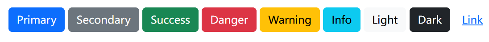

#### 按钮尺寸

```html
<button type="button" class="btn btn-primary btn-lg">Large button</button>
<button type="button" class="btn btn-primary">Default button</button>
<button type="button" class="btn btn-primary btn-sm">Small button</button>
```


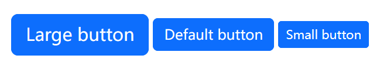

#### 按钮状态


```html
<button type="button" class="btn btn-primary" disabled>Disabled button</button>
<button type="button" class="btn btn-primary active">Active button</button>
```


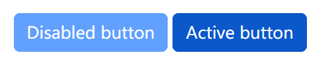


### 告警（Alert）

为典型的用户操作提供上下文反馈消息，并提供少量可用和灵活的警报消息。

#### 基本用法

```html
<div class="alert alert-primary" role="alert">
  A simple primary alert—check it out!
</div>
<div class="alert alert-secondary" role="alert">
  A simple secondary alert—check it out!
</div>
<div class="alert alert-success" role="alert">
  A simple success alert—check it out!
</div>
<div class="alert alert-danger" role="alert">
  A simple danger alert—check it out!
</div>
<div class="alert alert-warning" role="alert">
  A simple warning alert—check it out!
</div>
<div class="alert alert-info" role="alert">
  A simple info alert—check it out!
</div>
<div class="alert alert-light" role="alert">
  A simple light alert—check it out!
</div>
<div class="alert alert-dark" role="alert">
  A simple dark alert—check it out!
</div>
```


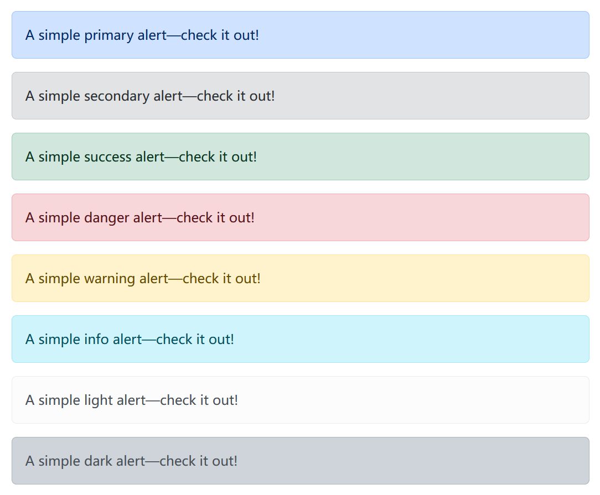


#### 链接


使用`.alert-link`实用程序类可以在任何警报中快速提供匹配的彩色链接


```html
<div class="alert alert-primary" role="alert">
  A simple primary alert with <a href="#" class="alert-link">an example link</a>. Give it a click if you like.
</div>
<div class="alert alert-secondary" role="alert">
  A simple secondary alert with <a href="#" class="alert-link">an example link</a>. Give it a click if you like.
</div>
<div class="alert alert-success" role="alert">
  A simple success alert with <a href="#" class="alert-link">an example link</a>. Give it a click if you like.
</div>
<div class="alert alert-danger" role="alert">
  A simple danger alert with <a href="#" class="alert-link">an example link</a>. Give it a click if you like.
</div>
<div class="alert alert-warning" role="alert">
  A simple warning alert with <a href="#" class="alert-link">an example link</a>. Give it a click if you like.
</div>
<div class="alert alert-info" role="alert">
  A simple info alert with <a href="#" class="alert-link">an example link</a>. Give it a click if you like.
</div>
<div class="alert alert-light" role="alert">
  A simple light alert with <a href="#" class="alert-link">an example link</a>. Give it a click if you like.
</div>
<div class="alert alert-dark" role="alert">
  A simple dark alert with <a href="#" class="alert-link">an example link</a>. Give it a click if you like.
</div>
</di>
```

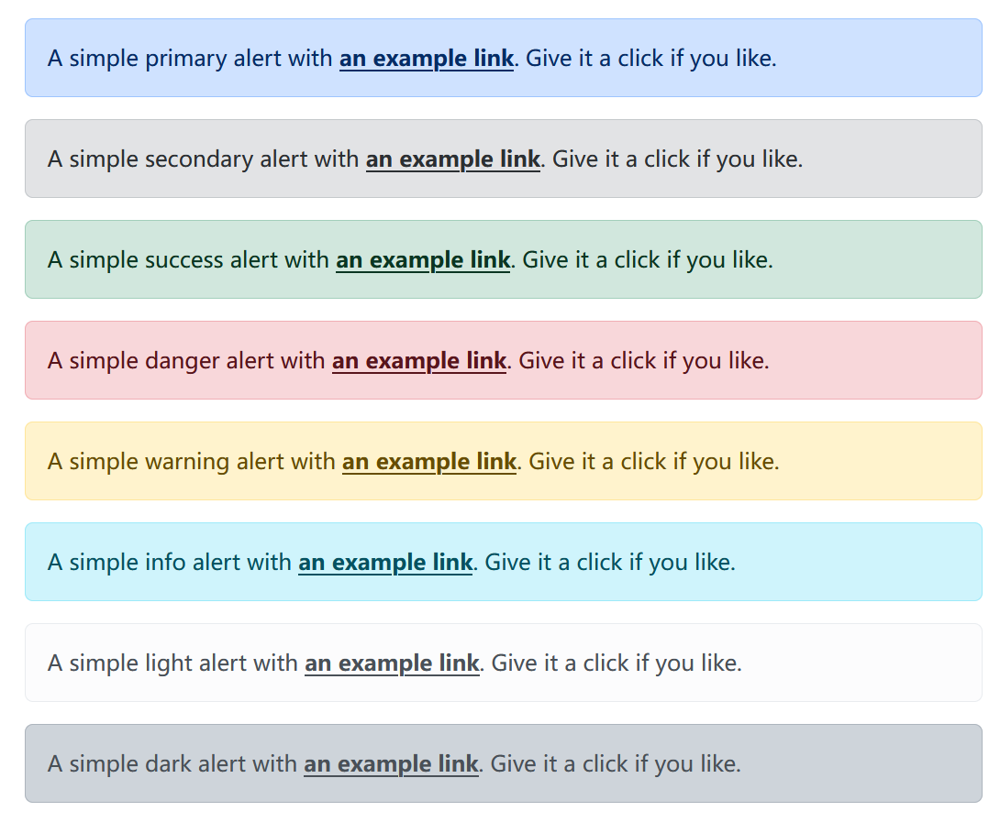


#### 图标


使用图标来创建带有图标的警报。

```html
<svg xmlns="http://www.w3.org/2000/svg" class="d-none">
  <symbol id="check-circle-fill" viewBox="0 0 16 16">
    <path
      d="M16 8A8 8 0 1 1 0 8a8 8 0 0 1 16 0zm-3.97-3.03a.75.75 0 0 0-1.08.022L7.477 9.417 5.384 7.323a.75.75 0 0 0-1.06 1.06L6.97 11.03a.75.75 0 0 0 1.079-.02l3.992-4.99a.75.75 0 0 0-.01-1.05z" />
  </symbol>
  <symbol id="info-fill" viewBox="0 0 16 16">
    <path
      d="M8 16A8 8 0 1 0 8 0a8 8 0 0 0 0 16zm.93-9.412-1 4.705c-.07.34.029.533.304.533.194 0 .487-.07.686-.246l-.088.416c-.287.346-.92.598-1.465.598-.703 0-1.002-.422-.808-1.319l.738-3.468c.064-.293.006-.399-.287-.47l-.451-.081.082-.381 2.29-.287zM8 5.5a1 1 0 1 1 0-2 1 1 0 0 1 0 2z" />
  </symbol>
  <symbol id="exclamation-triangle-fill" viewBox="0 0 16 16">
    <path
      d="M8.982 1.566a1.13 1.13 0 0 0-1.96 0L.165 13.233c-.457.778.091 1.767.98 1.767h13.713c.889 0 1.438-.99.98-1.767L8.982 1.566zM8 5c.535 0 .954.462.9.995l-.35 3.507a.552.552 0 0 1-1.1 0L7.1 5.995A.905.905 0 0 1 8 5zm.002 6a1 1 0 1 1 0 2 1 1 0 0 1 0-2z" />
  </symbol>
</svg>

<div class="alert alert-primary d-flex align-items-center" role="alert">
  <svg class="bi flex-shrink-0 me-2" role="img" aria-label="Info:">
    <use xlink:href="#info-fill" />
  </svg>
  <div>
    An example alert with an icon
  </div>
</div>
<div class="alert alert-success d-flex align-items-center" role="alert">
  <svg class="bi flex-shrink-0 me-2" role="img" aria-label="Success:">
    <use xlink:href="#check-circle-fill" />
  </svg>
  <div>
    An example success alert with an icon
  </div>
</div>
<div class="alert alert-warning d-flex align-items-center" role="alert">
  <svg class="bi flex-shrink-0 me-2" role="img" aria-label="Warning:">
    <use xlink:href="#exclamation-triangle-fill" />
  </svg>
  <div>
    An example warning alert with an icon
  </div>
</div>
<div class="alert alert-danger d-flex align-items-center" role="alert">
  <svg class="bi flex-shrink-0 me-2" role="img" aria-label="Danger:">
    <use xlink:href="#exclamation-triangle-fill" />
  </svg>
  <div>
    An example danger alert with an icon
  </div>
</div>
```

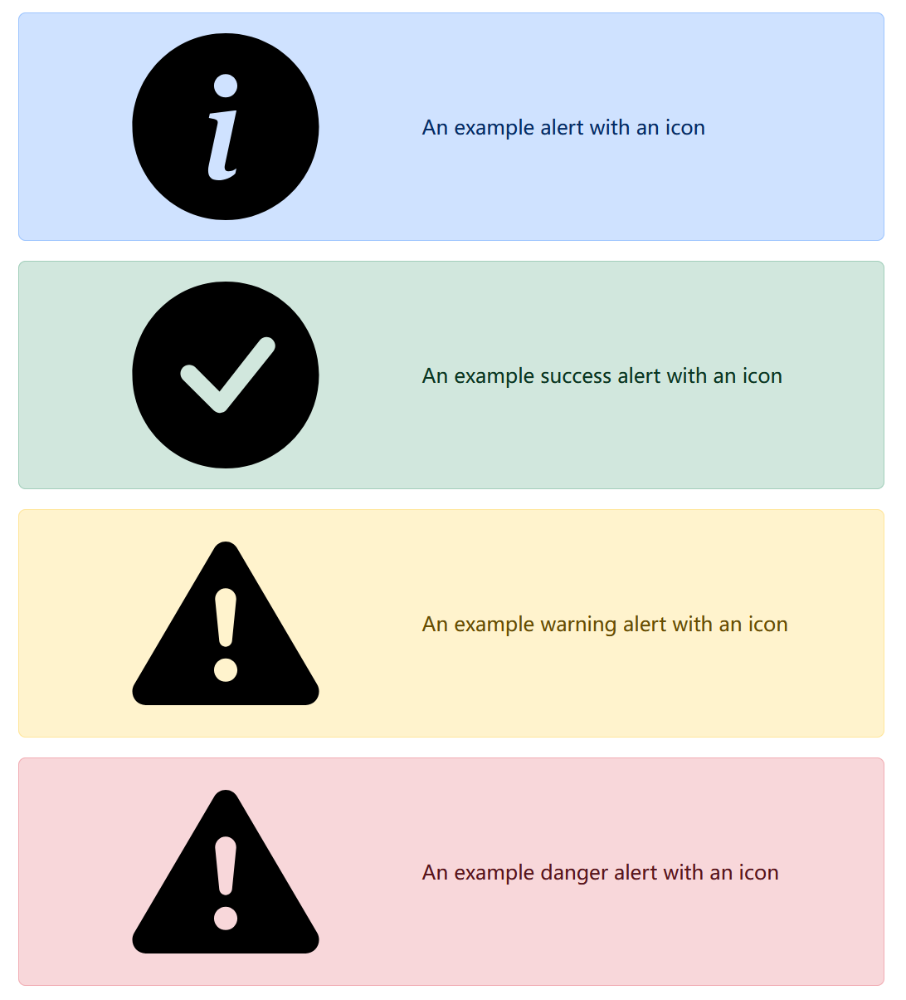


### 徽章（Badge）

徽章可以作为小计数器和标签组件。


#### 基本用法

徽章通过使用相对字体大小和单位来缩放以匹配直接父元素的大小。从v5开始，徽章不再具有链接的焦点或悬停样式。

```html
<h1>Example heading <span class="badge text-bg-secondary">New</span></h1>
<h2>Example heading <span class="badge text-bg-secondary">New</span></h2>
<h3>Example heading <span class="badge text-bg-secondary">New</span></h3>
<h4>Example heading <span class="badge text-bg-secondary">New</span></h4>
<h5>Example heading <span class="badge text-bg-secondary">New</span></h5>
<h6>Example heading <span class="badge text-bg-secondary">New</span></h6>
```


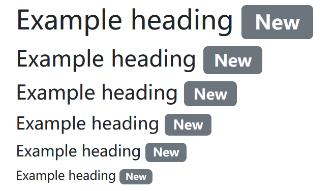


#### 用作链接或按钮的一部分

徽章可以用作链接或按钮的一部分，以提供计数器。


```html
<button type="button" class="btn btn-primary">
  Notifications <span class="badge text-bg-secondary">4</span>
</button>
```

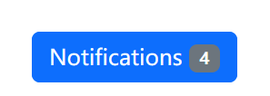


#### 定位

将徽章放置在链接或按钮的角落。


```html
<button type="button" class="btn btn-primary position-relative">
  Inbox
  <span class="position-absolute top-0 start-100 translate-middle badge rounded-pill bg-danger">
    99+
    <span class="visually-hidden">unread messages</span>
  </span>
</button>

<br>
<br>

<button type="button" class="btn btn-primary position-relative">
  Profile
  <span class="position-absolute top-0 start-100 translate-middle p-2 bg-danger border border-light rounded-circle">
    <span class="visually-hidden">New alerts</span>
  </span>
</button>
```

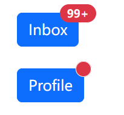


### 卡片（Card）

Bootstrap的卡片提供了一个灵活的、可扩展的内容容器，具有多个变体和选项。


```html
<div class="card" style="width: 18rem;">
  
  <div class="card-body">
    <h5 class="card-title">Card title</h5>
    <p class="card-text">Some quick example text to build on the card title and make up the bulk of the card’s
      content.</p>
    <a href="#" class="btn btn-primary">Go somewhere</a>
  </div>
</div>
```

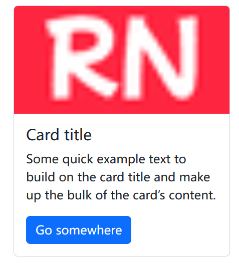

### Collapse


Collapse用于切换项目中内容的可见性。其工作原理是，按钮或锚点用作触发器，将其映射到所切换的特定元素。折叠一个元素将使其高度从当前值变为0。


点击下面的按钮，通过类的改变来显示和隐藏另一个元素：

* `.collapse`隐藏内容
* `.collapsing`在过渡期间应用
* `.collapse.show`显示内容


通常，建议使用带有data-bs-target属性的`<button>`。虽然不建议，但也可以使用带有href属性的`<a>`链接（以及`role="button"`）。在这两种情况下，都需要`data-bs-toggle="collapse"`。

```html
<p class="d-inline-flex gap-1">
  <a class="btn btn-primary" data-bs-toggle="collapse" href="#collapseExample" role="button" aria-expanded="false"
    aria-controls="collapseExample">
    Link with href
  </a>
  <button class="btn btn-primary" type="button" data-bs-toggle="collapse" data-bs-target="#collapseExample"
    aria-expanded="false" aria-controls="collapseExample">
    Button with data-bs-target
  </button>
</p>
<div class="collapse" id="collapseExample">
  <div class="card card-body">
    Some placeholder content for the collapse component. This panel is hidden by default but revealed when the user
    activates the relevant trigger.
  </div>
</div>
```

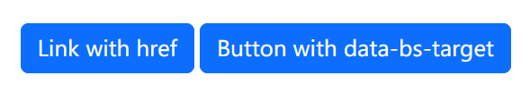


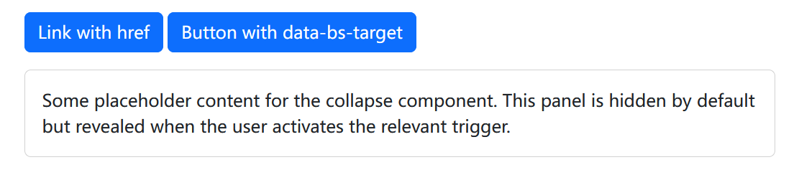


### 下拉（Dropdown）

使用Bootstrap下拉切换上下文覆盖以显示链接列表和更多内容。

```html
<div class="dropdown">
  <button class="btn btn-secondary dropdown-toggle" type="button" data-bs-toggle="dropdown" aria-expanded="false">
    Dropdown button
  </button>
  <ul class="dropdown-menu">
    <li><a class="dropdown-item" href="#">Action</a></li>
    <li><a class="dropdown-item" href="#">Another action</a></li>
    <li><a class="dropdown-item" href="#">Something else here</a></li>
  </ul>
</div>
```


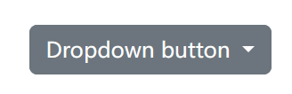


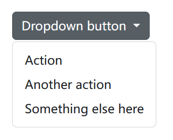

### 列表组（List group）


列表组是显示一系列内容的灵活而强大的组件。修改和扩展它们以支持其中的任何内容。


#### 基本用法


```html
<ul class="list-group">
  <li class="list-group-item">An item</li>
  <li class="list-group-item">A second item</li>
  <li class="list-group-item">A third item</li>
  <li class="list-group-item">A fourth item</li>
  <li class="list-group-item">And a fifth one</li>
</ul>
```

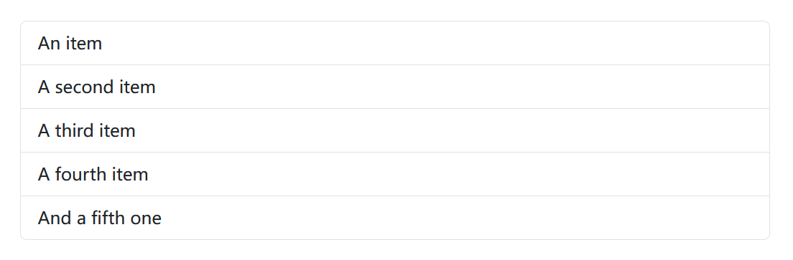

#### 编号


添加`.list-group-numbered`修饰符类（并可选择使用`<ol>`元素）来选择编号列表组项。


```html
<ol class="list-group list-group-numbered">
  <li class="list-group-item">A list item</li>
  <li class="list-group-item">A list item</li>
  <li class="list-group-item">A list item</li>
</ol>
```
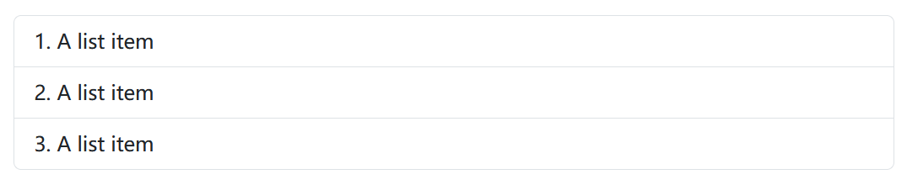


#### 带徽章


向任何列表组项添加徽章，以显示未读计数、活动等。


```html
<ul class="list-group">
  <li class="list-group-item d-flex justify-content-between align-items-center">
    A list item
    <span class="badge text-bg-primary rounded-pill">14</span>
  </li>
  <li class="list-group-item d-flex justify-content-between align-items-center">
    A second list item
    <span class="badge text-bg-primary rounded-pill">2</span>
  </li>
  <li class="list-group-item d-flex justify-content-between align-items-center">
    A third list item
    <span class="badge text-bg-primary rounded-pill">1</span>
  </li>
</ul>
```
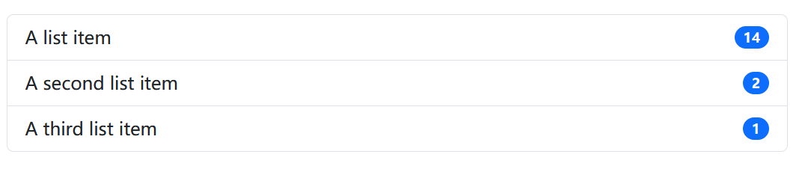


### 导航条（Navbar）

Bootstrap强大的、响应式导航页头、导航栏，能对品牌，导航等的进行支持。

```html
<nav class="navbar navbar-expand-lg bg-body-tertiary">
  <div class="container-fluid">
    <a class="navbar-brand" href="#">Navbar</a>
    <button class="navbar-toggler" type="button" data-bs-toggle="collapse" data-bs-target="#navbarSupportedContent"
      aria-controls="navbarSupportedContent" aria-expanded="false" aria-label="Toggle navigation">
      <span class="navbar-toggler-icon"></span>
    </button>
    <div class="collapse navbar-collapse" id="navbarSupportedContent">
      <ul class="navbar-nav me-auto mb-2 mb-lg-0">
        <li class="nav-item">
          <a class="nav-link active" aria-current="page" href="#">Home</a>
        </li>
        <li class="nav-item">
          <a class="nav-link" href="#">Link</a>
        </li>
        <li class="nav-item dropdown">
          <a class="nav-link dropdown-toggle" href="#" role="button" data-bs-toggle="dropdown"
            aria-expanded="false">
            Dropdown
          </a>
          <ul class="dropdown-menu">
            <li><a class="dropdown-item" href="#">Action</a></li>
            <li><a class="dropdown-item" href="#">Another action</a></li>
            <li>
              <hr class="dropdown-divider">
            </li>
            <li><a class="dropdown-item" href="#">Something else here</a></li>
          </ul>
        </li>
        <li class="nav-item">
          <a class="nav-link disabled" aria-disabled="true">Disabled</a>
        </li>
      </ul>
      <form class="d-flex" role="search">
        <input class="form-control me-2" type="search" placeholder="Search" aria-label="Search" />
        <button class="btn btn-outline-success" type="submit">Search</button>
      </form>
    </div>
  </div>
</nav>
```


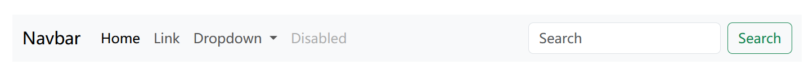


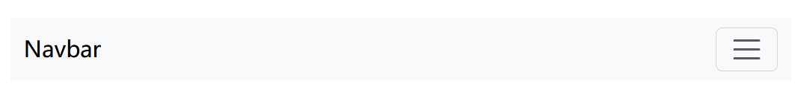


### 分页（Pagination）

分页以指示跨多个页面存在一系列相关内容。


#### 基本用法


```html
<nav aria-label="Page navigation example">
  <ul class="pagination">
    <li class="page-item"><a class="page-link" href="#">Previous</a></li>
    <li class="page-item"><a class="page-link" href="#">1</a></li>
    <li class="page-item"><a class="page-link" href="#">2</a></li>
    <li class="page-item"><a class="page-link" href="#">3</a></li>
    <li class="page-item"><a class="page-link" href="#">Next</a></li>
  </ul>
</nav>
```


#### 图标


```html
<nav aria-label="Page navigation example">
  <ul class="pagination">
    <li class="page-item">
      <a class="page-link" href="#" aria-label="Previous">
        <span aria-hidden="true">&laquo;</span>
      </a>
    </li>
    <li class="page-item"><a class="page-link" href="#">1</a></li>
    <li class="page-item"><a class="page-link" href="#">2</a></li>
    <li class="page-item"><a class="page-link" href="#">3</a></li>
    <li class="page-item">
      <a class="page-link" href="#" aria-label="Next">
        <span aria-hidden="true">&raquo;</span>
      </a>
    </li>
  </ul>
</nav>
```


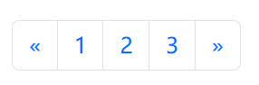


