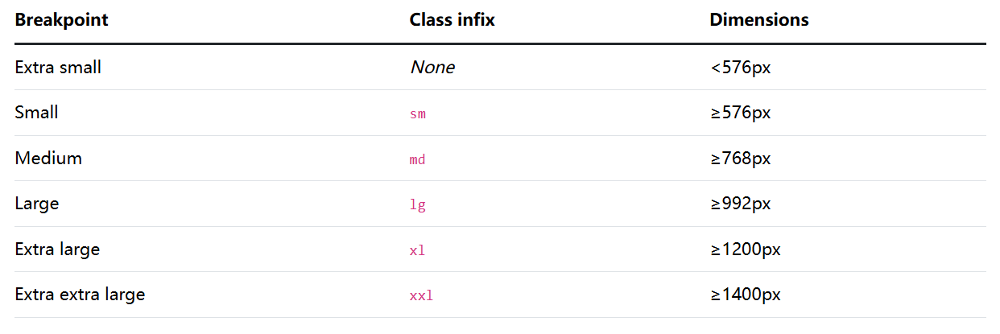
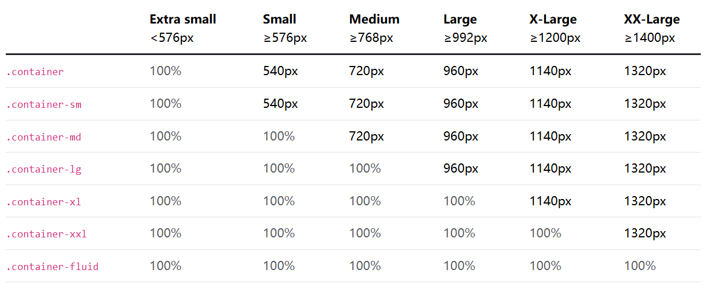
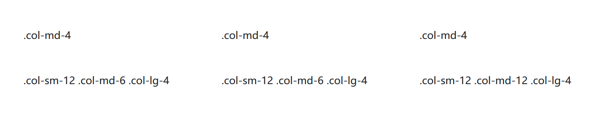
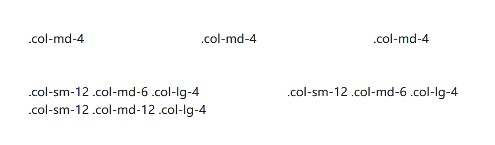
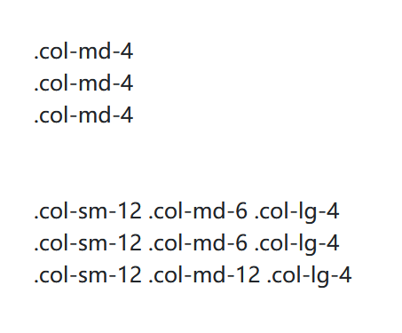
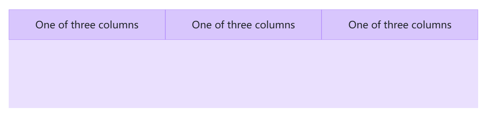
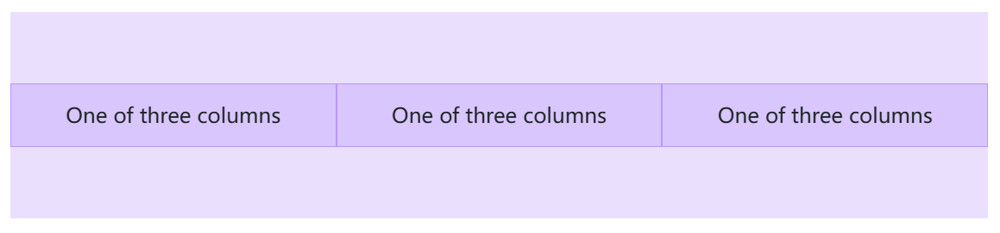
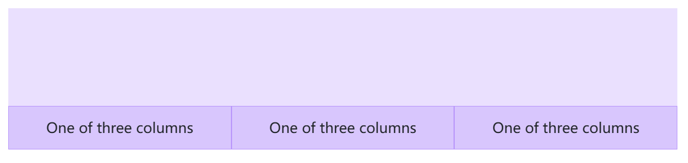
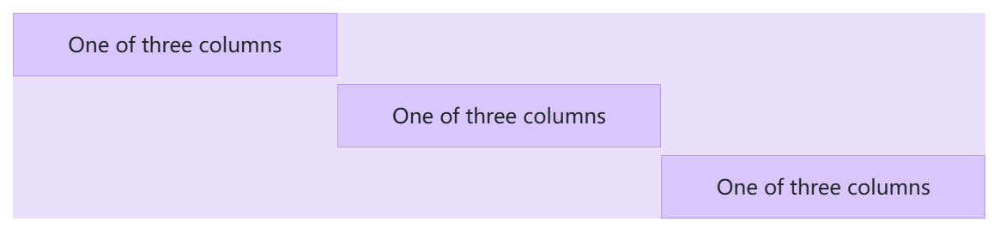
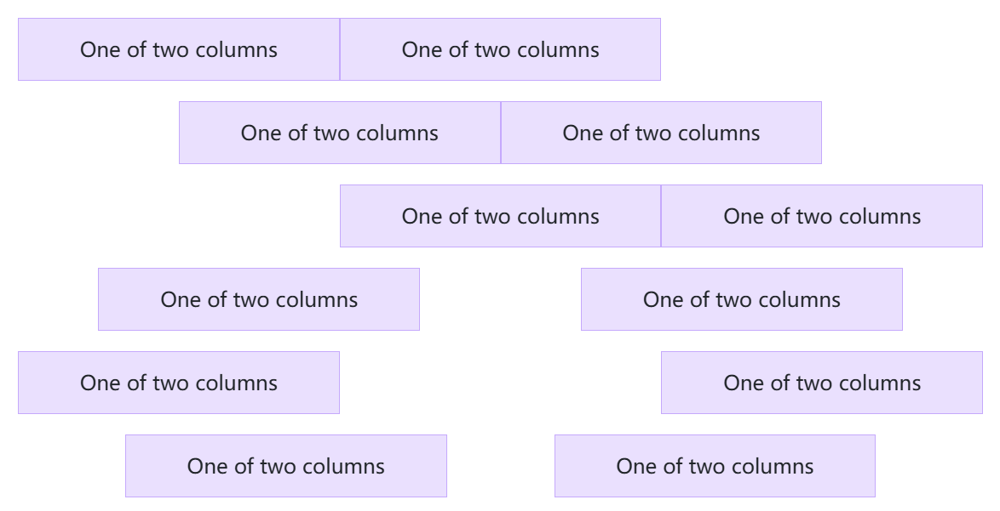

## 3.2 Bootstrap进阶：熟悉常用布局的用法

### 断点（Breakpoint）


断点是可自定义的宽度，它决定了你的响应式布局在Bootstrap中跨设备或视口大小的行为。

#### 核心概念

* 断点是响应式设计的基石。使用它们来控制何时可以根据特定的视口或设备尺寸调整布局。
* 使用媒体查询通过断点来构建CSS。媒体查询是CSS的一个特性，它允许您根据一组浏览器和操作系统参数有条件地应用样式。我们最常在媒体查询中使用最小宽度。
* 移动优先，响应式设计是目标。Bootstrap的CSS旨在应用最少的样式，使布局在最小的断点上工作，然后在样式上进行分层，以调整设计以适应更大的设备。这优化了你的CSS，改善了渲染时间，并为你的访问者提供了一个很好的体验。


#### 可用断点

Bootstrap包括六个默认断点，有时称为网格层，用于响应式构建。如果您使用的是源Sass文件，则可以自定义这些断点。




### 容器（Container）

容器是Bootstrap的基本构建块，它可以在给定的设备或视口中包含、填充和对齐内容。


#### 基本原理

容器是Bootstrap中最基本的布局元素，在使用默认网格系统时是必需的。容器用于容纳、填充和（有时）居中其中的内容。虽然容器可以嵌套，但大多数布局不需要嵌套容器。

Bootstrap带有三种不同的容器：
* `.container`，在每个响应断点处设置最大宽度
* `.container-{breakpoint}`，宽度：100%，直到指定的断点
* `.container-fluid`，在所有断点处宽度为100%


下表说明了每个容器的最大宽度如何在每个断点上与原始的 `.container`和`.container-fluid`进行比较。




### 网格系统（Grid）

Bootstrap 的网格系统基于 12 列布局，支持响应式设计。

```html
<div class="container">
  <div class="row">
    <div class="col-md-4">.col-md-4</div>
    <div class="col-md-4">.col-md-4</div>
    <div class="col-md-4">.col-md-4</div>
  </div>
</div>

<br>
<br>
<div class="container">
  <div class="row">
    <div class="col-sm-12 col-md-6 col-lg-4">.col-sm-12 .col-md-6 .col-lg-4</div>
    <div class="col-sm-12 col-md-6 col-lg-4">.col-sm-12 .col-md-6 .col-lg-4</div>
    <div class="col-sm-12 col-md-12 col-lg-4">.col-sm-12 .col-md-12 .col-lg-4</div>
  </div>
</div>
```










### 列（Column）

了解如何通过一些用于对齐、排序和偏移的选项来修改列，这要归功于我们的弹性盒网格系统。此外，了解如何使用列类来管理非网格元素的宽度。


#### 工作原理

列建立在网格的弹性盒（Flexbox）架构之上。弹性盒意味着我们可以选择更改单个列以及在行级别修改列组。你可以选择列如何拉伸、收缩或进行其他更改。

在构建网格布局时，所有内容都放在列中。Bootstrap 网格的层次结构是从容器到行，再到列，最后到你的内容。在极少数情况下，你可能会将内容和列结合起来，但要注意这可能会产生意想不到的后果。

Bootstrap 包含用于创建快速、响应式布局的预定义类。每个网格层有六个断点和十二个列，我们已经为你构建了数十个类来创建你想要的布局。如果需要，你可以通过 Sass 禁用它。

#### 对齐

使用弹性盒对齐工具类来垂直和水平对齐列。

#### 垂直对齐

使用任何响应式 `align-items-*` 类更改垂直对齐方式。

```html
<div class="container text-center">
  <div class="row align-items-start">
    <div class="col">
      One of three columns
    </div>
    <div class="col">
      One of three columns
    </div>
    <div class="col">
      One of three columns
    </div>
  </div>
</div>
```



```html
<div class="container text-center">
  <div class="row align-items-center">
    <div class="col">
      One of three columns
    </div>
    <div class="col">
      One of three columns
    </div>
    <div class="col">
      One of three columns
    </div>
  </div>
</div>
```




```html
<div class="container text-center">
  <div class="row align-items-end">
    <div class="col">
      One of three columns
    </div>
    <div class="col">
      One of three columns
    </div>
    <div class="col">
      One of three columns
    </div>
  </div>
</div>
```




或者，使用任何响应式 `.align-self-*` 类分别更改每个列的对齐方式。

```html
<div class="container text-center">
  <div class="row">
    <div class="col align-self-start">
      One of three columns
    </div>
    <div class="col align-self-center">
      One of three columns
    </div>
    <div class="col align-self-end">
      One of three columns
    </div>
  </div>
</div>
```



### 水平对齐

使用任何响应式 `justify-content-*` 类更改水平对齐方式。

```html
<div class="container text-center">
  <div class="row justify-content-start">
    <div class="col-4">
      One of two columns
    </div>
    <div class="col-4">
      One of two columns
    </div>
  </div>
  <div class="row justify-content-center">
    <div class="col-4">
      One of two columns
    </div>
    <div class="col-4">
      One of two columns
    </div>
  </div>
  <div class="row justify-content-end">
    <div class="col-4">
      One of two columns
    </div>
    <div class="col-4">
      One of two columns
    </div>
  </div>
  <div class="row justify-content-around">
    <div class="col-4">
      One of two columns
    </div>
    <div class="col-4">
      One of two columns
    </div>
  </div>
  <div class="row justify-content-between">
    <div class="col-4">
      One of two columns
    </div>
    <div class="col-4">
      One of two columns
    </div>
  </div>
  <div class="row justify-content-evenly">
    <div class="col-4">
      One of two columns
    </div>
    <div class="col-4">
      One of two columns
    </div>
  </div>
</div>
```



