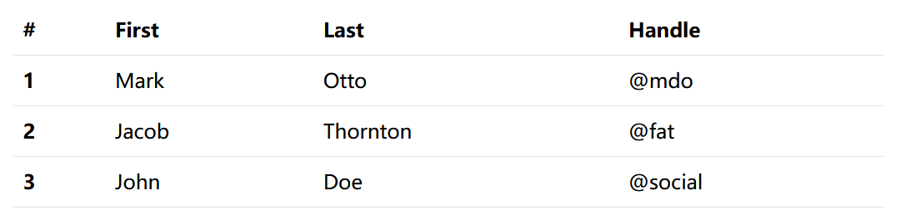
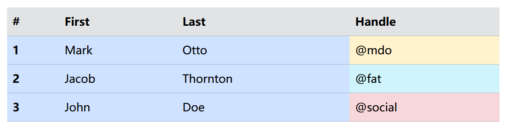
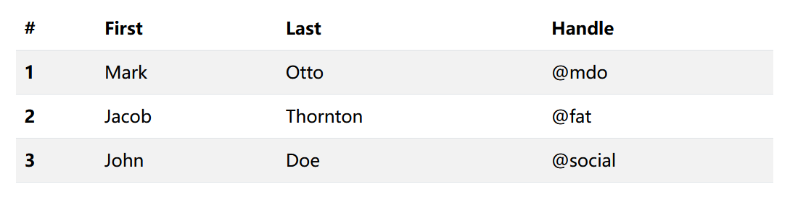
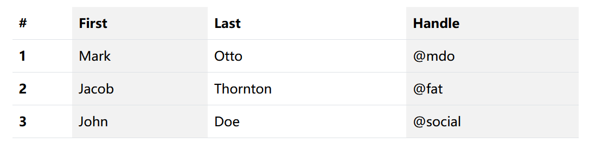
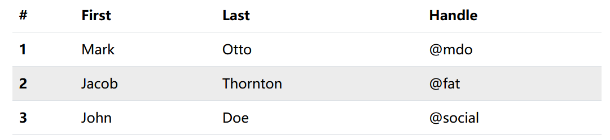

## 4.1 Bootstrap表格组件：快速掌握复杂数据场景下的高效呈现


Bootstrap 表格支持多种样式和功能，包括条纹、边框、悬停效果等。

### 基本表格

```html
<table class="table">
  <thead>
    <tr>
      <th scope="col">#</th>
      <th scope="col">First</th>
      <th scope="col">Last</th>
      <th scope="col">Handle</th>
    </tr>
  </thead>
  <tbody>
    <tr>
      <th scope="row">1</th>
      <td>Mark</td>
      <td>Otto</td>
      <td>@mdo</td>
    </tr>
    <tr>
      <th scope="row">2</th>
      <td>Jacob</td>
      <td>Thornton</td>
      <td>@fat</td>
    </tr>
    <tr>
      <th scope="row">3</th>
      <td>John</td>
      <td>Doe</td>
      <td>@social</td>
    </tr>
  </tbody>
</table>
```




### 上色

使用上下文类为表格、表格行或单个单元格上色。


```html
<table class="table table-primary">
  <thead>
    <tr class="table-secondary">
      <th scope="col">#</th>
      <th scope="col">First</th>
      <th scope="col">Last</th>
      <th scope="col">Handle</th>
    </tr>
  </thead>
  <tbody>
    <tr>
      <th scope="row">1</th>
      <td>Mark</td>
      <td>Otto</td>
      <td class="table-warning">@mdo</td>
    </tr>
    <tr>
      <th scope="row">2</th>
      <td>Jacob</td>
      <td>Thornton</td>
      <td class="table-info">@fat</td>
    </tr>
    <tr>
      <th scope="row">3</th>
      <td>John</td>
      <td>Doe</td>
      <td class="table-danger">@social</td>
    </tr>
  </tbody>
</table>
```




### 条纹行

使用`.table-striped`将斑马条纹添加到`<tbody>`中的任何表行。


```html
<table class="table table-striped">
  <thead>
    <tr>
      <th scope="col">#</th>
      <th scope="col">First</th>
      <th scope="col">Last</th>
      <th scope="col">Handle</th>
    </tr>
  </thead>
  <tbody>
    <tr>
      <th scope="row">1</th>
      <td>Mark</td>
      <td>Otto</td>
      <td>@mdo</td>
    </tr>
    <tr>
      <th scope="row">2</th>
      <td>Jacob</td>
      <td>Thornton</td>
      <td>@fat</td>
    </tr>
    <tr>
      <th scope="row">3</th>
      <td>John</td>
      <td>Doe</td>
      <td>@social</td>
    </tr>
  </tbody>
</table>
```





### 条纹柱


使用`.table-striped-columns`为任何表列添加斑马条纹。


```html
<table class="table table-striped-columns">
  <thead>
    <tr>
      <th scope="col">#</th>
      <th scope="col">First</th>
      <th scope="col">Last</th>
      <th scope="col">Handle</th>
    </tr>
  </thead>
  <tbody>
    <tr>
      <th scope="row">1</th>
      <td>Mark</td>
      <td>Otto</td>
      <td>@mdo</td>
    </tr>
    <tr>
      <th scope="row">2</th>
      <td>Jacob</td>
      <td>Thornton</td>
      <td>@fat</td>
    </tr>
    <tr>
      <th scope="row">3</th>
      <td>John</td>
      <td>Doe</td>
      <td>@social</td>
    </tr>
  </tbody>
</table>
```





### 可悬浮行

添加`.table-hover`以在`<tbody>`中的表行上启用悬停状态。

```html
<table class="table table-hover">
  <thead>
    <tr>
      <th scope="col">#</th>
      <th scope="col">First</th>
      <th scope="col">Last</th>
      <th scope="col">Handle</th>
    </tr>
  </thead>
  <tbody>
    <tr>
      <th scope="row">1</th>
      <td>Mark</td>
      <td>Otto</td>
      <td>@mdo</td>
    </tr>
    <tr>
      <th scope="row">2</th>
      <td>Jacob</td>
      <td>Thornton</td>
      <td>@fat</td>
    </tr>
    <tr>
      <th scope="row">3</th>
      <td>John</td>
      <td>Doe</td>
      <td>@social</td>
    </tr>
  </tbody>
</table>
```


