## 4.2 Bootstrap表单组件：实现用户体验与业务逻辑的完美平衡


表单（Form）用于创建各种表单的表单控件样式、布局选项和自定义组件的示例和使用指南。


### 表单控件（Form control）

为文本表单控件（如`<input>`和`<textarea>`）提供一个升级，使其具有自定义样式、大小、焦点状态等。


#### 基本用法

表单控件使用Sass和CSS变量的混合样式，允许它们适应颜色模式并支持任何自定义方法。

```html
<div class="mb-3">
  <label for="exampleFormControlInput1" class="form-label">Email address</label>
  <input type="email" class="form-control" id="exampleFormControlInput1" placeholder="name@example.com">
</div>
<div class="mb-3">
  <label for="exampleFormControlTextarea1" class="form-label">Example textarea</label>
  <textarea class="form-control" id="exampleFormControlTextarea1" rows="3"></textarea>
</div>
```


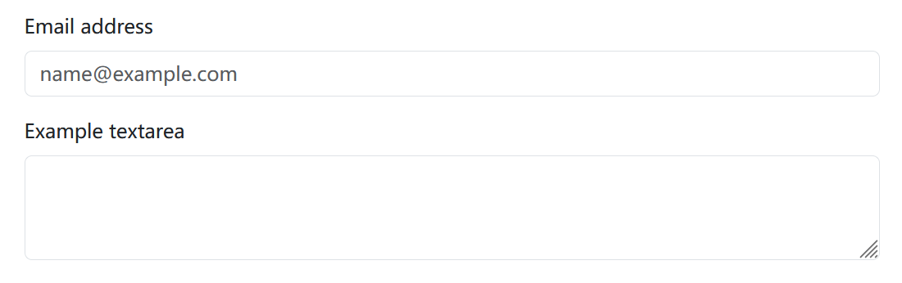


#### 大小
使用`.form-control-lg`和`.form-control-sm`类设置高度。

```html
<input class="form-control form-control-lg" type="text" placeholder=".form-control-lg"
  aria-label=".form-control-lg example">
<input class="form-control" type="text" placeholder="Default input" aria-label="default input example">
<input class="form-control form-control-sm" type="text" placeholder=".form-control-sm"
  aria-label=".form-control-sm example">
```


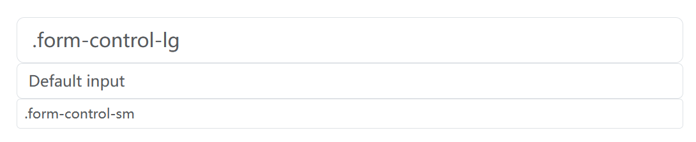

#### 表单文本

可以使用`.form-text`创建块级或内联级表单文本。


输入下面的表单文本可以使用`.form-text`样式。如果使用块级元素，则添加顶部边距，以便与上面的输入保持距离。


```html
<label for="inputPassword5" class="form-label">Password</label>
<input type="password" id="inputPassword5" class="form-control" aria-describedby="passwordHelpBlock">
<div id="passwordHelpBlock" class="form-text">
  Your password must be 8-20 characters long, contain letters and numbers, and must not contain spaces, special
  characters, or emoji.
</div>
```


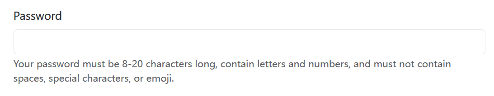


#### 禁用

在输入上添加disabled的布尔属性，使其呈现灰色外观，删除指针事件，并防止聚焦。

```html
<input class="form-control" type="text" placeholder="Disabled input" aria-label="Disabled input example" disabled>
<input class="form-control" type="text" value="Disabled readonly input" aria-label="Disabled input example" disabled
  readonly>
```


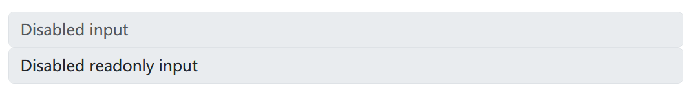


#### 只读

在输入上添加readonly布尔属性，以防止修改输入的值。只读输入仍然可以聚焦和选择，而禁用输入则不能。

```html
<div class="mb-3 row">
  <label for="staticEmail" class="col-sm-2 col-form-label">Email</label>
  <div class="col-sm-10">
    <input type="text" readonly class="form-control-plaintext" id="staticEmail" value="email@example.com">
  </div>
</div>
<div class="mb-3 row">
  <label for="inputPassword" class="col-sm-2 col-form-label">Password</label>
  <div class="col-sm-10">
    <input type="password" class="form-control" id="inputPassword">
  </div>
</div>
```


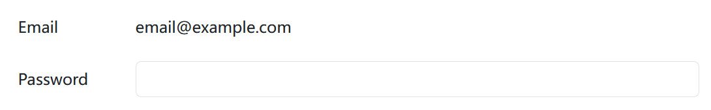

#### 文件


```html
<div class="mb-3">
  <label for="formFile" class="form-label">Default file input example</label>
  <input class="form-control" type="file" id="formFile">
</div>
<div class="mb-3">
  <label for="formFileMultiple" class="form-label">Multiple files input example</label>
  <input class="form-control" type="file" id="formFileMultiple" multiple>
</div>
<div class="mb-3">
  <label for="formFileDisabled" class="form-label">Disabled file input example</label>
  <input class="form-control" type="file" id="formFileDisabled" disabled>
</div>
<div class="mb-3">
  <label for="formFileSm" class="form-label">Small file input example</label>
  <input class="form-control form-control-sm" id="formFileSm" type="file">
</div>
<div>
  <label for="formFileLg" class="form-label">Large file input example</label>
  <input class="form-control form-control-lg" id="formFileLg" type="file">
</div>
```

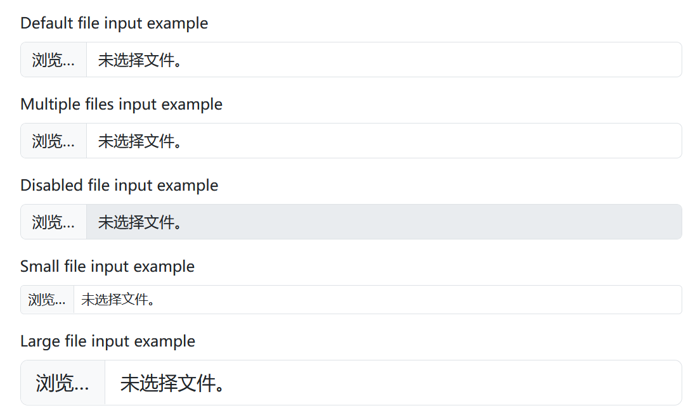

#### 颜色


设置`type="color"`，并将`.form-control-color`添加到`<input>`，实现颜色选择。


```html
<label for="exampleColorInput" class="form-label">Color picker</label>
<input type="color" class="form-control form-control-color" id="exampleColorInput" value="#563d7c"
  title="Choose your color">
```

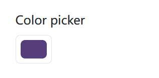

弹出的颜色选择器，取决于平台。比如，以下是Windows平台的颜色选择器。

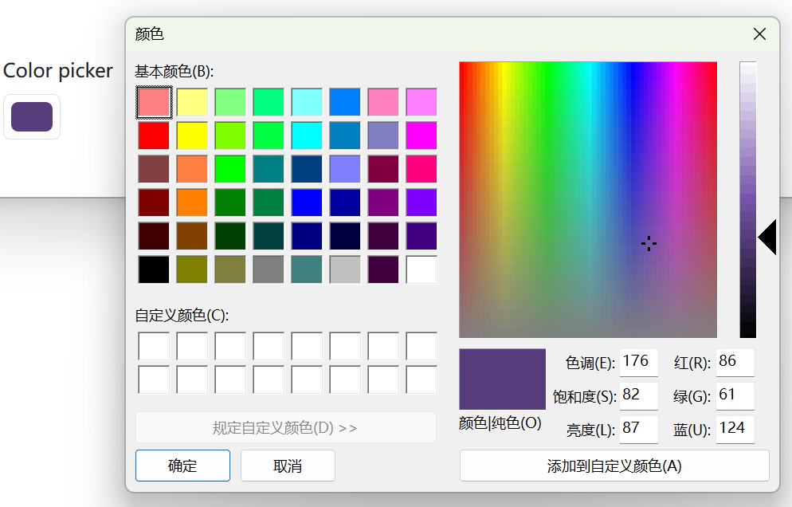

#### 数据列

数据允许创建一组`<option>`，这些`<option>`可以在`<input>`中访问（并自动完成）。这些元素类似于`<select>`元素，但是有更多的菜单样式限制和差异。虽然大多数浏览器和操作系统都包括对`<datalist>`元素的一些支持，但它们的样式充其量是不一致的。

```html
<label for="exampleDataList" class="form-label">Datalist example</label>
<input class="form-control" list="datalistOptions" id="exampleDataList" placeholder="Type to search...">
<datalist id="datalistOptions">
  <option value="San Francisco">
  <option value="New York">
  <option value="Seattle">
  <option value="Los Angeles">
  <option value="Chicago">
</datalist>
```

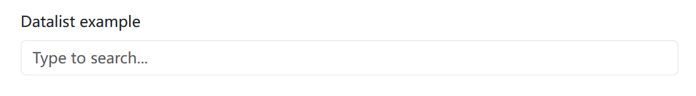


点击输入框，可以展示数据列表，并可以选择数据项。


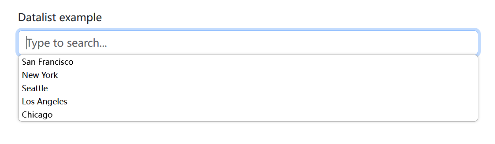


### Checkbox


Bootstrap使用我们完全重写的检查组件创建一致的跨浏览器和跨设备的Checkbox。


#### 基本用法


```html
<div class="form-check">
  <input class="form-check-input" type="checkbox" value="" id="checkDefault">
  <label class="form-check-label" for="checkDefault">
    Default checkbox
  </label>
</div>
<div class="form-check">
  <input class="form-check-input" type="checkbox" value="" id="checkChecked" checked>
  <label class="form-check-label" for="checkChecked">
    Checked checkbox
  </label>
</div>
```

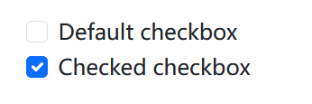


#### 禁用

添加disabled属性和关联的`<label>`将自动使用较浅的颜色进行样式匹配，以帮助指示输入的状态。


```html
<div class="form-check">
  <input class="form-check-input" type="checkbox" value="" id="checkIndeterminateDisabled" disabled>
  <label class="form-check-label" for="checkIndeterminateDisabled">
    Disabled indeterminate checkbox
  </label>
</div>
<div class="form-check">
  <input class="form-check-input" type="checkbox" value="" id="checkDisabled" disabled>
  <label class="form-check-label" for="checkDisabled">
    Disabled checkbox
  </label>
</div>
<div class="form-check">
  <input class="form-check-input" type="checkbox" value="" id="checkCheckedDisabled" checked disabled>
  <label class="form-check-label" for="checkCheckedDisabled">
    Disabled checked checkbox
  </label>
</div>
```

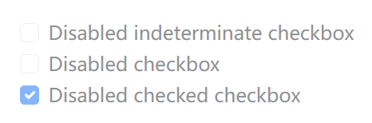


### Radio


Bootstrap使用我们完全重写的检查组件创建一致的跨浏览器和跨设备的Radio。


#### 基本用法


```html
<div class="form-check">
  <input class="form-check-input" type="radio" name="radioDefault" id="radioDefault1">
  <label class="form-check-label" for="radioDefault1">
    Default radio
  </label>
</div>
<div class="form-check">
  <input class="form-check-input" type="radio" name="radioDefault" id="radioDefault2" checked>
  <label class="form-check-label" for="radioDefault2">
    Default checked radio
  </label>
</div>
```


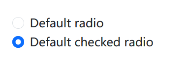


#### 禁用

添加disabled属性和关联的`<label>`将自动使用较浅的颜色进行样式匹配，以帮助指示输入的状态。


```html
<div class="form-check">
  <input class="form-check-input" type="radio" name="radioDisabled" id="radioDisabled" disabled>
  <label class="form-check-label" for="radioDisabled">
    Disabled radio
  </label>
</div>
<div class="form-check">
  <input class="form-check-input" type="radio" name="radioDisabled" id="radioCheckedDisabled" checked disabled>
  <label class="form-check-label" for="radioCheckedDisabled">
    Disabled checked radio
  </label>
</div>
```

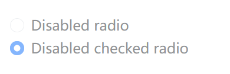

### Switch

Switch具有自定义checkbox的标记，但使用`.form-switch`类来呈现切换开关。考虑使用`role="switch"`来更准确地将控件的性质传达给支持此角色的辅助技术。在旧的辅助技术中，它只是作为一个常规的复选框作为备用。交换机也支持disabled属性。


```html
<div class="form-check form-switch">
  <input class="form-check-input" type="checkbox" role="switch" id="switchCheckDefault">
  <label class="form-check-label" for="switchCheckDefault">Default switch checkbox input</label>
</div>
<div class="form-check form-switch">
  <input class="form-check-input" type="checkbox" role="switch" id="switchCheckChecked" checked>
  <label class="form-check-label" for="switchCheckChecked">Checked switch checkbox input</label>
</div>
<div class="form-check form-switch">
  <input class="form-check-input" type="checkbox" role="switch" id="switchCheckDisabled" disabled>
  <label class="form-check-label" for="switchCheckDisabled">Disabled switch checkbox input</label>
</div>
<div class="form-check form-switch">
  <input class="form-check-input" type="checkbox" role="switch" id="switchCheckCheckedDisabled" checked disabled>
  <label class="form-check-label" for="switchCheckCheckedDisabled">Disabled checked switch checkbox input</label>
</div>
```

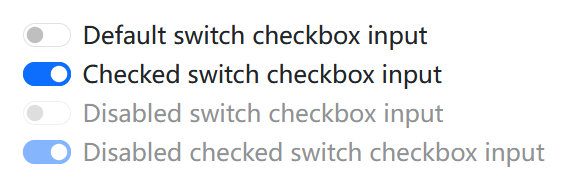


### 输入组（Input group）

通过在文本输入、自定义选择和自定义文件输入的两侧添加文本、按钮或按钮组，轻松扩展表单控件。


#### 基本用法


在输入的两侧放置一个附加组件或按钮。也可以在输入的两侧放置一个。记住在输入组之外放置`<label>`。


```html
<div class="input-group mb-3">
  <span class="input-group-text" id="basic-addon1">@</span>
  <input type="text" class="form-control" placeholder="Username" aria-label="Username" aria-describedby="basic-addon1">
</div>

<div class="input-group mb-3">
  <input type="text" class="form-control" placeholder="Recipient’s username" aria-label="Recipient’s username" aria-describedby="basic-addon2">
  <span class="input-group-text" id="basic-addon2">@example.com</span>
</div>

<div class="mb-3">
  <label for="basic-url" class="form-label">Your vanity URL</label>
  <div class="input-group">
    <span class="input-group-text" id="basic-addon3">https://example.com/users/</span>
    <input type="text" class="form-control" id="basic-url" aria-describedby="basic-addon3 basic-addon4">
  </div>
  <div class="form-text" id="basic-addon4">Example help text goes outside the input group.</div>
</div>

<div class="input-group mb-3">
  <span class="input-group-text">$</span>
  <input type="text" class="form-control" aria-label="Amount (to the nearest dollar)">
  <span class="input-group-text">.00</span>
</div>

<div class="input-group mb-3">
  <input type="text" class="form-control" placeholder="Username" aria-label="Username">
  <span class="input-group-text">@</span>
  <input type="text" class="form-control" placeholder="Server" aria-label="Server">
</div>

<div class="input-group">
  <span class="input-group-text">With textarea</span>
  <textarea class="form-control" aria-label="With textarea"></textarea>
</div>
```

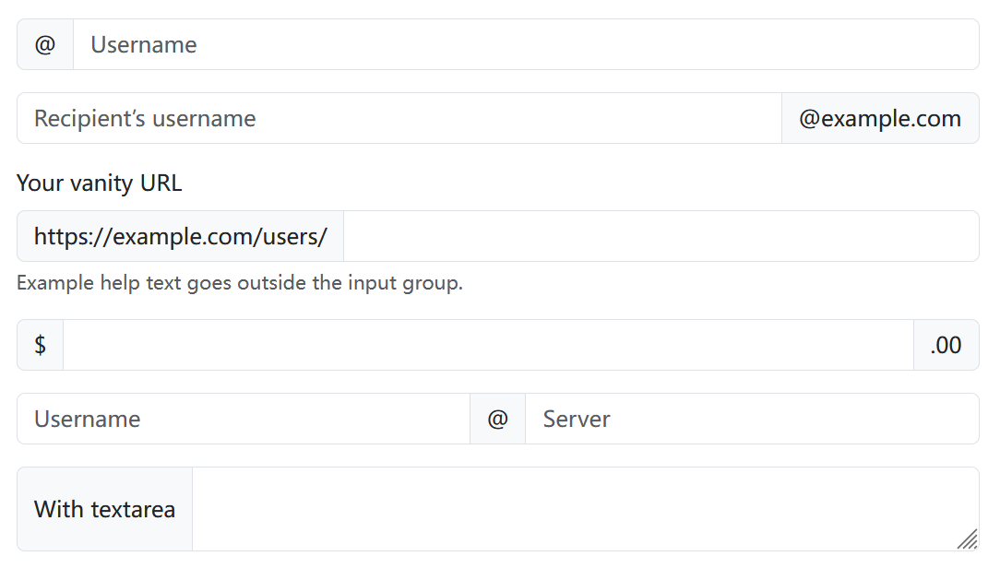


#### 大小

将相对表单大小类添加到`.input-group`本身，其中的内容将自动调整大小—无需在每个元素上重复表单控件大小类。
不支持单个输入组元素的大小调整。


```html
<div class="input-group input-group-sm mb-3">
  <span class="input-group-text" id="inputGroup-sizing-sm">Small</span>
  <input type="text" class="form-control" aria-label="Sizing example input" aria-describedby="inputGroup-sizing-sm">
</div>

<div class="input-group mb-3">
  <span class="input-group-text" id="inputGroup-sizing-default">Default</span>
  <input type="text" class="form-control" aria-label="Sizing example input" aria-describedby="inputGroup-sizing-default">
</div>

<div class="input-group input-group-lg">
  <span class="input-group-text" id="inputGroup-sizing-lg">Large</span>
  <input type="text" class="form-control" aria-label="Sizing example input" aria-describedby="inputGroup-sizing-lg">
</div>
```


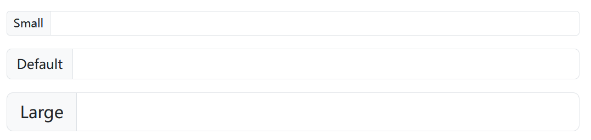

