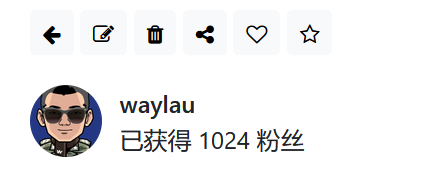

## 10.6 从笔记详情页面触发编辑、删除笔记的请求

在笔记详情页面操作栏上已经预留了编辑、删除笔记的按钮。如下图10-4所示。





接下来实现从编辑、删除笔记的按钮执行触发编辑、删除笔记的请求。


### 修改编辑笔记按钮事件

修改编辑的按钮事件，在`<button>`外层再套一个`<a>`即可：

```html
<!-- 编辑 -->
<a th:href="@{/note/{noteId}/edit(noteId=${note.noteId})}">
    <button class="btn btn-light btn-sm" th:if="${#authentication.name == note.author.username}">
        <i class="fa fa-edit"></i>
    </button>
</a>
```


### 修改删除笔记的按钮事件


修改删除的按钮事件，在`<button>`设置id属性和onclick事件处理：

```html
<!-- 删除 -->
<button class="btn btn-light btn-sm" th:if="${#authentication.name == note.author.username}"
    th:onclick="deleteNote([[${note.noteId}]])">
    <i class="fa fa-trash"></i>
</button>
```

deleteNote()函数定义如下：

```js
// 处理笔记删除
function deleteNote(noteId) {
    if (confirm("确定要删除此笔记吗？")) {
        fetch(`/note/${noteId}`, {
            method: 'DELETE'
        })
        .then(response => {
            if (response.ok) {
                response.json().then(data => {
                    // 从响应中获取提示信息
                    alert(data.message || '删除成功');

                    // 从响应中获取重定向URL
                    window.location.href = data.redirectUrl;
                });
            } else  {
                response.json().then(data => {
                    alert(data.message || '删除失败，请重试');
                });
            }
        })
        .catch(error => {
            console.error('删除失败：', error);
            alert('删除失败，请稍后重试');
        })
    }
}
```

通过fetch()来发送DELETE请求。fetch 是一个现代化的 JavaScript API，用于发送网络请求并获取资源。它是浏览器提供的全局方法，可以替代传统的 XMLHttpRequest。fetch 支持 Promise，因此更易用且代码更清晰。


