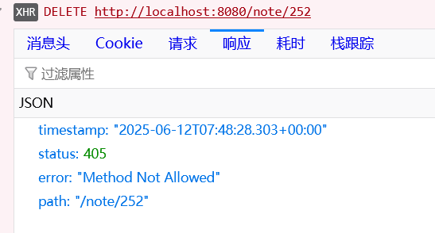
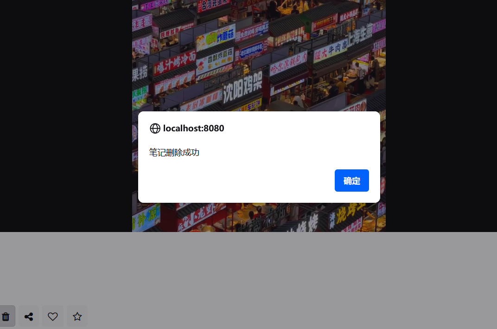
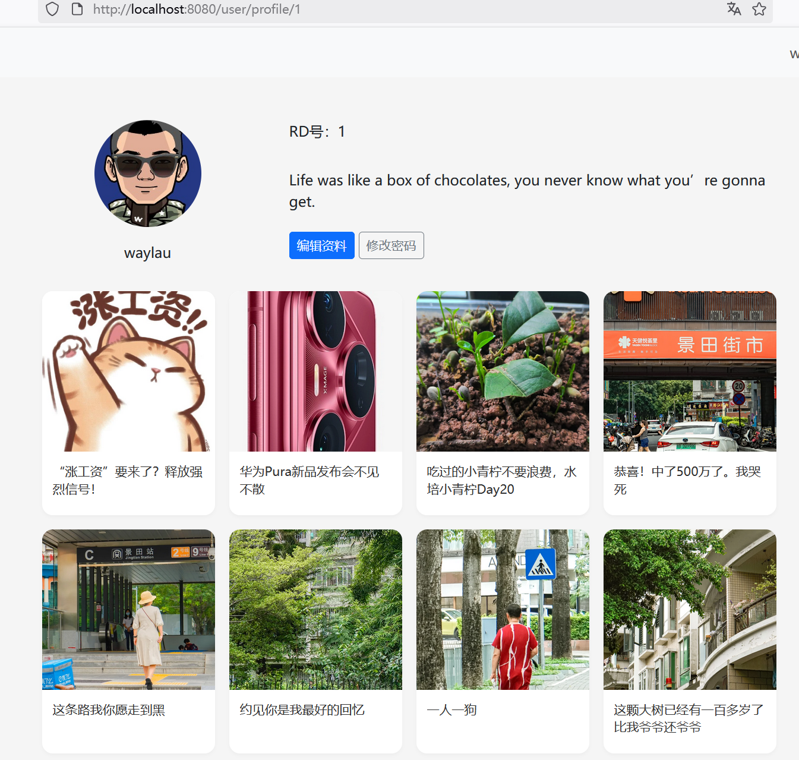

## 10.8 处理CSRF保护引发的HttpRequestMethodNotSupportedException异常

### 问题背景


运行应用，试图删除笔记时，报错如下图10-5所示。





同时在控制台日志里面看大如下信息：


```
2025-06-12T14:34:19.883+08:00  WARN 21324 --- [rednote] [io-8080-exec-10] .w.s.m.s.DefaultHandlerExceptionResolver : Resolved [org.springframework.web.HttpRequestMethodNotSupportedException: Request method 'DELETE' is not supported]
```


### 原因


系统已经启用了CSRF保护，在WebSecurityConfig配置如下：


```java
// 启用 CSRF 防护
.csrf(Customizer.withDefaults())
```


因此，使用JavaScript fetch API所发送的 DELETE 方法需要有效的 CSRF 令牌，否则会报错。


### 如何设置并获取 CSRF 令牌

首先，确保在你的 HTML 模板中有一个 meta 标签来存储 CSRF 令牌。Spring Security 默认会提供一个名为 `_csrf` 的令牌，你可以通过 Thymeleaf 将其插入到 meta 标签中。


修改user-profile.html，增加如下内容：

```html
<!-- 确保有一个meta标签来存储CSRF令牌 -->
<meta name="_csrf" th:content="${_csrf.token}"></meta>
```


接着，在JavaScript fetch API所发送的 DELETE 方法头信息里面设置 CSRF 令牌：

```js
// 笔记删除
function deleteNote(noteId) {
    if (confirm("确定要删除此笔记吗？")) {
        fetch(`/note/${noteId}`, {
            method: 'DELETE',
            // 添加请求头, 用于Spring Security CSRF
            headers: {
                'X-CSRF-TOKEN': document.querySelector('meta[name="_csrf"]').getAttribute('content')
            }
        })
    // ...为节约篇幅，此处省略非核心内容
```

### 运行调测


运行应用，删除笔记时，可以看到如下图10-6所示的提示框，说明笔记已经能够成功删除了。




点击提示框“确认”按钮，可以重定向到了用户信息管理界面，如下图10-7所示。



