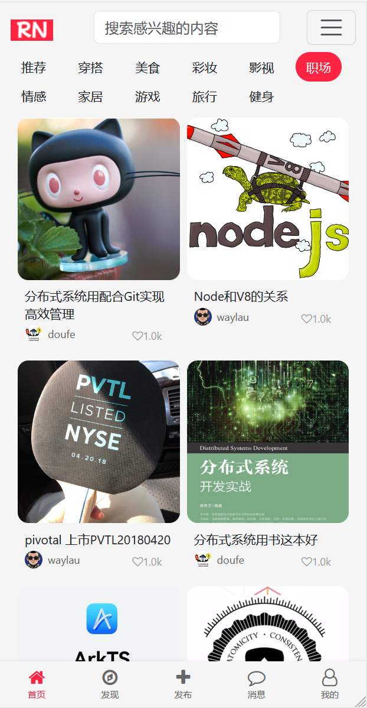

## 11.10 最佳实践总结及扩展建议

### 最佳实践

1. **优先使用DTO模式**：通过专门的DTO类定义API响应格式，避免直接序列化实体对象
2. **合理设计关联关系**：根据业务需求选择合适的加载策略（EAGER/FETCH）
3. **使用@JsonView进行精细控制**：在复杂场景中使用Jackson的@JsonView实现选择性序列化
4. **结合性能考虑**：懒加载是提高性能的重要手段，但需要配合合理的初始化策略
5. **格式化数字展示**：优化信息传达的效率和用户体验
6. **无限滚动加载**：优化了用户体验
7. **适配移动设备和桌面设备**：网格布局自动调整

如下图11-7所示的是适配移动设备之后的效果。

### 扩展建议

1. **个性化推荐**：
   - 基于用户兴趣和行为的内容推荐
   - 关注的用户发布的内容优先展示

2. **搜索功能**：
   - 实现全文搜索
   - 热门搜索词和搜索历史

3. **内容筛选**：
   - 添加更多筛选条件（最新、最热、附近等）

4. **视频内容**：
   - 支持视频内容的展示和播放
   - 视频缩略图和播放控制

5. **内容安全**：
   - 内容审核机制
   - 敏感内容过滤

6. **性能优化**：
   - 图片懒加载
   - 内容预加载
   - 分页数据缓存
