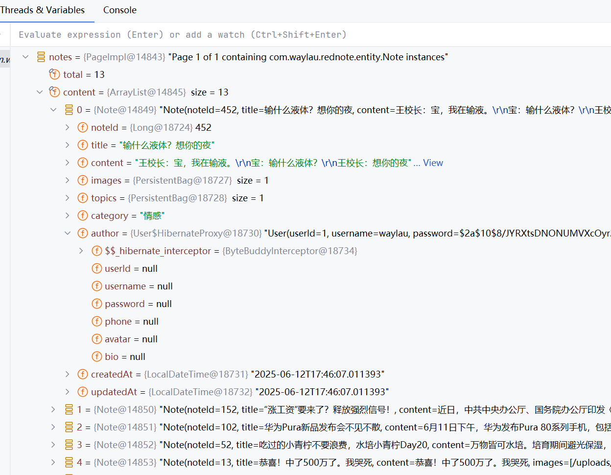
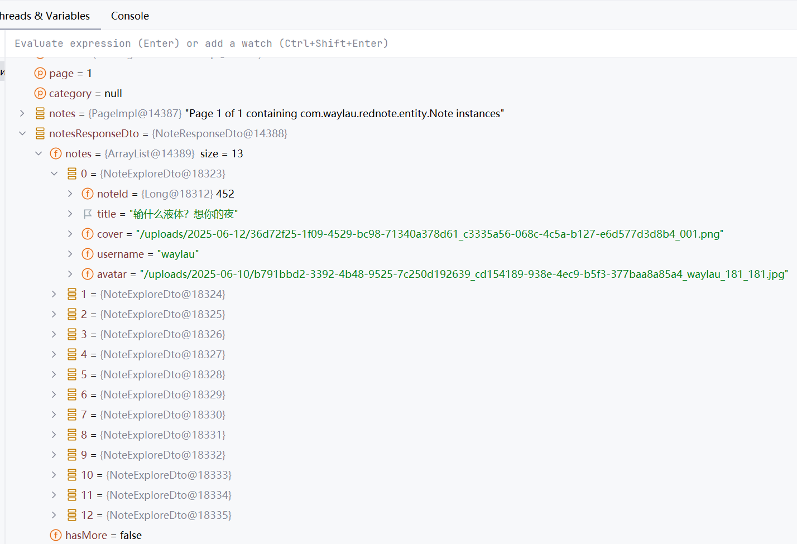
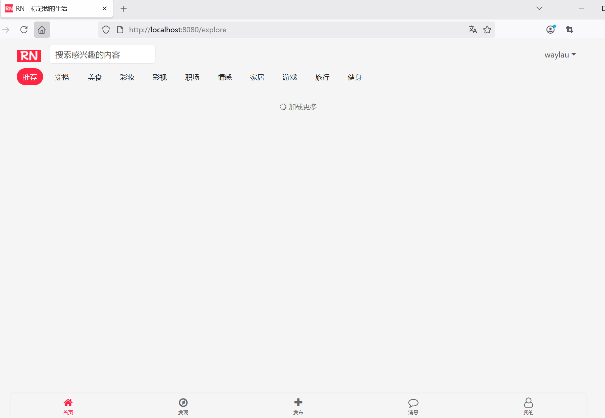
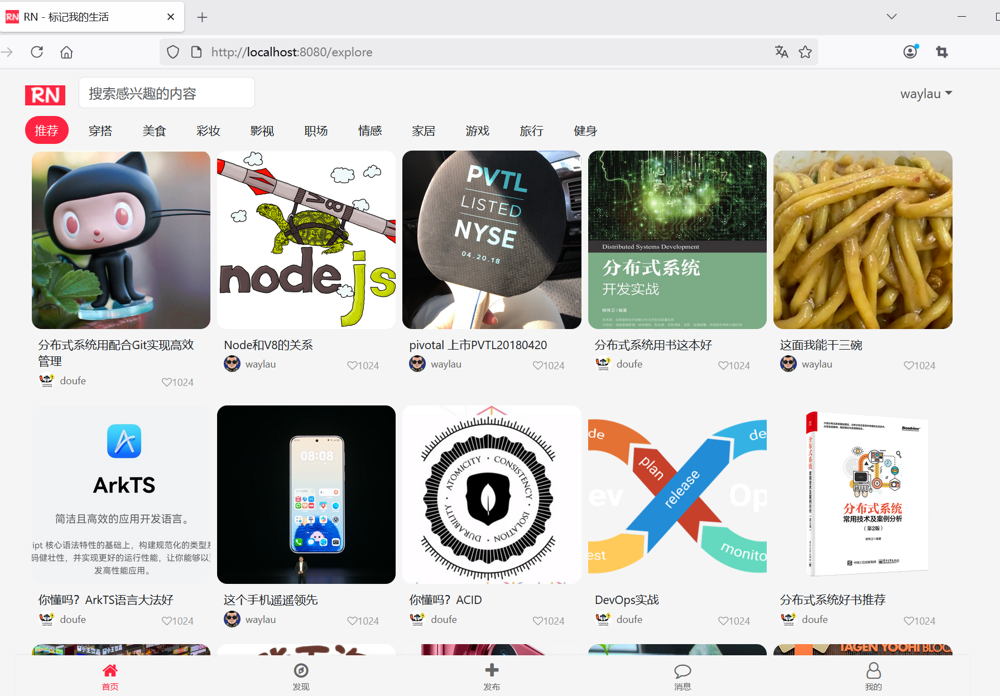

## 11.7 处理Hibernate懒加载与Jackson序列化冲突的问题


###  Hibernate 懒加载与 Jackson 序列化冲突的问题

当前端使用JavaScript fetch API试图访问返回首页笔记探索页面的笔记数据时，会报以下错误：

```
com.fasterxml.jackson.databind.exc.InvalidDefinitionException: No serializer found for class org.hibernate.proxy.pojo.bytebuddy.ByteBuddyInterceptor and no properties discovered to create BeanSerializer (to avoid exception, disable SerializationFeature.FAIL_ON_EMPTY_BEANS) (through reference chain: com.waylau.rednote.dto.NotesResponseDto["notes"]->java.util.Collections$UnmodifiableRandomAccessList[0]->com.waylau.rednote.entity.Note["author"]->com.waylau.rednote.entity.User$HibernateProxy["hibernateLazyInitializer"])
	at com.fasterxml.jackson.databind.exc.InvalidDefinitionException.from(InvalidDefinitionException.java:77) ~[jackson-databind-2.19.0.jar:2.19.0]
	at com.fasterxml.jackson.databind.SerializerProvider.reportBadDefinition(SerializerProvider.java:1359) ~[jackson-databind-2.19.0.jar:2.19.0]
	at com.fasterxml.jackson.databind.DatabindContext.reportBadDefinition(DatabindContext.java:415) ~[jackson-databind-2.19.0.jar:2.19.0]
	at com.fasterxml.jackson.databind.ser.impl.UnknownSerializer.failForEmpty(UnknownSerializer.java:52) ~[jackson-databind-2.19.0.jar:2.19.0]
	at com.fasterxml.jackson.databind.ser.impl.UnknownSerializer.serialize(UnknownSerializer.java:29) ~[jackson-databind-2.19.0.jar:2.19.0]
	at com.fasterxml.jackson.databind.ser.BeanPropertyWriter.serializeAsField(BeanPropertyWriter.java:732) ~[jackson-databind-2.19.0.jar:2.19.0]
	at com.fasterxml.jackson.databind.ser.std.BeanSerializerBase.serializeFields(BeanSerializerBase.java:760) ~[jackson-databind-2.19.0.jar:2.19.0]
	at com.fasterxml.jackson.databind.ser.BeanSerializer.serialize(BeanSerializer.java:183) ~[jackson-databind-2.19.0.jar:2.19.0]
	at com.fasterxml.jackson.databind.ser.BeanPropertyWriter.serializeAsField(BeanPropertyWriter.java:732) ~[jackson-databind-2.19.0.jar:2.19.0]
	at com.fasterxml.jackson.databind.ser.std.BeanSerializerBase.serializeFields(BeanSerializerBase.java:760) ~[jackson-databind-2.19.0.jar:2.19.0]
	at com.fasterxml.jackson.databind.ser.BeanSerializer.serialize(BeanSerializer.java:183) ~[jackson-databind-2.19.0.jar:2.19.0]
	at com.fasterxml.jackson.databind.ser.impl.IndexedListSerializer.serializeContents(IndexedListSerializer.java:119) ~[jackson-databind-2.19.0.jar:2.19.0]
	at com.fasterxml.jackson.databind.ser.impl.IndexedListSerializer.serialize(IndexedListSerializer.java:79) ~[jackson-databind-2.19.0.jar:2.19.0]
	at com.fasterxml.jackson.databind.ser.impl.IndexedListSerializer.serialize(IndexedListSerializer.java:18) ~[jackson-databind-2.19.0.jar:2.19.0]
	at com.fasterxml.jackson.databind.ser.BeanPropertyWriter.serializeAsField(BeanPropertyWriter.java:732) ~[jackson-databind-2.19.0.jar:2.19.0]
	at com.fasterxml.jackson.databind.ser.std.BeanSerializerBase.serializeFields(BeanSerializerBase.java:760) ~[jackson-databind-2.19.0.jar:2.19.0]
	at com.fasterxml.jackson.databind.ser.BeanSerializer.serialize(BeanSerializer.java:183) ~[jackson-databind-2.19.0.jar:2.19.0]
	at com.fasterxml.jackson.databind.ser.DefaultSerializerProvider._serialize(DefaultSerializerProvider.java:503) ~[jackson-databind-2.19.0.jar:2.19.0]
	at com.fasterxml.jackson.databind.ser.DefaultSerializerProvider.serializeValue(DefaultSerializerProvider.java:342) ~[jackson-databind-2.19.0.jar:2.19.0]
	at com.fasterxml.jackson.databind.ObjectWriter$Prefetch.serialize(ObjectWriter.java:1587) ~[jackson-databind-2.19.0.jar:2.19.0]
	at com.fasterxml.jackson.databind.ObjectWriter.writeValue(ObjectWriter.java:1061) ~[jackson-databind-2.19.0.jar:2.19.0]
	at org.springframework.http.converter.json.AbstractJackson2HttpMessageConverter.writeInternal(AbstractJackson2HttpMessageConverter.java:485) ~[spring-web-6.2.7.jar:6.2.7]
	at org.springframework.http.converter.AbstractGenericHttpMessageConverter.write(AbstractGenericHttpMessageConverter.java:126) ~[spring-web-6.2.7.jar:6.2.7]
	at org.springframework.web.servlet.mvc.method.annotation.AbstractMessageConverterMethodProcessor.writeWithMessageConverters(AbstractMessageConverterMethodProcessor.java:345) ~[spring-webmvc-6.2.7.jar:6.2.7]
	at org.springframework.web.servlet.mvc.method.annotation.HttpEntityMethodProcessor.handleReturnValue(HttpEntityMethodProcessor.java:263) ~[spring-webmvc-6.2.7.jar:6.2.7]
```

<http://localhost:8080/explore/note>接口返回的是ResponseEntity.ok(notesResponseDto)。`ResponseEntity.ok()` 是 Spring 框架中用于构建 HTTP 响应的一个便捷方法。它属于 `org.springframework.http.ResponseEntity` 类，主要用于封装 HTTP 响应的状态码、头部信息和响应体，提供更灵活的 API 响应控制。`ResponseEntity` 的内容会自动序列化为 JSON/XML 等格式。从上述报错信息可以知道，默认的自动序列化工具为Jackson。


### 错误原因分析

这个错误是典型的Hibernate懒加载与Jackson序列化冲突的问题。具体来说：

1. **错误根源**：当Jackson尝试序列化返回的Note数据时，遇到了Hibernate生成的代理对象（`User$HibernateProxy`）
2. **问题路径**：
   ```
   NotesResponseDto -> notes列表 -> Note实体 -> author属性 -> User实体的Hibernate代理对象
   ```
3. **技术细节**：
   - Hibernate使用代理对象实现懒加载关联实体
   - Jackson无法识别Hibernate的代理类（`ByteBuddyInterceptor`）
   - 代理对象中的`hibernateLazyInitializer`属性触发了序列化错误


从代码断点调试可以看到auther对象属性是空的，如下图11-1所示。





### 解决方案


解决方案有几下几种。

1. **优先使用DTO模式**：通过专门的DTO类定义API响应格式，避免直接序列化实体对象
2. **合理设计关联关系**：根据业务需求选择合适的加载策略（EAGER/FETCH）
3. **使用@JsonView进行精细控制**：在复杂场景中使用Jackson的@JsonView实现选择性序列化
4. **结合性能考虑**：懒加载是提高性能的重要手段，但需要配合合理的初始化策略


在本例中，使用的DTO模式。


#### 1. 创建NoteExploreDto

创建NoteExploreDto，代码如下：

```java
package com.waylau.rednote.dto;

import com.waylau.rednote.entity.Note;
import lombok.Getter;
import lombok.Setter;

/**
 * NoteExploreDto 笔记探索DTO
 *
 * @author <a href="https://waylau.com">Way Lau</a>
 * @version 2025/08/20
 **/
@Getter
@Setter
public class NoteExploreDto {
    private Long noteId;
    private String title;
    /**
     * 封面
     */
    private String cover;
    /**
     * 作者用户名
     */
    private String username;
    /**
     * 作者头像
     */
    private String avatar;

    public static NoteExploreDto toExploreDto(Note note) {
        NoteExploreDto noteExploreDto = new NoteExploreDto();
        noteExploreDto.setNoteId(note.getNoteId());
        noteExploreDto.setTitle(note.getTitle());
        noteExploreDto.setCover(note.getImages().get(0));
        noteExploreDto.setUsername(note.getAuthor().getUsername());
        noteExploreDto.setAvatar(note.getAuthor().getAvatar());

        return noteExploreDto;
    }
}
```

#### 2. 返回DTO类给前端

ExploreController修改如下：


```java
/**
  * 返回首页笔记探索页面的笔记数据
  */
@GetMapping("/note")
public ResponseEntity<NoteResponseDto> getNotesByCategory(
                                                          @RequestParam(defaultValue = "1") int page,
                                                          @RequestParam(required = false) String category) {
    // 把“推荐”当成空
    if (DEFAULT_CATEGORY.equals(category)) {
        category = null;
    }

    Page<Note> notes = noteService.getNotesByPage(page, PAGE_SIZE, category);

    NoteResponseDto notesResponseDto = new NoteResponseDto();
    notesResponseDto.setHasMore(notes.hasNext());
    //notesResponseDto.setNotes(notes.getContent());

    // 处理序列化问题
    List<NoteExploreDto> noteExploreDtoList = new ArrayList<>();
    for (Note note : notes.getContent()) {
        noteExploreDtoList.add(NoteExploreDto.toExploreDto(note));
    }
    notesResponseDto.setNotes(noteExploreDtoList);

    return ResponseEntity.ok(notesResponseDto);
}
```


NoteResponseDto修改如下：

```java
package com.waylau.rednote.dto;

import com.waylau.rednote.entity.Note;
import lombok.Getter;
import lombok.Setter;

import java.util.List;

/**
 * NoteResponseDto 探索笔记的响应对象
 *
 * @author <a href="https://waylau.com">Way Lau</a>
 * @version 2025/06/13
 **/
@Getter
@Setter
public class NoteResponseDto {
    /**
     * 笔记列表
     */
    // private List<Note> notes;
    private List<NoteExploreDto> notes;

    /**
     * 是否还有更多
     */
    private boolean hasMore;
}
```


通过以上方法，你应该能够解决Jackson序列化Hibernate代理对象的问题，确保API响应能够正确返回笔记数据。


从代码断点调试可以看到DTO对象属性都是有值的，如下图11-2所示。





如下图11-3所示的是首次访问首页的效果。





如下图11-4所示的是加载了笔记数据之后的效果。





