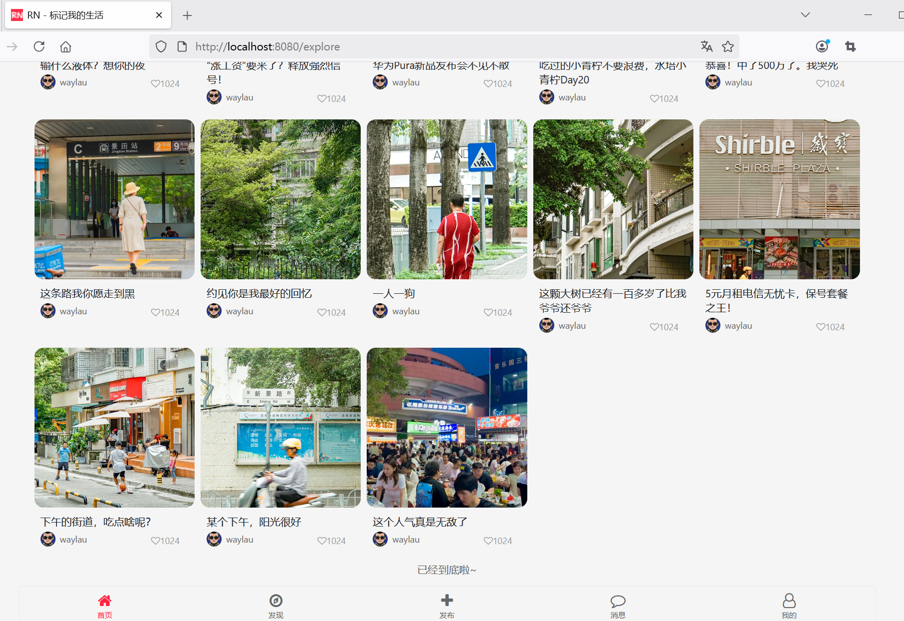

## 11.8 掌握笔记无限滚动刷新的技巧


修改explore.html，在`<script>`增加如下内容：

```js
<script>
    // ...为节约篇幅，此处省略非核心内容
    
    // 监听滚动事件
    window.addEventListener('scroll', function() {
        console.log('scroll');

        if (isLoading || !hasMore) {
            return;
        }

        console.log('scroll before');

        const scrollTop = window.pageYOffset || document.documentElement.scrollTop;
        const windowHeight = window.innerHeight;
        const documentHeight = document.documentElement.scrollHeight;

        console.log('scrollTop: ' + scrollTop);
        console.log('windowHeight: ' + windowHeight);
        console.log('documentHeight: ' + documentHeight);

        if (scrollTop + windowHeight >= documentHeight - 300) {
            loadMoreNotes();
        }

        console.log('scroll after');
    });
</script>
```


如下图11-5所示的是无限滚动刷新，查询完笔记数据之后的效果。





