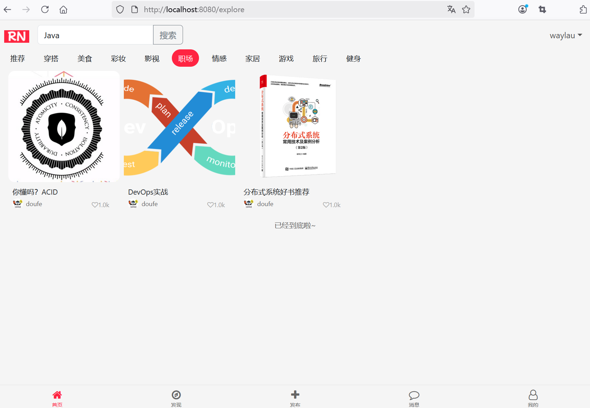

## 12.3 重构ExploreController处理搜索请求


### 控制器层


修改getNotesByCategory()方法，增加了query参数。

```java
/**
  * 返回首页笔记探索页面的笔记数据
  */
@GetMapping("/note")
public ResponseEntity<NoteResponseDto> getNotesByCategory(
                                                          @RequestParam(defaultValue = "1") int page,
                                                          @RequestParam(required = false) String category,
                                                          @RequestParam(required = false) String query) {
    // 把“推荐”当成空
    if (DEFAULT_CATEGORY.equals(category)) {
        category = null;
    }

    Page<Note> notes = null;

    // 区分是关键字搜索还是分类查询
    if (query == null || query.isEmpty()) {
        notes = noteService.getNotesByPage(page, PAGE_SIZE, category);
    } else {
        notes = noteService.getNotesByPageAndQuery(page, PAGE_SIZE, category, query);
    }


    NoteResponseDto notesResponseDto = new NoteResponseDto();
    notesResponseDto.setHasMore(notes.hasNext());

    // 处理序列化问题
    List<NoteExploreDto> noteExploreDtoList = new ArrayList<>();
    for (Note note : notes.getContent()) {
        noteExploreDtoList.add(NoteExploreDto.toExploreDto(note));
    }
    notesResponseDto.setNotes(noteExploreDtoList);

    return ResponseEntity.ok(notesResponseDto);
}
```

 
如果没有传入query参数值，则执行原有的NoteService.getNotesByPage()方法；否则，执行NoteService.getNotesByPageAndQuery()新方法。


### 服务层

修改NoteService，增加如下接口：

```java
/**
 * 搜索分页查询笔记
 *
 * @param page
 * @param pageSize
 * @param category
 * @param query
 * @return
 */
Page<Note> getNotesByPageAndQuery(int page, int pageSize, String category, String query);
```


修改NoteServiceImpl，增加如下方法：

```java
@Override
public Page<Note> getNotesByPageAndQuery(int page, int pageSize, String category, String query) {
    // 构造Pageable对象，按照创建时间倒序排序
    Pageable pageable = PageRequest.of(page - 1, pageSize, Sort.by("createAt").descending());

    if (category != null && !category.isEmpty() && query != null && !query.isEmpty()) {
        return noteRepository.findByCategoryAndTopicsContaining(category, query, pageable);
    } else if (query != null && !query.isEmpty()) {
        return noteRepository.findByTopicsContaining(query, pageable);
    } else {
        return noteRepository.findAll(pageable);
    }
}
```

如果没有传入category参数值，则执行原有的NoteRepository.findByTopicsContaining()方法；否则，执行NoteRepository.findByCategoryAndTopicsContaining()新方法。


### 仓库层


在 Spring Data JPA 中查询`List<String>`类型的属性需要使用特殊的方法。针对Note实体中的topics属性，新增如下接口：

```java
/**
 * 根据分类和话题标签分页查询笔记
 *
 * @param category
 * @param query
 * @param pageable
 * @return
 */
Page<Note> findByCategoryAndTopicsContaining(String category, String query, Pageable pageable);

/**
 * 根据话题标签分页查询笔记
 *
 * @param query
 * @param pageable
 * @return
 */
Page<Note> findByTopicsContaining(String query, Pageable pageable);
```

### 运行调测


在首页“推荐”分类执行搜素“Java”关键字，效果如下图12-1所示。


在首页“职场”分类执行搜素“Java”关键字，效果下图12-2所示。





两个搜素结果不一致，说明有些包含“Java”主题的笔记，并不在“职场”分类中。