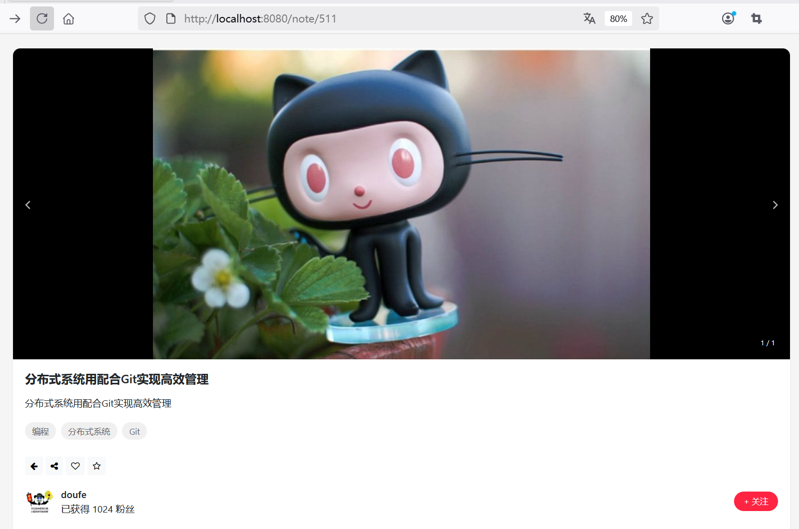
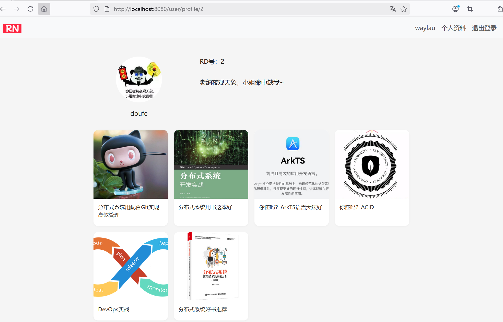

## 12.6 实现从笔记详情页跳转到作者详情页

类似上一节的做法，也可以在笔记详情页作者信息区域，设置点击跳转到作者的详情页。


### 加个CSS样式


修改note-detail.html。

去除`<a>`标签的下划线，只需要加个CSS样式：

```html
<style>
/* 去掉下划线 */
a {
    text-decoration: none;
}
</style>
```


### 前端修改


点击笔记的作者头像时，我们希望就能跳转到该作者的详情页。实现方式，只需要在作者头像上的``上套一层`<a>`即可。


```html
<!-- 作者信息 -->
<div class="author-info">
    <!-- 点击作者头像跳转到作者详情页 -->
    <a th:href="@{/user/profile/{userId}(userId=${note.author.userId})}">
        
    </a>

    <div>
        <div class="author-name" th:text="${note.author.username}">
            waylau
        </div>
        <div class="author-meta">
            已获得 1024 粉丝
        </div>
    </div>
    <div class="author-follow" th:if="${#authentication.name != note.author.username}">
        + 关注
    </div>
</div>
```


### 运行调测


运行应用，作者头像效果如下图12-6所示。





点击作者头像就可以跳转到作者的详情页了，效果如下图12-7所示。





