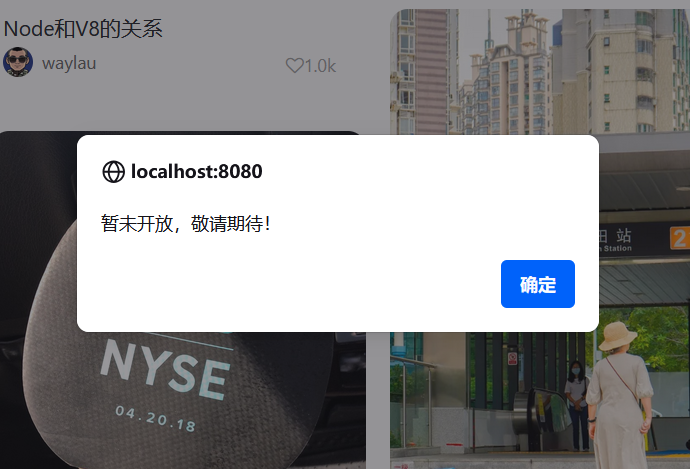

## 12.8 从底部导航栏导航到其他页面

修改explore.html，实现从底部导航栏导航到其他页面的功能。


### 底部导航栏设置点击事件

```html
<!-- 底部导航栏 -->
<div class="container bottom-nav">
    <div class="nav-item active" onclick="navigateTo('home')">
        <i class="fa fa-home nav-icon"></i>
        <span class="nav-text">首页</span>
    </div>
    <div class="nav-item" onclick="navigateTo('discover')">
        <i class="fa fa-compass nav-icon"></i>
        <span class="nav-text">发现</span>
    </div>
    <div class="nav-item" onclick="navigateTo('publish')">
        <i class="fa fa-plus nav-icon"></i>
        <span class="nav-text">发布</span>
    </div>
    <div class="nav-item" onclick="navigateTo('message')">
        <i class="fa fa-comment-o nav-icon"></i>
        <span class="nav-text">消息</span>
    </div>
    <div class="nav-item" onclick="navigateTo('profile')">
        <i class="fa fa-user-o nav-icon"></i>
        <span class="nav-text">我的</span>
    </div>
</div>
```


### 添加JS脚本处理导航

```js
// 导航函数
function navigateTo(page) {
    console.log('navigateTo: ' + page);

    if (page === 'home') {
        window.location.href = '/';
    } else if (page === 'publish') {
        window.location.href = '/note/publish';
    } else if (page === 'profile') {
        window.location.href = '/user/profile';
    } else {
        // 待实现的功能页面
        alert('暂未开放，敬请期待！');

        return;
    }
}
```


当点击暂未开放的功能时，比如“消息”，提示框效果如下图12-11所示。





