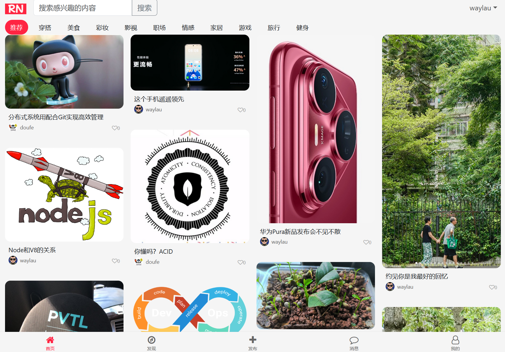
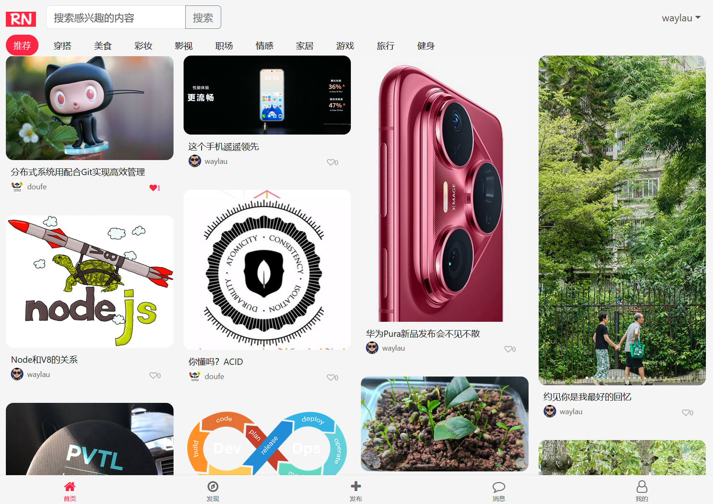

## 13.6 掌握无刷新更新点赞前端设计的核心要点，精通data属性用法


### 前端实现


修改explore.html中内容。

#### 1. 添加点赞按钮样式

```css
/* 点赞按钮样式 */
.liked {
    color: #ff2442;
}

.like-btn {
    cursor: pointer;
}
```


#### 2. 添加点赞状态显示及按钮事件

在笔记卡片中添加点赞按钮：

```html
// 创建笔记卡片元素
function createNoteElement(note) {
    // 判定笔记是否点赞，来设置点赞图标的样式
    let likeIconClass = note.liked ? "fa fa-heart like-btn liked" : "fa fa-heart-o like-btn";

    const noteElement = document.createElement("div");
    noteElement.className = "masonry-item";
    noteElement.innerHTML = `
        <!--<div class="note-image-container">-->
            <!-- 点击跳转到笔记详情页 -->
            <a href="/note/${note.noteId}">
                <!---->
                
            </a>
        <!--</div>-->
        <div class="note-content">
            <div class="note-title">${note.title}</div>
            <div class="note-author-stats">
                <!-- 点击跳转到用户详情页 -->
                <a href="/user/profile/${note.userId}">
                    <div class="note-author">
                        
                        <span class="author-name">${note.username}</span>
                    </div>
                </a>

                <div class="note-stats">
                    <div class="stat-item">
                        <!--<i class="fa fa-heart-o">${numberFormat(1024)}</i>-->
                        <i class="${likeIconClass}" data-node-id="${note.noteId}"
                            onclick="handleLike(this)">${numberFormat(note.likeCount)}</i>
                    </div>
                </div>
            </div>
        </div>
    `;

    return noteElement;
}
```


点赞按钮的样式变量className，其值是根据是否点赞而动态设置。


#### 3. 实现点赞交互

```javascript
// 点赞按钮的点击事件处理函数
function handleLike(element) {
    // 从data-*获取笔记ID
    const noteId = element.dataset.nodeId;

    // 禁用按钮放置重复点击
    element.disabled = true;

    // 发送请求
    fetch(`/like/${noteId}`, {
        method: 'POST',
        // 添加请求头, 用于Spring Security CSRF
        headers: {
            'X-CSRF-TOKEN': document.querySelector('meta[name="_csrf"]').getAttribute('content')
        }
    })
    .then(response => response.json())
    .then(data => {
        if (data.liked) {
            // 设置按钮为点赞样式
            element.classList.remove('fa-heart-o');
            element.classList.add('fa-heart');
            element.classList.add('liked');
        } else {
            // 恢复按钮为未点赞样式
            element.classList.remove('fa-heart');
            element.classList.remove('liked');
            element.classList.add('fa-heart-o');
        }

        // 点赞量显示处理
        element.textContent = numberFormat(data.likeCount);
    })
    .catch(error => {
        console.error('Error:', error);
        alert('点赞失败，请稍后再试');
    });

    // 启用按钮
    element.disabled = false;
}
```

### Thymeleaf 中的 `th:data-*` 属性详解

`th:data-note-id` 是 Thymeleaf 模板引擎中的**数据属性绑定**语法，用于将后端数据注入到 HTML 元素的 `data-*` 属性中。这类属性主要用于存储页面的自定义数据，便于 JavaScript 读取和操作。


#### 1. **基础语法**
- `th:data-*` 是 Thymeleaf 的标准属性处理器
- `*` 部分会被转换为 HTML 中的 `data-*` 属性
- 例如：`th:data-note-id="${note.id}"` → `<div data-note-id="123">`

#### 2. **核心作用**
- **数据传递**：将服务器端数据（如 Java 对象的属性）传递到前端
- **DOM 与数据解耦**：避免直接在 JavaScript 中硬编码数据
- **增强交互性**：为前端事件处理提供必要的上下文信息


#### 3. 其他 Thymeleaf 属性的对比

| **Thymeleaf 属性** | **作用**                               | **应用场景**                     |
|--------------------|----------------------------------------|----------------------------------|
| `th:text`          | 设置元素的文本内容                     | 显示标题、描述等文本信息         |
| `th:value`         | 设置表单元素的值                       | 填充输入框、下拉框初始值         |
| `th:attr`          | 通用属性设置                           | 设置非标准属性（如 `aria-*`）    |
| `th:data-*`        | 设置 HTML5 的 `data-*` 自定义数据属性  | 为 JavaScript 提供数据上下文     |


#### 4. JavaScript 中获取 data-* 属性的方法

1. **标准方式（dataset 属性）**

```javascript
const element = document.querySelector('.like-btn');
const noteId = element.dataset.noteId; // 推荐方式
```

2. **传统方式（getAttribute）**

```javascript
const noteId = element.getAttribute('data-note-id');
```

3. **批量获取所有 data-* 属性**

```javascript
const allData = element.dataset; // 返回 DOMStringMap 对象
// 例如 data-note-id="123" 会变成 allData.noteId === "123"
```

#### 5. 总结

`th:data-note-id` 是 Thymeleaf 中用于将后端数据注入到 HTML 元素的 `data-note-id` 属性的语法。其核心价值在于：

1. **数据传递**：实现服务器端数据与前端 DOM 的绑定
2. **事件驱动**：为 JavaScript 事件处理提供必要的上下文
3. **解耦设计**：避免在 JavaScript 中硬编码数据 ID，提高代码可维护性

在实际项目中，合理使用 `data-*` 属性可以简化前端与后端的数据交互流程，特别是在传统的服务端渲染项目中尤为实用。


### 运行调测


在首页查看笔记未点赞时效果，如下图13-1所示。




在首页查看笔记未点赞时效果，如下图13-2所示。




