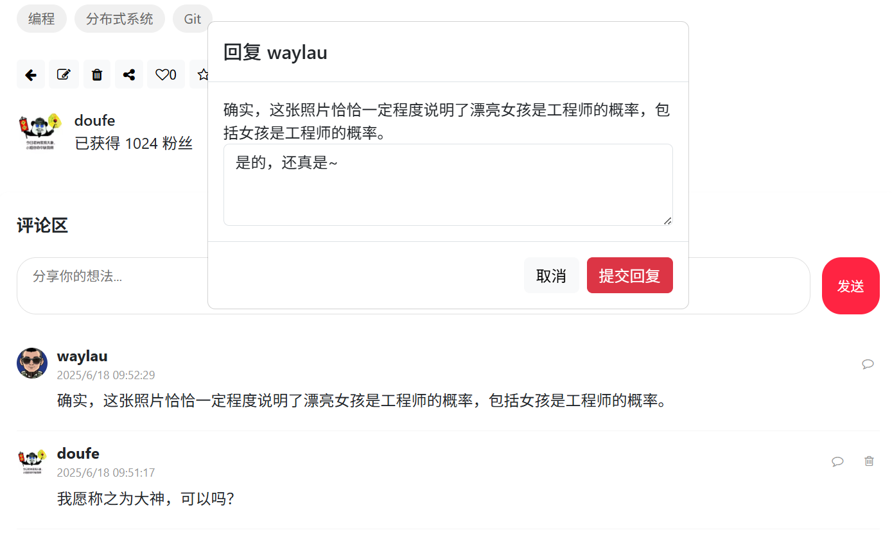
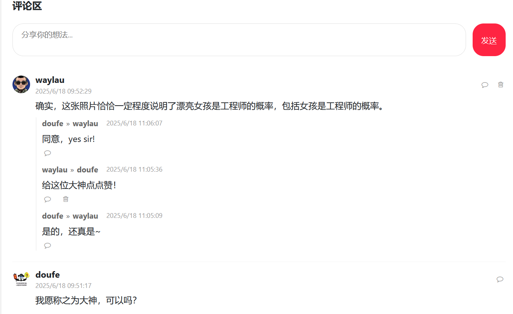

## 14.12 提交回复及删除回复


### 设置提交回复事件处理

回复弹窗上的提交回复设置点击事件以触发handleSubmitReply函数执行：


```html
<button type="button" class="btn btn-danger" id="submitReply" onclick="handleSubmitReply()">提交回复</button>
```

### handleSubmitReply函数


handleSubmitReply函数用于处理发送提交回复的请求到后端API，代码如下：


```js
// 处理提交回复点击事件
function handleSubmitReply() {
   const submitReply = document.getElementById('submitReply');
   const commentId  = submitReply.dataset.commentId;
   const noteId = submitReply.dataset.noteId;
   const replyContent = document.getElementById('replyContent').value;

   if (!replyContent) {
      return;
   }

   // 发送提交回复的请求
   fetch(`/comment/${noteId}/reply/${commentId}`, {
      method: "POST",
      headers: {
            "Content-Type": "application/json",
            'X-CSRF-TOKEN': document.querySelector('meta[name="_csrf"]').getAttribute('content')
      },
      body: replyContent
   })
   .then(response => {
         if (response.ok) {
               // 加载评论列表
               loadComments(noteId);

               // 关闭回复模态窗口
               const modal = document.getElementById('replyModal');
               modal.style.display = 'none';
               document.getElementById('replyContent').value = '';
         } else  {
               alert('回复失败，请重试');
         }
      })
      .catch(error => {
         console.error('回复错误：', error);
         alert('回复失败，请稍后重试');
      });
}
```


### 在回复回复按钮上增加点击事件

在回复回复按钮上增加点击事件以触发showReplyModal函数。

```html
<!-- 回复评论 -->
<button class="reply-btn" onclick='showReplyModal(${JSON.stringify(comment)})'>
   <i class="fa fa-comment-o"></i>
</button>
```


上述处理逻辑与在回复评论按钮上的点击事件处理一致，都是重用了回复弹窗处理回复。

### 在删除回复按钮上增加点击事件

在删除回复按钮上增加点击事件以触发deleteComment函数。

```html
<!-- 删除回复的按钮-->
<button class="delete-comment" ${isCurrentUser(reply.userId) ? '' : 'style="display:none"'}
   onclick="deleteComment(${reply.commentId})">
   <i class="fa fa-trash-o"></i>
</button>
```


上述处理逻辑与在删除回复按钮上的点击事件处理一致，都是重用了删除评论的处理。


### 运行调测


通过以上实现，可以在项目中完整实现回复的功能，包括评论回复评论、回复列表展示、删除回复，以及删除回复后回复列表的刷新。

如下图14-4所示的是回复弹窗。





如下图14-5所示的是回复列表，能够显示完整的回复路径。





通过以上实现，你可以支持无限层级的嵌套评论，同时保持良好的性能和用户体验。实际项目中，建议根据具体需求限制最大层级深度（如不超过5层），以避免界面过于复杂。