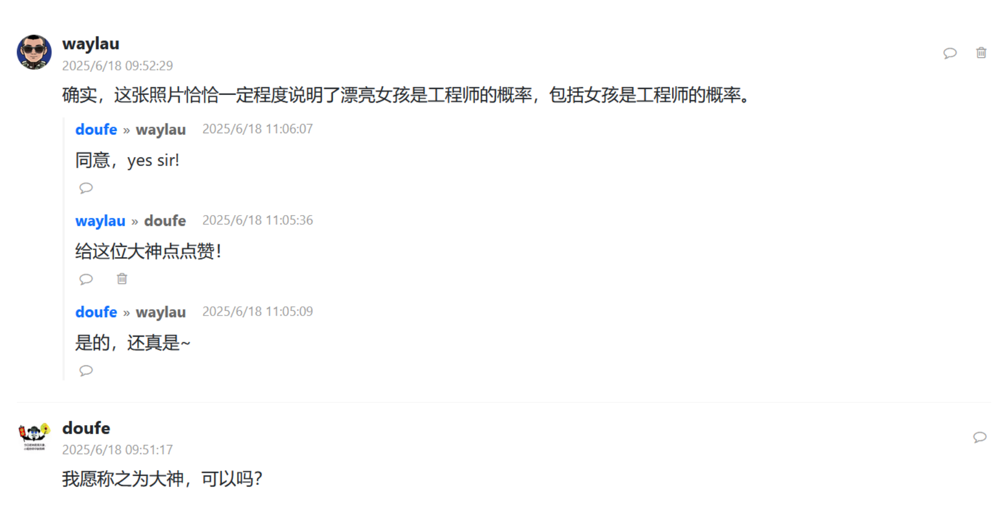

## 14.13 从评论列表跳转到作者详情页


### 前端修改


点击评论的作者头像时，我们希望就能跳转到该作者的详情页。实现方式，只需要在作者信息的标签外再套一层`<a>`标签即可。


```js
// 创建一个评论项元素
function createCommentElement(comment) {
   const commentElement = document.createElement('div');
   commentElement.className = 'comment-item';
   commentElement.dataset.commentId = comment.commentId;

   // 格式化日期
   const date = new Date(comment.createAt);
   const formattedDate = date.toLocaleString();

   commentElement.innerHTML = `
   <div class="comment-header">
      <!-- 点击用户头像跳转到用户详情页 -->
      <a href="/user/profile/${comment.userId}">
            
      </a>

// ...为节约篇幅，此处省略非核心内容
```


回复内容也是类似处理，点击用户名跳转到用户详情页：


```js
// 渲染回复列表
function renderReplies(replies) {
   // 判定回复列表是否为空
   if (replies.length === 0) {
      return '';
   }

   return replies.map(reply => {
      const date = new Date(reply.createAt);
      const formattedDate = date.toLocaleString();

      return `
      <div class="reply-item">
            <div class="reply-header">
               <!-- 点击用户名跳转到用户详情页 -->
               <a href="/user/profile/${reply.userId}">
                  <span class="reply-username">${reply.username}</span>
               </a>

// ...为节约篇幅，此处省略非核心内容
```


### 运行调试

如下图14-6所示的是回复列表，显示是能够可以跳转了。





