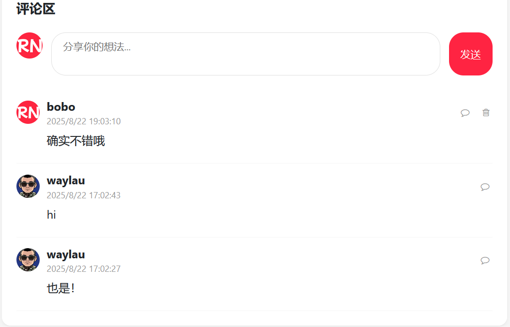

## 14.8 发布评论及评论列表展示的功能实现


### 前端实现

#### 1. HTML模板修改

在笔记卡片评论区域的”发送“按钮上添加点击事件，并设置data属性、增加评论列表div：

```html
<!-- 评论区 -->
<div class="comments-section">
    <div class="comments-header">
        <div class="comments-title">
            评论区
        </div>
    </div>

    <!-- 评论输入框 -->
    <div class="comment-input">
        
        <textarea class="comment-textarea" placeholder="分享你的想法..."></textarea>
        <div class="comment-btn" th:data-note-id="${note.noteId}" th:onclick="sendComment([[${note.noteId}]])">
            发送
        </div>
    </div>

    <!-- 评论列表 -->
    <div class="comment-list" id="commentList"></div>
</div>
```

#### 2. JavaScript实现评论交互
```javascript
// 首次加载评论
const noteId = document.querySelector('.comment-btn').dataset.noteId;
loadComments(noteId);

// 处理评论发送按钮事件
function sendComment(noteId) {
    const textarea = document.querySelector('.comment-textarea');

    // 获取评论内容
    const commentContent = textarea.value.trim();

    if (commentContent === '') {
        alert('评论内容不能为空');
        return;
    }

    // 发送请求
    fetch(`/comment/${noteId}`, {
        method: 'POST',
        headers: {
            'Content-Type': 'application/json',
            'X-CSRF-TOKEN': document.querySelector('meta[name="_csrf"]').getAttribute('content')
        },
        body: commentContent
    })
    .then(response => {
            if (response.ok) {
                // 加载评论列表
                loadComments(noteId);

                // 清空评论输入框
                textarea.value = '';
            } else  {
                alert('评论失败，请重试');
            }
        })
        .catch(error => {
            console.error('评论错误：', error);
            alert('评论失败，请稍后重试');
        });
}

// 加载评论列表
function loadComments(noteId) {
    // 获取评论列表容器
    const commentList = document.getElementById('commentList');

    // 清空评论列表
    commentList.innerHTML = '';

    // 发送请求获取评论列表数据
    fetch(`/comment/${noteId}`)
    .then(response => response.json())
    .then(data => {
        // 判定返回的数据是否为空
        if (data.length > 0) {
            // 遍历评论列表，生成评论项并添加到列表容器中
            data.forEach(comment => {
                const commentElement = createCommentElement(comment);
                commentList.appendChild(commentElement);
            })
        } else {
            // 添加一个提示元素
            const noCommentElement = createNoCommentElement();
            commentList.appendChild(noCommentElement);
        }
    })
}

// 创建一个评论项元素
function createCommentElement(comment) {
    const commentElement = document.createElement('div');
    commentElement.className = 'comment-item';
    commentElement.dataset.commentId = comment.commentId;

    // 格式化日期
    const date = new Date(comment.createAt);
    const formattedDate = date.toLocaleString();

    commentElement.innerHTML = `
    <div class="comment-header">
        
        <div class="comment-user-info">
            <div class="comment-username">${comment.username}</div>
            <div class="comment-time">${formattedDate}</div>
        </div>

        <!-- TODO 回复评论-->
        <button class="reply-btn">
            <i class="fa fa-comment-o"></i>
        </button>

        <!-- TODO 删除评论-->
        <button class="delete-comment">
            <i class="fa fa-trash-o"></i>
        </button>
    </div>

    <div class="comment-content">${comment.content}</div>
    `;

    return commentElement;
}

// 添加一个暂无评论的提示元素
function createNoCommentElement() {
    const commentElement = document.createElement('div');
    commentElement.innerHTML = `<p class="empty-comments">暂无评论，快来发表你的看法吧</p>`;

    return commentElement;
}
```

#### 3. CSS样式美化界面


添加必要的CSS样式：

```css
/* 评论区（第二部分）*/
.comment-user-avatar {
    width: 32px;
    height: 32px;
    border-radius: 50%;
    margin-right: 10px;
}

.comment-user-info {
    flex: 1;
}

.comment-username {
    font-weight: bold;
}

.comment-time {
    font-size: 12px;
    color: #999;
}

.comment-content {
    margin-left: 42px;
    margin-bottom: 10px;
}


.reply-btn, .delete-comment {
    background: none;
    border: none;
    color: #999;
    cursor: pointer;
    font-size: 12px;
}

.delete-comment {
    margin-left: 10px;
}

.empty-comments {
    color: #999;
    text-align: center;
    padding: 20px 0;
}
```


### 运行调测


通过以上实现，可以在项目中完整实现评论区功能，包括评论发布、评论列表展示和用户交互反馈等，演示效果如下图14-1所示。


