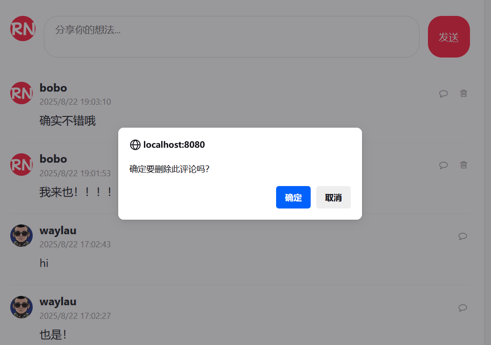
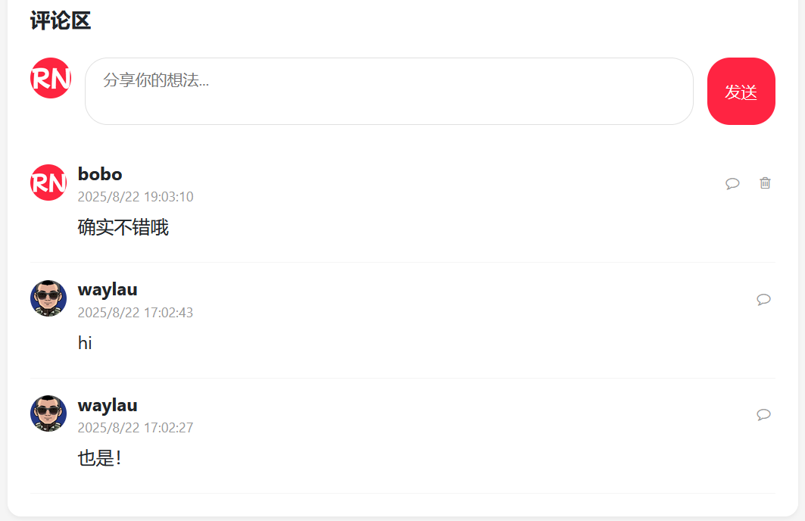

## 14.9 删除评论的功能实现


### 删除评论按钮

在删除评论按钮上添加数据属性绑定，并根据判定动态设置样式：

```js
// 创建一个评论项元素
function createCommentElement(comment) {
    const commentElement = document.createElement('div');
    commentElement.className = 'comment-item';
    commentElement.dataset.commentId = comment.commentId;

    // 格式化日期
    const date = new Date(comment.createAt);
    const formattedDate = date.toLocaleString();

    commentElement.innerHTML = `
    <div class="comment-header">
        
        <div class="comment-user-info">
            <div class="comment-username">${comment.username}</div>
            <div class="comment-time">${formattedDate}</div>
        </div>

        <!-- TODO 回复评论-->
        <button class="reply-btn">
            <i class="fa fa-comment-o"></i>
        </button>

        <!-- 删除评论-->
        <button class="delete-comment" ${isCurrentUser(comment.userId) ? '' : 'style="display:none"'}
            onclick="deleteComment(${comment.commentId})">
            <i class="fa fa-trash-o"></i>
        </button>
    </div>

    <div class="comment-content">${comment.content}</div>
    `;

    return commentElement;
}
```

只有评论的作者自己才能删除。


### 检查是否是当前用户


确保在 HTML 模板中有一个 meta 标签来存储 当前用户ID：

```html
<!-- 确保有一个meta标签来存储当前用户ID -->
<meta name="currentUserId" th:content="${#authentication.principal?.userId}"></meta>
```


检查是否是当前用户函数isCurrentUser()如下：


```javascript
// 检查是否是当前用户
function isCurrentUser(userId) {
    const currentUserId = document.querySelector('meta[name="currentUserId"]').content;
    return userId.toString() === currentUserId;
}
```

#### 调用删除评论的接口


调用删除评论的接口：

```js
// 处理删除按钮点击事件
function deleteComment(commentId) {
    // 删除评论前先做确认提示
    if (!confirm("确定要删除此评论吗？")) {
        return;
    }

    // 发送删除请求
    fetch(`/comment/${commentId}`, {
        method: 'DELETE',
        headers: {
            'X-CSRF-TOKEN': document.querySelector('meta[name="_csrf"]').getAttribute('content')
        }
    }).then(response => {
            if (response.ok) {
                // 加载评论列表
                loadComments(noteId);
            } else  {
                alert('删除评论失败，请重试');
            }
        })
        .catch(error => {
            console.error('删除评论错误：', error);
            alert('删除评论失败，请稍后重试');
        });
}
```


### 运行调测


通过以上实现，可以在项目中完整实现评论删除功能，包括评论删除提前的提示，以及删除后评论列表的刷新。

如下图14-2所示的是评论删除提前的提示。





如下图14-3所示的是评论删除后的列表刷新。




