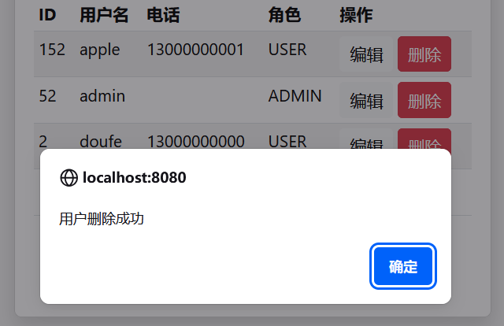

## 15.10 设计用户管理功能的删除用户操作


### “删除”按钮上设置点击事件

在admin-user.html文件的“删除”按钮上设置点击事件，以便跳转到删除请求，修改如下：

```html
<button class="btn btn-sm btn-danger" th:onclick="deleteUser([[${user.userId}]])">
    删除
</button>
```


确保有一个meta标签来存储CSRF令牌：


```html
<!-- 确保有一个meta标签来存储CSRF令牌 -->
<meta name="_csrf" th:content="${_csrf.token}"></meta>
```
    


事件处理逻辑如下：


```js
<script th:inline="javascript">
    // 删除用户
    function deleteUser(userId) {
        // 先确认是否删除用户
        if (!confirm('确定要删除该用户吗？')) {
            return;
        }

        // 发送请求
        fetch('/admin/user/' + userId, {
            method: 'DELETE',
                // 添加请求头, 用于Spring Security CSRF
                headers: {
                    'X-CSRF-TOKEN': document.querySelector('meta[name="_csrf"]').getAttribute('content')
                }
           })
           .then(response => {
               if (response.ok) {
                    response.json().then(data => {
                        // 从响应中获取提示信息
                        alert(data.message || '删除成功');

                        // 从响应中获取重定向URL
                        window.location.href = data.redirectUrl;
                    });
               } else  {
                   response.json().then(data => {
                       alert(data.message || '删除失败，请重试');
                   });
               }
           })
           .catch(error => {
               console.error('删除失败：', error);
               alert('删除失败，请稍后重试');
           })
    }
</script>
```

上述代码会向后端发送删除请求。

### 删除请求控制器

在AdminController中增加如下删除请求方法如下：

```java
/**
 * 处理用户删除的请求
 */
@DeleteMapping("/user/{userId}")
public ResponseEntity<DeleteResponseDto> deleteUser(@PathVariable Long userId) {
    // 判定用户是否存在，不存在则抛出异常
    Optional<User> optionalUser = userService.findByUserId(userId);
    if (!optionalUser.isPresent()) {
        throw new UserNotFoundException("");
    }

    userService.deleteUser(userId);

    DeleteResponseDto deleteResponseDto = new DeleteResponseDto();
    deleteResponseDto.setMessage("用户删除成功");
    deleteResponseDto.setRedirectUrl("/admin/user");

    return ResponseEntity.ok(deleteResponseDto);
}
```


### 删除服务


UserRepository新增如下接口：

```java
/**
  * 根据用户删除ID
  *
  * @param userId
  */
void deleteById(Long userId);
```


UserService新增如下接口：

```java
/**
  * 删除用户
  *
  * @param userId
  */
void deleteUser(Long userId);
```


UserServiceImpl新增如下方法：

```java
@Override
public void deleteUser(Long userId) {
    userRepository.deleteById(userId);
}
```


如下图15-10所示，是在移动设备上访问删除用户成功后的效果。



