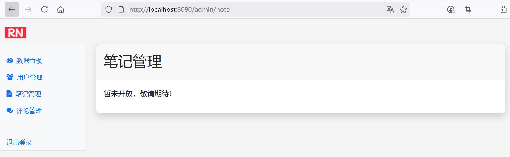
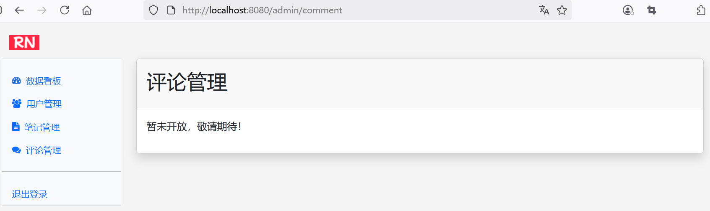

## 15.11 其他功能的处理及安全总结、优化建议


### 其他功能的处理

受限于篇幅，其他功能如笔记管理、评论管理等，实现的过程与用户管理类似，这里就不再赘述。


笔记管理、评论管理等功能简单处理如下。


#### 笔记管理定义页面片段

新增admin-note.html文件，HTML页面片段定义如下：


```html
<!DOCTYPE html>
<html lang="en" xmlns:th="http://www.thymeleaf.org">
<body>
<!-- 定义片段 -->
<div th:fragment="admin-note">
    <div class="card shadow mb-4">
        <div class="card-header py-3">
            <h2>笔记管理</h2>
        </div>
        <!-- 笔记管理 -->
        <div class="card-body">
            <p>暂未开放，敬请期待！</p>
        </div>

    </div>
</div>
</body>
</html>
```

#### 评论管理定义页面片段

新增admin-note.html文件，HTML页面片段定义如下：

```html
<!DOCTYPE html>
<html lang="en" xmlns:th="http://www.thymeleaf.org">
<body>
<!-- 定义片段 -->
<div th:fragment="admin-comment">
    <div class="card shadow mb-4">
        <div class="card-header py-3">
            <h2>评论管理</h2>
        </div>
        <!-- 评论管理 -->
        <div class="card-body">
            <p>暂未开放，敬请期待！</p>
        </div>

    </div>
</div>
</body>
</html>
```


最终两个界面的效果如下图15-11、图15-12所示。







### 安全总结

1. **权限区分**：
   - 为管理员和普通用户设置不同的角色

1. **密码加密**：
   - 在生产环境中，永远不要使用明文密码（如 `{noop}`）
   - 使用BCrypt或Argon2等强哈希算法加密密码
   - 可以使用`BCryptPasswordEncoder`工具类生成加密密码：


### 优化建议

1. **数据可视化**：使用Chart.js或ECharts实现数据图表
2. **搜索过滤**：添加搜索和过滤功能
3. **操作日志**：记录管理员操作
4. **批量操作**：支持批量删除、审核等操作
5. **权限细分**：实现更细粒度的权限控制（如菜单权限、按钮权限）
6. **多环境配置**：
   - 开发环境可以使用配置文件快速配置
   - 生产环境应使用数据库存储用户信息
7. **安全风险**：
   - 配置文件中的密码可能会被意外提交到版本控制系统
   - 考虑使用环境变量或Spring Cloud Config等工具保护敏感信息
   - 限制管理员登录IP范围
   - 添加登录失败次数限制
   - 为管理员账号启用两步验证
