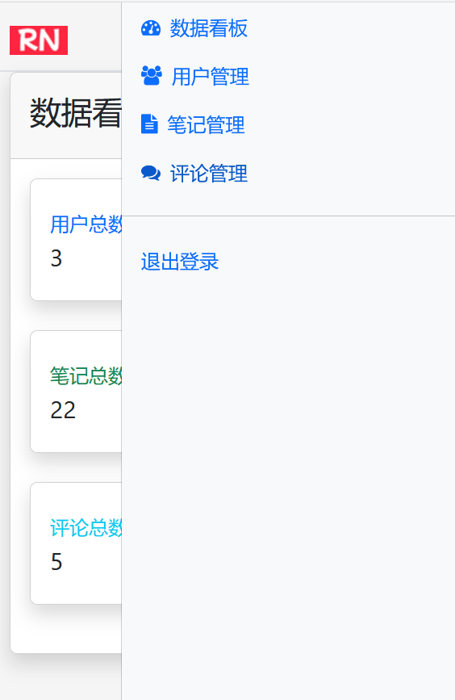

## 15.7 数据看板功能的实现

### 定义页面片段

新增admin-dashboard.html文件，数据看板HTML页面片段定义如下：

```html
<!DOCTYPE html>
<html lang="en" xmlns:th="http://www.thymeleaf.org" xmlns:sec="http://www.thymeleaf.org/extras/spring-security">

<body>
    <!-- 定义片段 -->
    <div th:fragment="admin-dashboard">
        <div class="card shadow mb-4">
            <div class="card-header py-3">
                <h2>数据看板</h2>
            </div>
            <div class="card-body">
                <!-- 统计卡片 -->
                <div class="col-xl-3 col-md-6 mb-4">
                    <div class="card border-left-primary shadow h-100 py-2">
                        <div class="card-body">
                            <div class="row no-gutters align-items-center">
                                <div class="col mr-2">
                                    <div class="text-xs font-weight-bold text-primary text-uppercase mb-1">用户总数</div>
                                    <div class="h5 mb-0 font-weight-bold text-gray-800" th:text="${userCount}">0</div>
                                </div>
                                <div class="col-auto">
                                    <i class="fa fa-users fa-2x text-gray-300"></i>
                                </div>
                            </div>
                        </div>
                    </div>
                </div>

                <div class="col-xl-3 col-md-6 mb-4">
                    <div class="card border-left-success shadow h-100 py-2">
                        <div class="card-body">
                            <div class="row no-gutters align-items-center">
                                <div class="col mr-2">
                                    <div class="text-xs font-weight-bold text-success text-uppercase mb-1">笔记总数</div>
                                    <div class="h5 mb-0 font-weight-bold text-gray-800" th:text="${noteCount}">0</div>
                                </div>
                                <div class="col-auto">
                                    <i class="fa fa-file-text fa-2x text-gray-300"></i>
                                </div>
                            </div>
                        </div>
                    </div>
                </div>

                <div class="col-xl-3 col-md-6 mb-4">
                    <div class="card border-left-info shadow h-100 py-2">
                        <div class="card-body">
                            <div class="row no-gutters align-items-center">
                                <div class="col mr-2">
                                    <div class="text-xs font-weight-bold text-info text-uppercase mb-1">评论总数</div>
                                    <div class="h5 mb-0 font-weight-bold text-gray-800" th:text="${commentCount}">0
                                    </div>
                                </div>
                                <div class="col-auto">
                                    <i class="fa fa-comments fa-2x text-gray-300"></i>
                                </div>
                            </div>
                        </div>
                    </div>
                </div>
            </div>
        </div>
    </div>
</body>

</html>
```


上述片段的名称为“admin-dashboard”。

### 统计用户数

UserRepository新增如下接口：

```java
/**
  * 统计用户数
  *
  * @return
  */
long count();
```


UserService新增如下接口：

```java
/**
  * 统计用户数
  *
  * @return
  */
long countUsers();
```


UserServiceImpl新增如下方法：

```java
@Override
public long countUsers() {
    return userRepository.count();
}
```

### 统计笔记数

NoteRepository新增如下接口：

```java
/**
  * 统计笔记数
  *
  * @return
  */
long count();
```


NoteService新增如下接口：

```java
/**
  * 统计笔记数
  *
  * @return
  */
long countNotes();
```


NoteServiceImpl新增如下方法：

```java
@Override
public long countNotes() {
    return noteRepository.count();
}
```


### 统计评论数

CommentRepository新增如下接口：

```java
/**
  * 统计评论数
  *
  * @return
  */
long count();
```


CommentService新增如下接口：

```java
/**
  * 统计评论数
  *
  * @return
  */
long countComments();
```


CommentServiceImpl新增如下方法：

```java
@Override
public long countComments() {
    return commentRepository.count();
}
```

### 修改控制器


AdminController修改如下：

```java
@GetMapping("/dashboard")
public String dashboard(Model model) {
    // 统计数据
    long userCount = userService.countUsers();
    long noteCount = noteService.countNotes();
    long commentCount = commentService.countComments();

    model.addAttribute("userCount", userCount);
    model.addAttribute("noteCount", noteCount);
    model.addAttribute("commentCount", commentCount);

    model.addAttribute("contentFragment", "admin-dashboard");

    return "admin";
}
```

### 运行调测


如下图15-3所示，是账号admin访问`/admin`页面路径的效果，重定向到了`/admin/dashboard`页面。


admin.html模版采用了响应式的布局，即便在移动设备上，也能能有很好的适配。如下图15-4所示，是在移动设备上访问`/admin`页面的效果。


点击右上角的按钮，也可以展示完整菜单，如下图15-5所示



