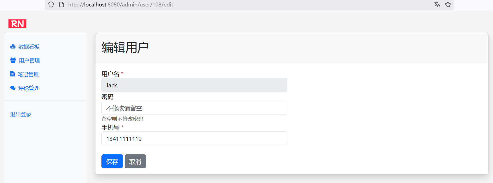
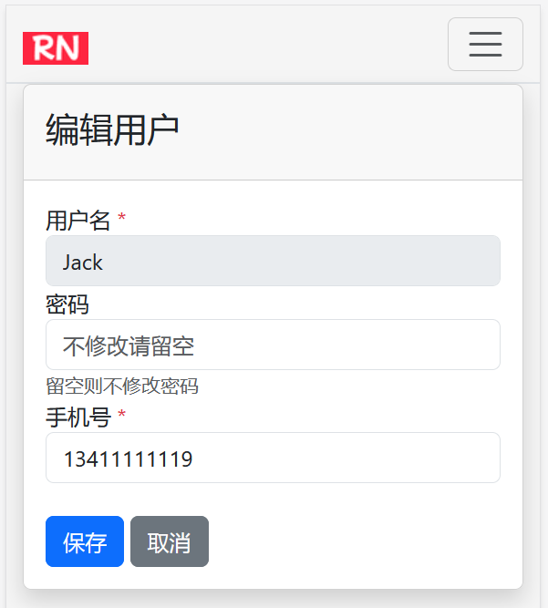

## 15.9 设计用户管理功能的编辑用户操作


### “编辑”按钮上设置点击事件

在admin-user.html文件的“编辑”按钮上设置点击事件，以便跳转到编辑页面，修改如下：

```html
<button class="btn btn-sm btn-light"
        th:onclick="'window.location.href=\'' + @{/admin/user/{userId}/edit(userId=${user.userId})} + '\''">
    编辑
</button>
```


上述代码会重定向到编辑页面。

### 编辑页面控制器

编辑页面控制器如下：

```java
/**
 * 显示用户编辑界面
 */
@GetMapping("/user/{userId}/edit")
public String editUser(@PathVariable Long userId, Model model) {
    // 判定用户是否存在，不存在则抛出异常
    Optional<User> optionalUser = userService.findByUserId(userId);
    if (!optionalUser.isPresent()) {
        throw new UserNotFoundException("");
    }

    model.addAttribute("user", optionalUser.get());
    model.addAttribute("contentFragment", "admin-user-edit");

    return "admin";
}
```

根据userId查询到用户数据，并绑定到admin.html页面上。同时设置了代码片段为“admin-user-edit”。


### 新增代码片段admin-user-edit.html

```html
<!DOCTYPE html>
<html lang="en" xmlns:th="http://www.thymeleaf.org">
<body>
<!-- 定义片段 -->
<div th:fragment="admin-user">
    <div class="card shadow mb-4">
        <div class="card-header py-3">
            <h2>编辑用户</h2>
        </div>
        <div class="card-body">
            <form th:action="@{/admin/user}" method="post" th:object="${user}">
                <!-- 隐藏用户ID -->
                <input type="hidden" name="userId" th:field="*{userId}">

                <div class="row">
                    <div class="col-lg-6">
                        <!-- 用户名不可编辑 -->
                        <div class="form-group">
                            <label for="username">用户名 <span class="text-danger">*</span></label>
                            <input type="text" class="form-control" id="username" name="username"
                                   th:field="*{username}" disabled>
                        </div>

                        <!-- 密码 -->
                        <div class="form-group">
                            <label for="password">密码</label>
                            <input type="password" class="form-control" id="password" name="password"
                                   th:field="*{password}" placeholder="不修改请留空">
                            <div class="small text-muted">留空则不修改密码</div>
                        </div>

                        <!-- 手机号 -->
                        <div class="form-group">
                            <label for="phone">手机号 <span class="text-danger">*</span></label>
                            <input type="text" class="form-control" id="phone" name="phone"
                                   th:field="*{phone}" placeholder="请输入手机号">
                        </div>
                    </div>
                </div>

                <!-- 操作按钮 -->
                <div class="mt-4">
                    <button type="submit" class="btn btn-primary mr-2">保存</button>
                    <button type="button" class="btn btn-secondary"
                            th:onclick="history.back()">取消
                    </button>
                </div>
            </form>
        </div>
    </div>
</div>
</body>
</html>
```

### 运行调测


如下图15-8所示，访问编辑用户页面的效果。





如下图15-9所示，是在移动设备上访问编辑用户页面。





### 保存编辑后的数据

当点击“保存”时，会发送保存数据到后台接口。后台控制器AdminController增加如下方法：


```java
/**
 * 处理保存用户的请求
 */
@PostMapping("/user")
public String updateUser(@ModelAttribute User user) {
    // 判定用户是否存在，不存在则抛出异常
    Optional<User> optionalUser = userService.findByUserId(user.getUserId());
    if (!optionalUser.isPresent()) {
        throw new UserNotFoundException("");
    }

    User oldUser = optionalUser.get();

    // 更新用户
    userService.updateUserByAdmin(oldUser, user);
    return "redirect:/admin/user";
}
```


UserService新增如下接口：

```java
/**
 * 管理员更新用户
 *
 * @param oldUser
 * @param user
 */
void updateUserByAdmin(User oldUser, User user);
```


UserServiceImpl新增如下方法：

```java
@Override
public void updateUserByAdmin(User oldUser, User user) {
    // 更新基本信息
    oldUser.setPhone(user.getPhone());

    // 更新密码前先判定是否需要更新
    if (user.getPassword() != null && !user.getPassword().isEmpty()) {
        String encodedPassword = passwordEncoder.encode(user.getPassword());
        oldUser.setPassword(encodedPassword);
    }

    userRepository.save(oldUser);
}
```

