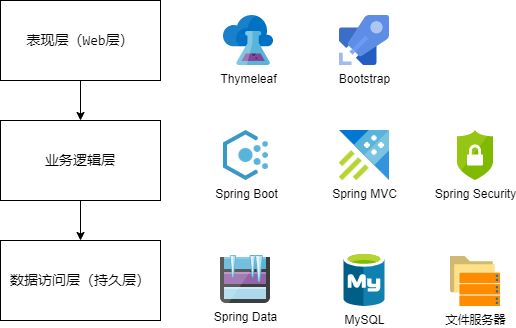

## 2.1 基于全栈的角度进行项目需求分析与架构设计

### 需求分析

* 用户模块
  * 注册功能
  * 登录功能
  * 信息管理：修改个人资料、修改密码、分页展示笔记
* 笔记模块
  * 发布功能
  * 查询功能
  * 编辑功能
  * 删除功能
* 文件服务器
  * 上传图片
  * 删除图片
* 首页模块
  * 瀑布流展示笔记
  * 搜索笔记
* 点赞模块
  * 执行点赞
  * 取消点赞
* 评论模块
  * 增加评论
  * 删除评论
  * 回复评论
  * 删除回复
* 后台管理模块
  * 数据看板
  * 用户管理

### 架构设计

三层架构。

