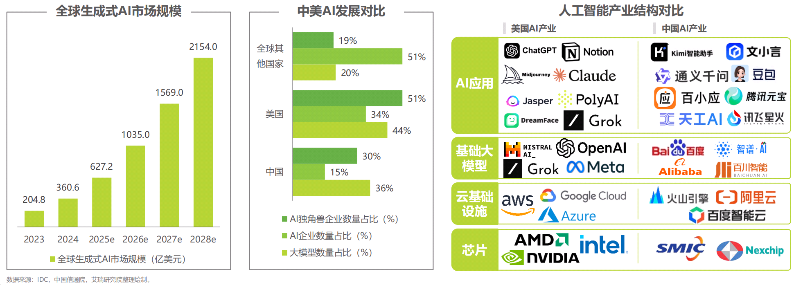
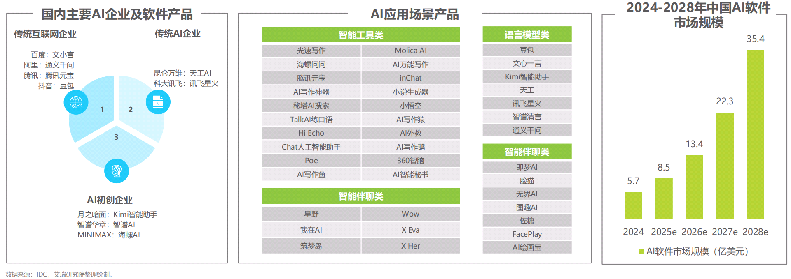

## 2.2 如何让AI成为你的贴身编程导师？

全球人工智能市场正快速发展，中美作为主要引领者，推动技术、产品和应用的多轮驱动。大语言模型（包括多模态大模型）的崛起提升了AI能力和使用时间，而中国在应用场景方面展现了显著优势。Java程序员应如何把握时代机遇？

### 全球AI市场

如下图2-2所示，全球AI产业在技术、产品与应用多轮驱动推动市场不断发展，其中，中美是产业引领者。

* 全球人工智能市场规模正在持续扩大，预计到2027年将迎来普适AI的时代，届时AI软件市场规模将达到1569亿美元，2028年将超2154亿美元。
* 大型模型正在推动AI能力的提升与边界的扩展，能力水平不断提高，AI使用时间也不断增加。
* 美国和中国已成为主要竞争主体，而国内在应用场景方面具备显著优势。

### 中国AI产业

如下图2-3所示，国内AI产业应用正在从百模大战向应用驱动转型，推动AI应用生态的发展。

* 中国AI产业正处于快速发展的阶段，国内AI应用场景日益丰富，尤其是面向消费者（To C）的市场迅速崛起。目前国内形成了传统互联网企业、传统AI企业和初创企业为代表的三个不同背景企业组成的产业生态。
* 本土化大模型的加速落地，显著推动了AI应用的爆发和市场规模增长，预计2028年中国AI软件市场规模将达到35.4亿美元。

### 处于AI时代的浪巅，Java程序员应躬身入局

要让AI成为你的贴身Java编程导师，让AI成为你的利用工具。关键在于构建高效的互动模式，充分利用AI的知识储备和即时反馈能力。以下是具体方法：

### 1. 明确学习目标，定向提问
- **基础学习**：针对语法细节提问，例如："Java中==和equals()的区别是什么？请用代码示例说明"
- **进阶提升**：聚焦设计模式、性能优化等，例如："如何用工厂模式重构这段Java代码？"
- **项目实践**：带着具体问题求助，例如："我的Spring Boot项目启动时报错'No qualifying bean'，可能的原因有哪些？"

### 2. 善用代码交互功能
- 直接提供代码片段，让AI分析问题："这段多线程代码有线程安全问题吗？如何修复？"
- 要求AI生成示例代码并解释："请写一个Java 8 Stream API处理集合的例子，并逐行解释"
- 对比不同实现方案："用for循环和递归两种方式实现斐波那契数列，各有什么优劣？"

### 3. 模拟实战场景
- 让AI扮演面试官："请出5道Java并发编程的面试题，并给出参考答案"
- 模拟项目需求："我需要开发一个简单的图书管理系统，用Java实现，该如何设计类结构？"
- 代码评审："这是我写的用户登录功能代码，请从安全性和可读性角度点评并优化"

### 4. 建立知识体系
- 要求AI梳理知识框架："请帮我整理Java集合框架的核心接口和实现类的关系"
- 关联前后知识："之前学了ArrayList，它和LinkedList的底层实现有什么不同？"
- 查漏补缺："除了try-catch-finally，Java还有哪些异常处理方式？"

### 5. 利用AI的迭代指导
- 逐步深入：从"什么是泛型"到"如何实现泛型擦除的绕过"
- 跟踪学习进度："基于我之前问的关于HashMap的问题，现在该学习哪些相关知识点？"
- 错题复盘："我在这个Java考试题上答错了，能帮我分析错误原因吗？"

通过这种有针对性的互动，AI可以成为随叫随到的导师，既解决即时问题，又能帮助构建系统的Java知识体系，同时培养独立编程思维。关键是要主动思考、明确问题，并结合实践不断验证和深化理解。

### 6. 利用AI辅助编程工具

利用AI辅助编程工具：

1. CodeGeeX
2. 通义灵码