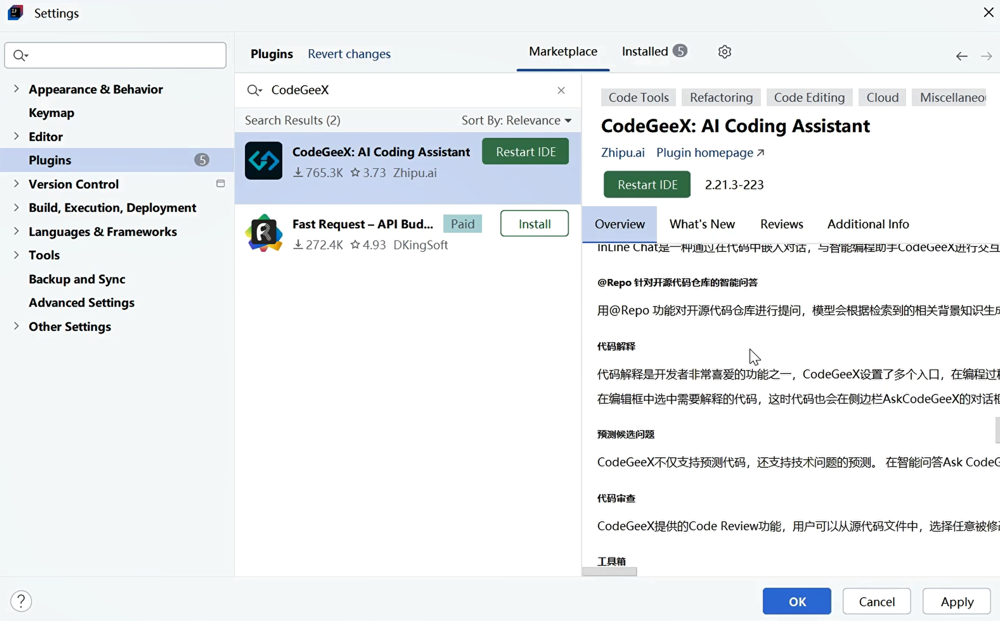

## 2.3 AI辅助编程工具CodeGeeX安装及使用

CodeGeeX是一款北京智谱华章科技股份有限公司出品的基于大模型的全能的智能编程助手。它可以实现代码的生成与补全、自动添加注释、代码翻译以及智能问答等功能，能够帮助开发者显著提高工作效率。CodeGeeX支持Python、Java、C++、JavaScript、Go等数十种常见编程语言，并适配Visual Studio Code及IntelliJ IDEA、PyCharm、GoLand等JetBrains IDE。CodeGeeX插件对个人用户完全免费，同时也提供面向企业的CodeGeeX私有化部署服务。

### 一、CodeGeeX 核心功能
1. **智能代码生成**：根据注释或代码上下文生成完整函数、类或代码块，支持多种编程场景
2. **实时代码补全**：在编写过程中提供上下文相关的代码建议，减少重复编码
3. **代码解释**：对已有代码进行逐行或整体解释，帮助理解复杂逻辑
4. **代码翻译**：在不同编程语言间进行代码转换（如Java转Python）
5. **调试与优化**：识别代码潜在问题并提供优化建议，支持单元测试生成


### 二、安装方法（以IntelliJ IDEA为例）
1. 打开IntelliJ IDEA，进入`File > Settings > Plugins`
2. 在搜索框输入"CodeGeeX"，找到对应的插件
3. 点击"Install"安装，等待安装完成后重启IDE，如下图2-4所示
4. 首次使用需在IDE右侧的CodeGeeX面板中完成账号注册或登录（支持GitHub、微信等方式）





### 三、基本使用方法
1. **代码生成**：
   - 编写注释描述需要实现的功能，如：
     ```java
     // 实现一个Java方法，计算两个整数的最大公约数
     ```
   - 按下快捷键（默认`Alt+\`），CodeGeeX会自动生成对应的实现代码

2. **代码补全**：
   - 在编写代码时，工具会自动提示可能的代码续写
   - 例如输入`public static int gcd(`，会自动补全参数和可能的实现逻辑

3. **代码解释**：
   - 选中需要解释的代码段
   - 右键选择"CodeGeeX > 解释代码"，会生成详细的代码说明

4. **跨语言转换**：
   - 选中Java代码
   - 右键选择"CodeGeeX > 代码翻译"，选择目标语言（如Python），即可得到转换后的代码

5. **集成使用技巧**：
   - 配合Spring Boot开发时，可通过注释快速生成Controller、Service等层代码
   - 调试时，选中报错代码，使用"优化建议"功能获取修复方案
   - 在重构时，利用"代码简化"功能优化冗余代码

### 四、优势特点
- 对中文注释支持友好，更符合国内开发者习惯
- 模型针对多编程语言优化，尤其在Java企业级开发场景表现出色
- 可离线使用（部分功能），保护代码隐私
- 持续更新迭代，不断优化对新框架和语法的支持

通过合理使用CodeGeeX，Java开发者可以将更多精力集中在业务逻辑设计上，减少重复劳动，提升代码质量和开发效率。