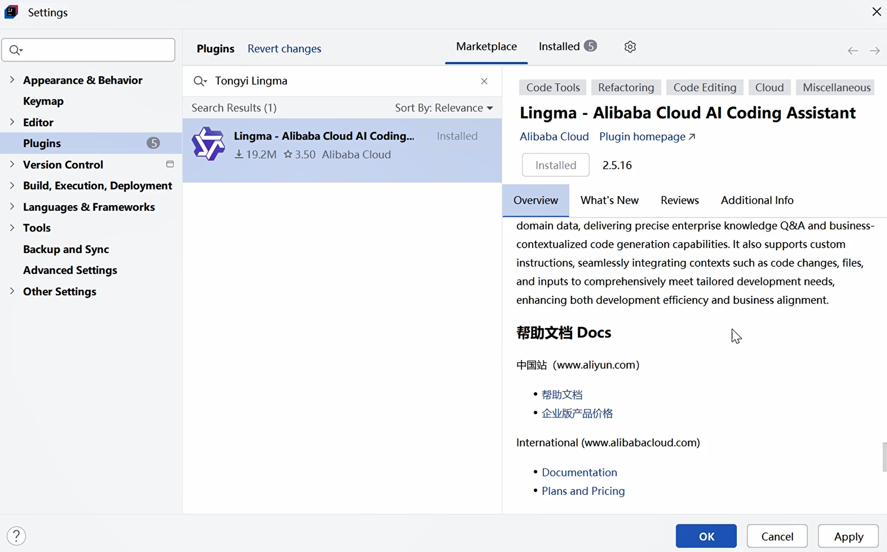

## 2.4 AI辅助编程工具通义灵码安装及使用

通义灵码是阿里巴巴达摩院研发的AI辅助编程工具，专注于提升开发者的编码效率，尤其在Java、Python等主流编程语言以及云原生、微服务等企业级开发场景中表现出色。它能通过理解代码上下文和业务意图，提供实时补全、代码生成、智能推荐等功能，同时对阿里系技术栈（如Spring Cloud Alibaba、Dubbo等）有深度适配。


### 一、通义灵码核心功能
1. **智能代码补全**：根据当前编码上下文，实时提供函数、变量、语句等补全建议，支持整行或多行间的连续补全。
2. **代码生成**：通过自然语言注释或不完整代码片段，生成完整的函数、类、甚至模块代码（如自动生成Spring Boot的Controller、Service层代码）。
3. **阿里技术栈适配**：针对阿里云、钉钉开发、支付宝生态等场景提供专属代码模板和最佳实践建议。
4. **代码优化与重构**：识别冗余代码、性能问题或不符合编码规范的片段，提供优化方案和重构建议。
5. **文档生成**：自动为类、方法生成注释文档，支持JavaDoc、Python Docstring等规范。
6. **跨语言转换**：支持Java与其他语言（如Python、Go）的代码互转，便于多语言项目协作。


### 二、安装方法（以IntelliJ IDEA为例）
1. 打开IntelliJ IDEA，进入 `File > Settings > Plugins`。
2. 在插件市场搜索“通义灵码”（或“Tongyi Lingma”），找到对应插件。
3. 点击“Install”安装，等待安装完成后就可以直接使用，无需重启IDE，如下图2-5所示
4. 首次使用需登录：在IDE右侧的“通义灵码”面板中，选择“登录”，支持阿里云账号、淘宝账号或钉钉扫码登录（需完成实名认证）。




### 三、基本使用方法
#### 1. 实时代码补全
- 编写代码时，工具会自动在光标处显示补全建议，按 `Tab` 键即可采纳。
- 示例（Java）：输入 `public List<String> getUserNames(` 时，会自动补全参数列表、返回逻辑甚至异常处理代码。

#### 2. 通过注释生成代码
- 编写自然语言注释描述功能，按下 `Alt + \`（默认快捷键）触发生成。
  ```java
  // 功能：从数据库查询指定用户ID的订单列表，按创建时间倒序排列
  // 参数：userId - 用户ID；pageNum - 页码；pageSize - 每页条数
  // 返回：分页后的订单列表
  public Page<Order> getUserOrders(Long userId, int pageNum, int pageSize) {
      // 按下Alt+\后，通义灵码会生成基于MyBatis或JPA的实现代码
  }
  ```

#### 3. 代码优化与解释
- 选中需要优化的代码段，右键选择“通义灵码 > 优化代码”，工具会给出简化、性能提升或规范调整建议。
- 选择“解释代码”可获取代码逻辑的逐行说明，适合理解复杂逻辑或第三方库代码。

#### 4. 适配阿里技术栈的专属功能
- 在Spring Cloud Alibaba项目中，输入 `@DubboService` 后，会自动补全服务暴露的配置模板。
- 开发阿里云OSS相关功能时，可通过注释快速生成文件上传、下载的完整代码（包含签名验证、异常处理）。


### 四、使用技巧
- **自定义快捷键**：进入 `Settings > Keymap > 通义灵码` 可修改生成、补全的触发快捷键，适配个人编码习惯。
- **隐私保护**：支持本地模式（部分功能），敏感代码可在本地处理，避免上传云端。
- **项目适配**：首次打开项目时，工具会自动分析技术栈（如识别是Spring Boot还是Dubbo项目），后续建议会更精准。

通义灵码尤其适合Java开发者在企业级应用开发中提升效率，其对国内技术生态的深度适配和中文语境的理解能力，能有效减少“重复编码”和“查文档”的时间成本。