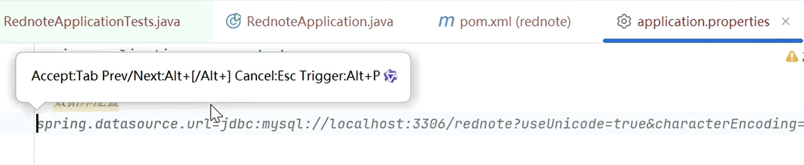
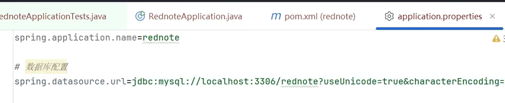
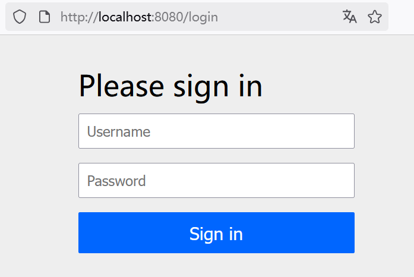

## 3.3 实战：AI辅助编程自动创建数据库连接配置


上一节所初始化的应用，因为缺乏数据库的配置，因而无法正常启动。本节将来通过AI辅助编程工具的帮助下，来生成配置文件。


### 初始化数据库

首先启动MySQL数据库服务器。

其次，通过MySQL客户端创建名为“rednote”新的数据库：

```
mysql> CREATE DATABASE rednote;
Query OK, 1 row affected (0.19 sec)
```


### 设置数据库链接


当我们试图在应用配置文件application.properties里面写下“# 数据库配置”注释的时候，AI辅助编程工具（以通义灵码为例）会自动提醒，生成推荐的配置信息，界面如下。




此时，只需要点击“Tab”按键，即可接收建议，形成正式的配置文件，界面如下。





其他配置也如法炮制。当然，也要注意甄别AI辅助编程提供的数据库信息是否准确，如果不准确则需要修正。比如数据库的密码，AI辅助编程工具是没法“猜对”的。

最终，应用配置如下：

```
spring.application.name=rednote

# 数据库配置
spring.datasource.url=jdbc:mysql://localhost:3306/rednote?useUnicode=true&characterEncoding=utf-8&zeroDateTimeBehavior=convertToNull&transformedBitIsBoolean=true&allowMultiQueries=true&useSSL=false&allowPublicKeyRetrieval=true&useJDBCCompliantTimezoneShift=true&useLegacyDatetimeCode=
spring.datasource.username=root
spring.datasource.password=123456
```


### 运行应用

可以在IDE中直接启动主类（`main` 方法），或者通过Maven打包后通过命令行运行：

```bash
mvn package
java -jar target/rednote-0.0.1-SNAPSHOT.jar
```

应用启动之后，访问浏览器地址：<http://localhost:8080>，如果能看到如下图3-5所示的界面，则证明应用启动正常。





