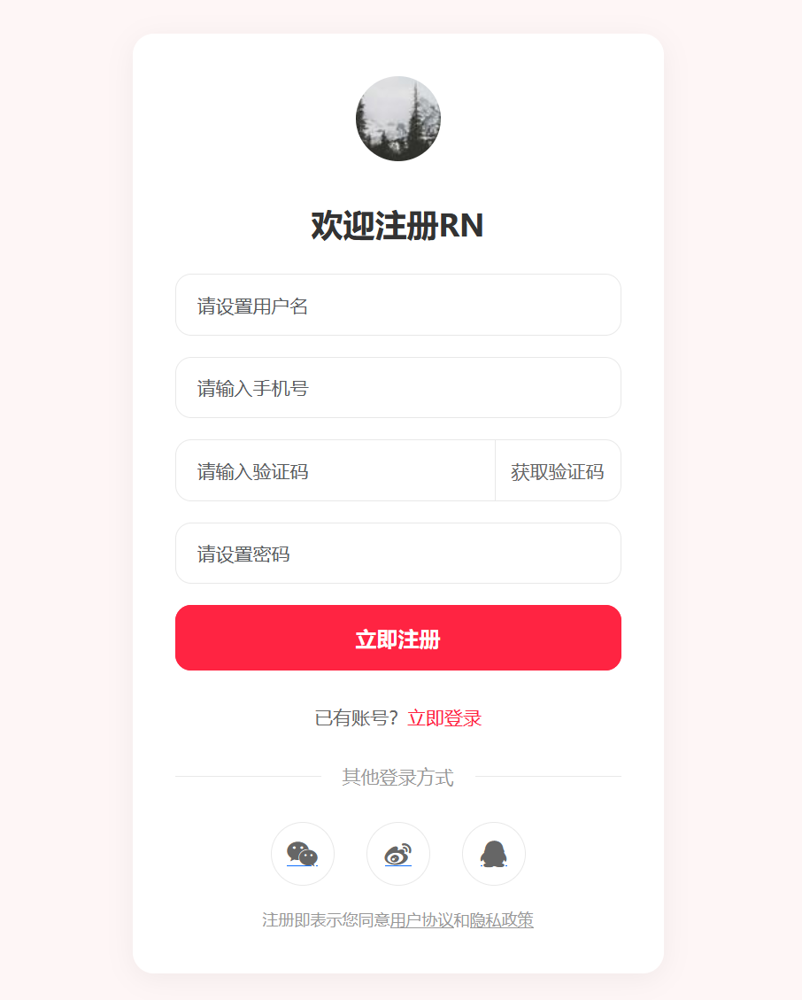
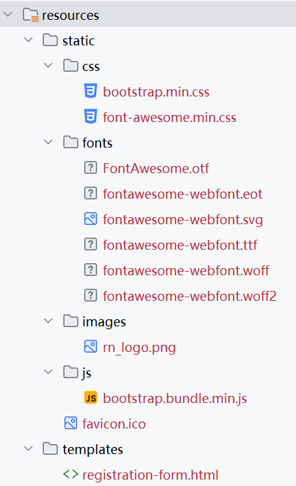

## 4.2 使用Bootstrap、Font Awesome以及Thymeleaf轻松实现注册表单页面


1. 引入 Bootstrap 和 Font Awesome 样式和脚本
2. 使用 Bootstrap 的表单组件（Form、Input、Button 等）创建注册表单
3. 设计表单布局，包括用户名、密码、确认密码、手机号等输入框和注册按钮
4. 添加表单验证规则，如用户名长度、密码强度、手机号格式等
5. 在 Thymeleaf 模板中配置静态资源路径


### 关键技术点说明

1. **Thymeleaf 表单绑定**：
   - `th:object="${user}"`：绑定表单对象
   - `th:field="*{property}"`：绑定表单字段，自动生成 `id` 和 `name` 属性

2. **错误显示机制**：
   - `th:if="${#fields.hasErrors('fieldName')}"`：判断字段是否有错误
   - `th:errors="*{fieldName}"`：显示对应字段的错误信息
   - `th:errorclass="is-invalid"`：当字段有错误时添加 Bootstrap 的错误样式类

3. **Bootstrap 样式集成**：
   - `is-invalid`：为输入框添加红色边框
   - `invalid-feedback`：显示错误消息的容器


### 借助 Bootstrap 生成小红书风格注册表单实现方案

以下是基于 Bootstrap 实现的仿小红书注册表单页面。这个表单包含基本的用户注册字段（用户名、手机号、密码等），并融入了小红书的视觉风格和交互体验。

在`src/main/resources/templates`目录下创建 registration-form.html 文件，内容如下： 


```html
<!DOCTYPE html>

<html lang="en">
<head>
    <meta charset="UTF-8">
    <meta name="viewport" content="width=device-width, initial-scale=1.0">
    <title>RN - 注册</title>
    <!-- 引入 Bootstrap CSS -->
    <link href="https://cdn.jsdelivr.net/npm/bootstrap@5.3.6/dist/css/bootstrap.min.css" rel="stylesheet">
    <!-- 引入 Font Awesome -->
    <link href="https://cdn.jsdelivr.net/npm/font-awesome@4.7.0/css/font-awesome.min.css" rel="stylesheet">
    <!-- 自定义样式 -->
    <style>
        body {
            background-color: #fef6f6;
            font-family: -apple-system, BlinkMacSystemFont, "Segoe UI", Roboto, Helvetica, Arial, sans-serif;
        }

        .form-container {
            background-color: white;
            border-radius: 16px;
            box-shadow: 0 4px 20px rgba(0, 0, 0, 0.05);
            padding: 32px;
            max-width: 400px;
            margin: 0 auto;
        }

        .logo {
            text-align: center;
            margin-bottom: 32px;
        }

        .logo img {
            width: 64px;
            height: 64px;
        }

        .form-title {
            font-size: 24px;
            font-weight: 700;
            color: #333;
            margin-bottom: 24px;
            text-align: center;
        }

        .form-control {
            border-radius: 12px;
            border: 1px solid #e8e8e8;
            padding: 12px 16px;
            height: auto;
            font-size: 14px;
        }

        .form-control:focus {
            border-color: #ff2442;
            box-shadow: 0 0 0 2px rgba(255, 36, 66, 0.1);
        }

        .btn-primary {
            background-color: #ff2442;
            border-color: #ff2442;
            border-radius: 12px;
            padding: 12px;
            font-size: 16px;
            font-weight: 600;
            transition: all 0.3s ease;
        }

        .btn-primary:hover,
        .btn-primary:focus {
            background-color: #e61e3a;
            border-color: #e61e3a;
            box-shadow: 0 4px 12px rgba(255, 36, 66, 0.2);
        }

        .btn-outline-secondary {
            border-radius: 12px;
            padding: 12px;
            font-size: 14px;
            color: #666;
            border-color: #e8e8e8;
        }

        .btn-outline-secondary:hover {
            background-color: #f8f8f8;
            border-color: #ddd;
        }

        .form-footer {
            text-align: center;
            margin-top: 24px;
            font-size: 14px;
            color: #666;
        }

        .form-footer a {
            color: #ff2442;
            text-decoration: none;
        }

        .form-footer a:hover {
            text-decoration: underline;
        }

        .divider {
            display: flex;
            align-items: center;
            margin: 24px 0;
            color: #999;
            font-size: 14px;
        }

        .divider::before,
        .divider::after {
            content: '';
            flex: 1;
            border-bottom: 1px solid #e8e8e8;
        }

        .divider::before {
            margin-right: 16px;
        }

        .divider::after {
            margin-left: 16px;
        }

        .social-login {
            display: flex;
            justify-content: center;
            gap: 24px;
            margin-top: 24px;
        }

        .social-btn {
            width: 48px;
            height: 48px;
            border-radius: 50%;
            display: flex;
            align-items: center;
            justify-content: center;
            border: 1px solid #e8e8e8;
            transition: all 0.3s ease;
        }

        .social-btn:hover {
            background-color: #f8f8f8;
            transform: translateY(-2px);
        }

        .social-btn i {
            font-size: 20px;
            color: #666;
        }

        .policy {
            font-size: 12px;
            color: #999;
            text-align: center;
            margin-top: 16px;
        }

        .policy a {
            color: #999;
            text-decoration: underline;
        }

        .error-message {
            color: #ff2442;
            font-size: 12px;
            margin-top: 4px;
            /* display: none; */
        }
    </style>
</head>
<body class="d-flex align-items-center min-vh-100 py-4">
<div class="container">
    <div class="form-container">
        <!-- Logo -->
        <div class="logo">
            <!-- Logo图片 -->
            
        </div>

        <!-- 表单标题 -->
        <h2 class="form-title">欢迎注册RN</h2>

        <!-- 注册表单 -->
        <form id="registrationForm" method="post">
            <!-- 用户名 -->
            <div class="mb-3">
                <input type="text" class="form-control" id="username" placeholder="请设置用户名" required>-
                <div class="error-message" id="usernameError"></div>
            </div>

            <!-- 手机号 -->
            <div class="mb-3">
                <input type="tel" class="form-control" id="phone" placeholder="请输入手机号" required>
                <div class="error-message" id="phoneError"></div>
            </div>

            <!-- 验证码 -->
            <div class="mb-3">
                <div class="input-group">
                    <input type="text" class="form-control" id="verificationCode" placeholder="请输入验证码" required>
                    <button type="button" class="btn btn-outline-secondary" id="getCodeBtn">获取验证码</button>
                </div>
                <div class="error-message" id="codeError"></div>
            </div>

            <!-- 密码 -->
            <div class="mb-3">
                <input type="password" class="form-control" id="password" placeholder="请设置密码" required>
                <div class="error-message" id="passwordError"></div>
            </div>

            <!-- 注册按钮 -->
            <button class="btn btn-primary w-100">立即注册</button>
        </form>
        
        <!-- 已有账号 -->
        <div class="form-footer">
            已有账号？<a href="#">立即登录</a>
        </div>

        <!-- 其他登录方式 -->
        <div class="divider">
            <span>其他登录方式</span>
        </div>

        <!-- 社交登录 -->
        <div class="social-login">
            <a href="#" class="social-btn">
                <i class="fa fa-weixin"></i>
            </a>
            <a href="#" class="social-btn">
                <i class="fa fa-weibo"></i>
            </a>
            <a href="#" class="social-btn">
                <i class="fa fa-qq"></i>
            </a>
        </div>

        <!-- 用户协议、隐藏政策 -->
        <div class="policy">
            注册即表示同意<a href="#">用户协议</a>和<a href="#">隐藏政策</a>
        </div>
    </div>
</div>

<!-- Bootstrap JS -->
<script src="https://cdn.jsdelivr.net/npm/bootstrap@5.3.6/dist/js/bootstrap.bundle.min.js"></script>
<!-- ...以下省略表单验证逻辑 -->

</body>
</html>
```





### 使用 Thymeleaf 模拟引擎


```html
<!DOCTYPE html>
<!-- 引入 Thymeleaf -->
<!--<html lang="en">-->
<html lang="en" xmlns:th="http://www.thymeleaf.org">
<head>
    <meta charset="UTF-8">
    <meta name="viewport" content="width=device-width, initial-scale=1.0">
    <title>RN - 注册</title>
    <!-- 引入 Bootstrap CSS -->
    <!--<link href="https://cdn.jsdelivr.net/npm/bootstrap@5.3.6/dist/css/bootstrap.min.css" rel="stylesheet">-->
    <link href="https://cdn.jsdelivr.net/npm/bootstrap@5.3.6/dist/css/bootstrap.min.css" th:href="@{/css/bootstrap.min.css}" rel="stylesheet">
    <!-- 引入 Font Awesome -->
    <!--<link href="https://cdn.jsdelivr.net/npm/font-awesome@4.7.0/css/font-awesome.min.css" rel="stylesheet">-->
    <link href="https://cdn.jsdelivr.net/npm/font-awesome@4.7.0/css/font-awesome.min.css" th:href="@{/css/font-awesome.min.css}" rel="stylesheet">
    <!-- 自定义样式 -->
    <!-- ...为节约篇幅，此处省略非核心内容 -->
</head>
<body class="d-flex align-items-center min-vh-100 py-4">
<div class="container">
    <div class="form-container">
        <!-- Logo -->
        <div class="logo">
            <!-- Logo图片 -->
            <!-- -->
            
        </div>

        <!-- 表单标题 -->
        <h2 class="form-title">欢迎注册RN</h2>

        <!-- 注册表单 -->
        <!--<form id="registrationForm" method="post">-->
        <form id="registrationForm" th:action="@{/auth/register}" th:object="${user}" method="post">
            <!-- 用户名 -->
            <div class="mb-3">
                <!-- <input type="text" class="form-control" id="username" placeholder="请设置用户名" required>-->
                <input type="text" class="form-control" id="username" placeholder="请设置用户名" th:field="*{username}" required>
                <!--<div class="error-message" id="usernameError">用户名长度应为4-20个字符</div>-->
                <div class="error-message" id="usernameError" th:errors="*{username}"></div>
            </div>

            <!-- 手机号 -->
            <div class="mb-3">
                <!-- <input type="tel" class="form-control" id="phone" placeholder="请输入手机号" required>-->
                <input type="tel" class="form-control" id="phone" name="phone" placeholder="请输入手机号" th:field="*{phone}" required>
                <!--<div class="error-message" id="phoneError">请输入正确的手机号</div>-->
                <div class="error-message" id="phoneError" th:errors="*{phone}"></div>
            </div>

            <!-- 验证码 -->
            <div class="mb-3">
                <div class="input-group">
                    <!-- <input type="text" class="form-control" id="verificationCode" placeholder="请输入验证码" required>-->
                    <input type="text" class="form-control" id="verificationCode" name="verificationCode" placeholder="请输入验证码" th:field="*{verificationCode}" required>
                    <button type="button" class="btn btn-outline-secondary" id="getCodeBtn">获取验证码</button>
                </div>
                <!--<div class="error-message" id="codeError">验证码不正确</div>-->
                <div class="error-message" id="codeError"
                     th:errors="*{verificationCode}"></div>
            </div>

            <!-- 密码 -->
            <div class="mb-3">
                <!-- <input type="password" class="form-control" id="password" placeholder="请设置密码" required>-->
                <input type="password" class="form-control" id="password" name="password" placeholder="请设置密码" th:field="*{password}" required>
                <!--<div class="error-message" id="passwordError">密码长度应为8-20个字符，包含字母和数字</div>-->
                <div class="error-message" id="passwordError"
                     th:errors="*{password}"></div>
            </div>

            <!-- 注册按钮 -->
            <button class="btn btn-primary w-100">立即注册</button>
        </form>
        
        <!-- ...为节约篇幅，此处省略非核心内容 -->
    </div>
</div>

<!-- Bootstrap JS -->
<!--<script src="https://cdn.jsdelivr.net/npm/bootstrap@5.3.6/dist/js/bootstrap.bundle.min.js"></script>-->
<script src="https://cdn.jsdelivr.net/npm/bootstrap@5.3.6/dist/js/bootstrap.bundle.min.js" th:src="@{/js/bootstrap.bundle.min.js}"></script>


<script>
//...TODO -->
</script>
</body>
</html>
```


上述改动点

1. CSS、JS、字体文件、图片等都放在了`src/main/resources/static`目录（如下图4-3所示），以进一步优化减少网络请求。
2. 引入了 Thymeleaf 模拟引擎，与后台模型做绑定。




