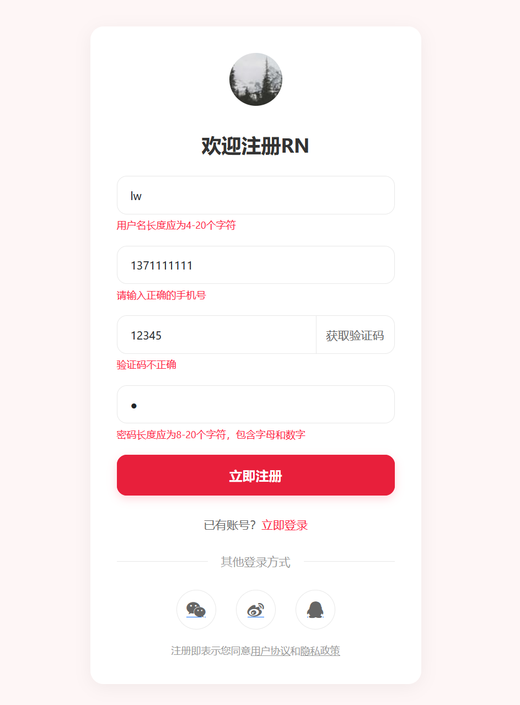

## 4.3 AI加持下快速实现表单输入校验及验证码的获取


### 实现表单验证逻辑

```js
<!-- 表单验证逻辑 -->
<script>
// 表单验证逻辑
document.getElementById('registrationForm').addEventListener('submit', function (event) {
    // 阻止表单提交
    event.preventDefault();

    // 验证用户名，用户名长度应为4-20个字符
    const username = document.getElementById('username').value;
    if (username.length < 4 || username.length > 20) {
        document.getElementById('usernameError').textContent = '用户名长度应为4-20个字符';
    } else {
        document.getElementById('usernameError').textContent = '';
    }

    // 验证手机号，手机号长度应为11个字符, 手机号格式为数字
    const phone = document.getElementById('phone').value;
    if (!/^[0-9]+$/.test(phone)) {
        document.getElementById('phoneError').textContent = '手机号格式为数字';
    } else {
        document.getElementById('phoneError').textContent = '';
    }
    if (phone.length !== 11) {
        document.getElementById('phoneError').textContent = '手机号长度应为11个字符';
    } else {
        document.getElementById('phoneError').textContent = '';
    }

    // 验证验证码，验证码长度应为6个字符, 验证码格式为数字
    const verificationCode = document.getElementById('verificationCode').value;
    if (!/^[0-9]+$/.test(verificationCode)) {
        document.getElementById('verificationCodeError').textContent = '验证码格式为数字';
    } else {
        document.getElementById('verificationCodeError').textContent = '';
    }
    if (verificationCode.length !== 6) {
        document.getElementById('verificationCodeError').textContent = '验证码长度应为6个字符';
    }

    // 验证密码，密码长度应为8-20个字符，密码格式为数字、字母
    const password = document.getElementById('password').value;
    if (!/^[0-9a-zA-Z]+$/.test(password)) {
        document.getElementById('passwordError').textContent = '密码格式为数字、字母';
    } else {
        document.getElementById('passwordError').textContent = '';
    }
    if (password.length < 8 || password.length > 20) {
        document.getElementById('passwordError').textContent = '密码长度应为8-20个字符';
    } else {
        document.getElementById('passwordError').textContent = '';
    }

    // 所有验证通过，提交表单
    this.submit();
});
</script>
```

注册表单校验效果如下图4-2所示。




你可以根据实际需求进一步调整样式或添加更多功能，如密码强度指示器、图形验证码等。


### 实现获取验证码倒计时


```js
// 获取验证码倒计时
let countdown = 60;
let timer;
document.getElementById('getCodeBtn').addEventListener('click', function () {
    if (countdown === 60) {
        timer = setInterval(function () {
            countdown--;
            document.getElementById('getCodeBtn').textContent = countdown + '秒后重新获取';
            if (countdown === 0) {
                clearInterval(timer);
                countdown = 60;
                document.getElementById('getCodeBtn').textContent = '获取验证码';
            } else {
                document.getElementById('getCodeBtn').disabled = true;
            }
        }, 1000)
    }
})
```


### 国内CDN加速


国外的CDN服务器在国内可能访问比较慢，可以替换为国内的地址以提升访问速度。


```html
<!-- 引入 Bootstrap CSS -->
<!--<link href="https://cdn.jsdelivr.net/npm/bootstrap@5.3.6/dist/css/bootstrap.min.css"
        th:href="@{/css/bootstrap.min.css}" rel="stylesheet">-->
<!-- 替换为BootCDN -->
<link href="https://cdn.bootcdn.net/ajax/libs/bootstrap/5.3.6/css/bootstrap.min.css" 
    th:href="@{/css/bootstrap.min.css}" rel="stylesheet">

<!-- 引入 Font Awesome -->
<!--<link href="https://cdn.jsdelivr.net/npm/font-awesome@4.7.0/css/font-awesome.min.css"
        th:href="@{/css/font-awesome.min.css}" rel="stylesheet">-->
<!-- 替换为BootCDN -->
<link href="https://cdn.bootcdn.net/ajax/libs/font-awesome/4.7.0/css/font-awesome.min.css" 
    th:href="@{/css/font-awesome.min.css}" rel="stylesheet">

<!-- Bootstrap JS -->
<!--<script src="https://cdn.jsdelivr.net/npm/bootstrap@5.3.6/dist/js/bootstrap.bundle.min.js"
        th:src="@{/js/bootstrap.bundle.min.js}"></script>-->
<!-- 替换为BootCDN -->
<script src="https://cdn.bootcdn.net/ajax/libs/bootstrap/5.3.6/js/bootstrap.bundle.min.js" 
    th:src="@{/js/bootstrap.bundle.min.js}"></script>
```


