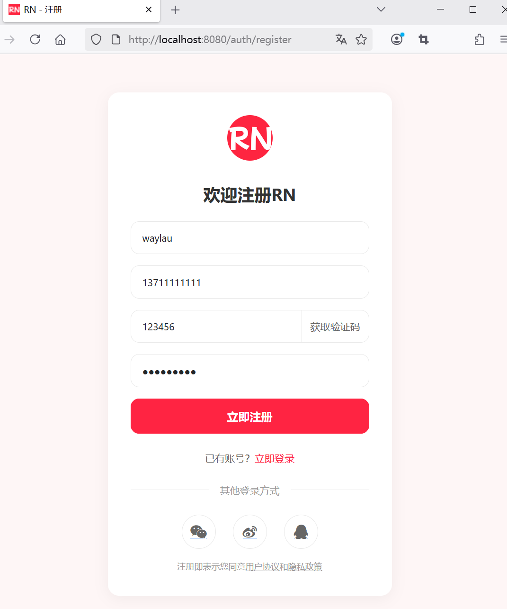
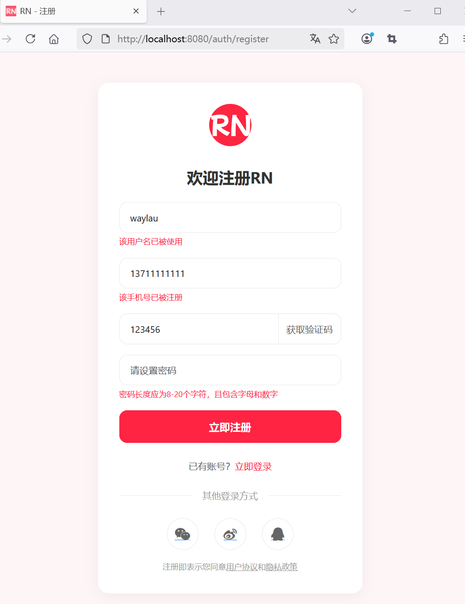

## 4.8 增加应用配实现表结构自动更新

### 修改应用配置

在 application.properties 文件种，增加如下配置，以便于开发、测试：

```
## 每次运行程序，没有表会新建表，表内有数据会清空
spring.jpa.properties.hibernate.hbm2ddl.auto=create
## 显示SQL
spring.jpa.show-sql=true

# Thymeleaf配置
spring.thymeleaf.cache=false
spring.thymeleaf.mode=HTML5
spring.thymeleaf.encoding=UTF-8

# Spring Boot Devtools
spring.devtools.restart.enabled=true
spring.devtools.livereload.enabled=true
```

当希望每次修改代码之后想重启应用，在上述配置基础上，IntelliJ IDEA执行构建项目（Build -> Build Project）会触发自动重启。


#### 可选值及含义

`spring.jpa.properties.hibernate.hbm2ddl.auto` 是 Spring Boot 中用于配置 Hibernate 自动生成或更新数据库表结构的属性。它通过 Hibernate 的 `hbm2ddl` 工具在应用程序启动时自动执行 DDL（数据定义语言）操作，如创建、更新或验证数据库表结构。


1. **`none`**  
   - **作用**：禁用自动 DDL 操作。  
   - **适用场景**：完全手动管理数据库结构（如使用 Flyway/Liquibase）。

2. **`create`**  
   - **作用**：启动时**删除并重新创建**所有表（基于实体类映射）。  
   - **数据丢失**：原有数据会被清空。  
   - **适用场景**：仅用于开发/测试环境，尤其是内存数据库（如 H2）。

3. **`create-drop`**  
   - **作用**：与 `create` 类似，但**在应用关闭时删除所有表**。  
   - **适用场景**：临时测试或演示环境。

4. **`update`**  
   - **作用**：Hibernate 会**对比实体类与现有表结构**，仅执行必要的变更（如添加列）。  
   - **限制**：不会删除未使用的列或表，复杂变更可能需手动处理。  
   - **风险**：生产环境慎用，可能导致数据丢失或结构不一致。

5. **`validate`**  
   - **作用**：仅验证实体类与表结构是否匹配，**不执行任何变更**。  
   - **适用场景**：生产环境，确保部署前结构一致。


#### 注意事项：
1. **生产环境风险**  
   - `create`/`create-drop`/`update` 可能导致数据丢失，生产环境建议使用数据库迁移工具（如 Flyway）。
   
2. **与 `spring.jpa.hibernate.ddl-auto` 的关系**  
   - 在 Spring Boot 中，`spring.jpa.hibernate.ddl-auto` 是更简洁的等效配置（底层同样设置 `hbm2ddl.auto`）。

3. **Hibernate 版本差异**  
   - 不同 Hibernate 版本对 `update` 的支持可能不同，复杂变更建议手动编写 SQL。

4. **日志调试**  
   - 启用 Hibernate SQL 日志可查看生成的 DDL 语句：
     ```properties
     spring.jpa.show-sql=true
     logging.level.org.hibernate.SQL=DEBUG
     logging.level.org.hibernate.type.descriptor.sql.BasicBinder=TRACE
     ```


#### 总结
- **开发环境**：`update` 或 `create-drop`（方便快速迭代）。  
- **生产环境**：`validate` 或 `none`（结合迁移工具）。  
- **关键原则**：始终备份数据，避免在生产环境使用破坏性操作。


### 表单提交数据校验改为后台校验


因为已经有后台校验，所以可以把前台校验的内容注释掉：


```js
// 表单验证逻辑
document.getElementById('registrationForm').addEventListener('submit', function (event) {
    // 阻止表单提交
    event.preventDefault();

    /*
    // 验证用户名，用户名长度应为4-20个字符
    const username = document.getElementById('username').value;
    if (username.length < 4 || username.length > 20) {
        document.getElementById('usernameError').textContent = '用户名长度应为4-20个字符';
    } else {
        document.getElementById('usernameError').textContent = '';
    }

    // 验证手机号，手机号长度应为11个字符, 手机号格式为数字
    const phone = document.getElementById('phone').value;
    if (!/^[0-9]+$/.test(phone)) {
        document.getElementById('phoneError').textContent = '手机号格式为数字';
    } else {
        document.getElementById('phoneError').textContent = '';
    }
    if (phone.length !== 11) {
        document.getElementById('phoneError').textContent = '手机号长度应为11个字符';
    } else {
        document.getElementById('phoneError').textContent = '';
    }

    // 验证验证码，验证码长度应为6个字符, 验证码格式为数字
    const verificationCode = document.getElementById('verificationCode').value;
    if (!/^[0-9]+$/.test(verificationCode)) {
        document.getElementById('verificationCodeError').textContent = '验证码格式为数字';
    } else {
        document.getElementById('verificationCodeError').textContent = '';
    }
    if (verificationCode.length !== 6) {
        document.getElementById('verificationCodeError').textContent = '验证码长度应为6个字符';
    }

    // 验证密码，密码长度应为8-20个字符，密码格式为数字、字母
    const password = document.getElementById('password').value;
    if (!/^[0-9a-zA-Z]+$/.test(password)) {
        document.getElementById('passwordError').textContent = '密码格式为数字、字母';
    } else {
        document.getElementById('passwordError').textContent = '';
    }
    if (password.length < 8 || password.length > 20) {
        document.getElementById('passwordError').textContent = '密码长度应为8-20个字符';
    } else {
        document.getElementById('passwordError').textContent = '';
    }
    */
    // 所有验证通过，提交表单
    this.submit();
});
```

### 运行应用进行测试


访问浏览器地址：<http://localhost:8080/auth/register>，开源看到如下注册界面。





点击“立即注册”按钮，可以在应用控制台日志里面看到如下SQL语句的执行：

```sql
Hibernate: select u1_0.user_id,u1_0.password,u1_0.phone,u1_0.username from t_user u1_0 where u1_0.username=?
Hibernate: select u1_0.user_id,u1_0.password,u1_0.phone,u1_0.username from t_user u1_0 where u1_0.phone=?
Hibernate: select next_val as id_val from t_user_seq for update
Hibernate: update t_user_seq set next_val= ? where next_val=?
Hibernate: insert into t_user (password,phone,username,user_id) values (?,?,?,?)
```


通过MySQL客户端工具，查询数据库用户表的数据，则可以看到查询内容如下：


```
mysql> SELECT * FROM t_user;
+---------+------------+-------------+----------+
| user_id | password   | phone       | username |
+---------+------------+-------------+----------+
|       1 | 12345qwert | 13711111111 | waylau   |
+---------+------------+-------------+----------+
1 row in set (0.017 sec)
```


因此，验证用户注册的数据已经能完整记录进数据库了。


我们可以将相同的数据再注册一遍，以验证数据校验功能是否生效。




如上图4-5所示，相同数据不允许再此注册，从而证明数据校验功能是生效的。