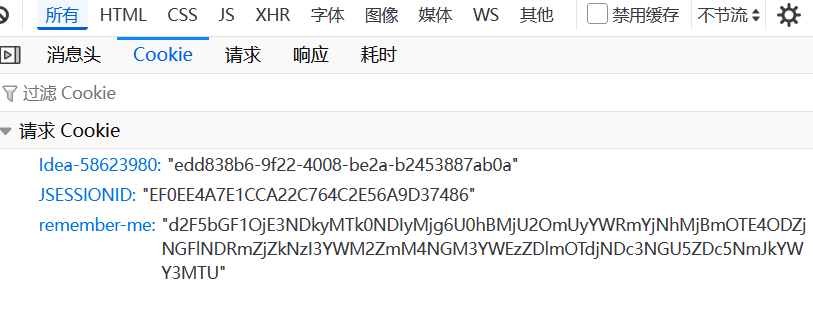

## 5.10 实现“记住我”浏览器重启后无需再次登录


在Spring Security中，“记住我”（Remember-Me）功能允许用户在关闭浏览器后重新访问网站时自动登录，而无需重新输入用户名和密码。这是通过在客户端存储一个持久化的令牌（通常是一个Cookie）来实现的，如下图。





以下是一个基于Spring Security 6.5的“记住我”功能示例：

### 配置`SecurityFilterChain`

首先，配置`HttpSecurity`以启用“记住我”功能。修改SecurityConfig，增加退出登录相关配置：

```java
@Bean
public SecurityFilterChain filterChain(HttpSecurity http) throws Exception {
    http

          // ...为节约篇幅，此处省略非核心内容

          // 记住我
        .rememberMe(rememberMe -> rememberMe
                // 设置记住我令牌的有效期（秒），默认是2周。以下设置1周
                .tokenValiditySeconds(60 * 60 * 24 * 7)
                // 设置用于签名令牌的密钥
                .key("rnRememberMeKey")
        )

    ;

    return http.build();
}
```

关键配置说明

- **`tokenValiditySeconds(86400)`**：设置“记住我”令牌的有效期（以秒为单位）。在此示例中设置为24小时（86400秒）。
- **`key("rnRememberMeKey")`**：用于签名令牌的密钥。应确保此密钥是唯一的且保密的。

### 确保登录表单有“记住我”复选框

在登录页面中，需要有一个“记住我”复选框：

```html
<!-- 记住我 -->
<div class="form-check mb-3">
    <input type="checkbox" class="form-check-input" id="rememberMe" name="remember-me">
    <label class="form-check-label" for="rememberMe">记住我</label>
</div>
```


注意，复选框是name必须是“remember-me”。

### 注意事项

- **安全性**：确保“记住我”令牌的密钥（`key`）是唯一的且保密的。
