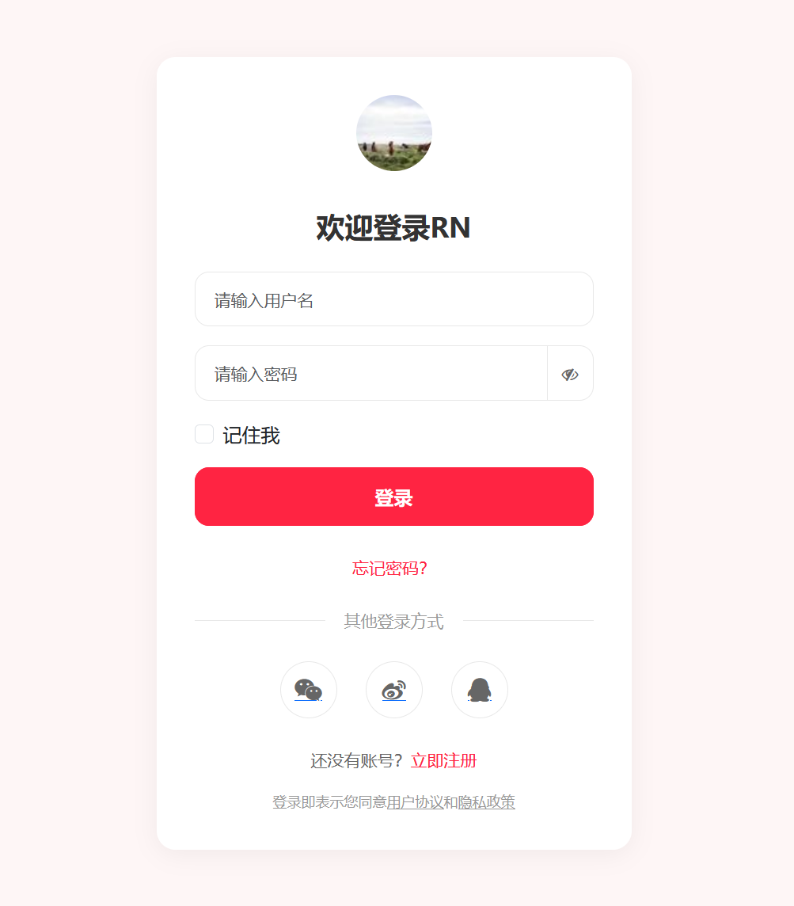
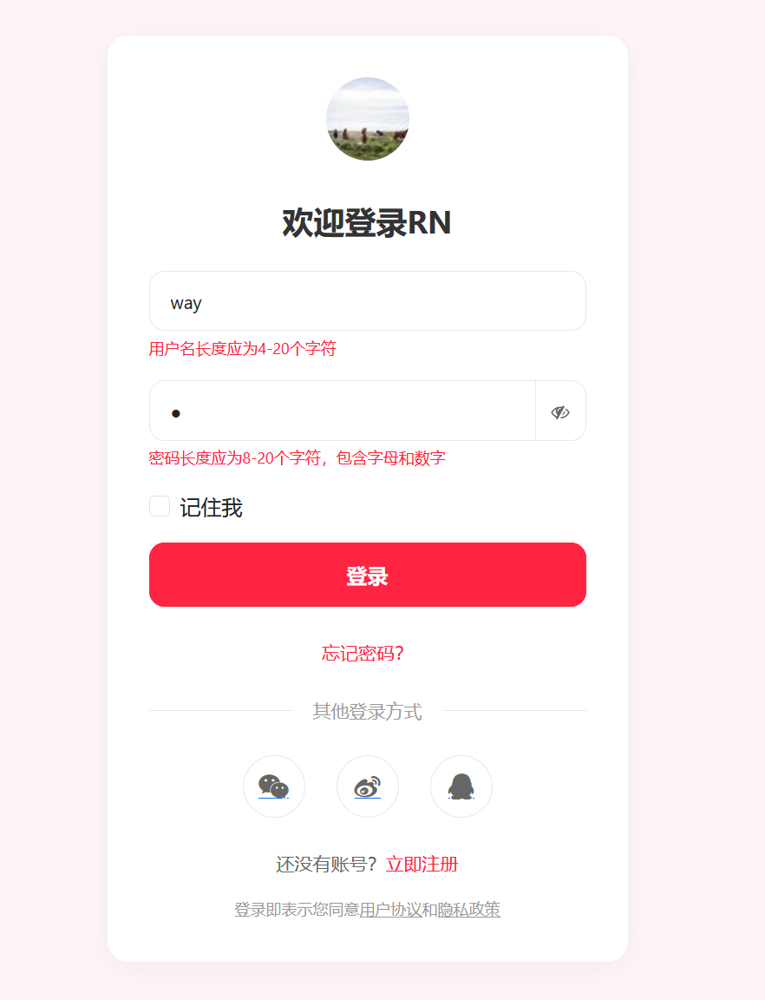
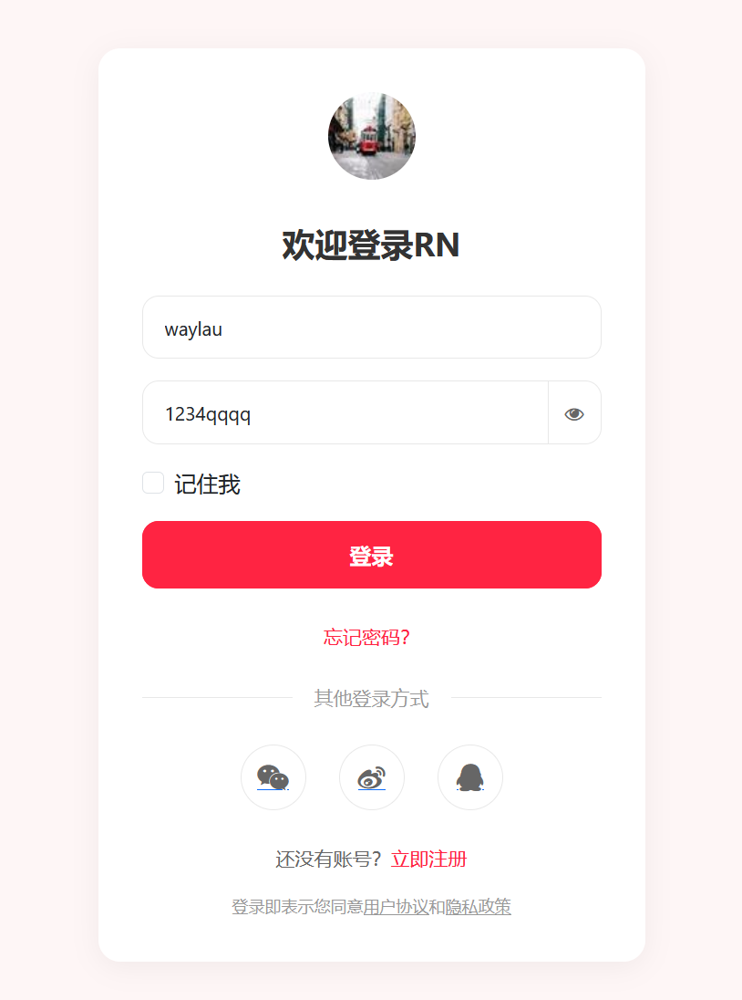

## 5.2 使用Bootstrap、Font Awesome以及Thymeleaf轻松实现登录表单


可以在注册表单的基础上，进行代码的复用。


### 登录表单实现方案


创建login-form.html：

```html
<!DOCTYPE html>
<html lang="en" xmlns:th="http://www.thymeleaf.org">
<head>
    <meta charset="UTF-8">
    <meta name="viewport" content="width=device-width, initial-scale=1.0">
    <title>RN - 登录</title>
    <!-- 引入 Bootstrap CSS -->
    <link href="https://cdn.jsdelivr.net/npm/bootstrap@5.3.6/dist/css/bootstrap.min.css" th:href="@{/css/bootstrap.min.css}" rel="stylesheet">
    <!-- 引入 Font Awesome -->
    <link href="https://cdn.jsdelivr.net/npm/font-awesome@4.7.0/css/font-awesome.min.css" th:href="@{/css/font-awesome.min.css}" rel="stylesheet">
    <!-- 自定义样式 -->
    <style>
        body {
            background-color: #fef6f6;
            font-family: -apple-system, BlinkMacSystemFont, "Segoe UI", Roboto, Helvetica, Arial, sans-serif;
        }

        .form-container {
            background-color: white;
            border-radius: 16px;
            box-shadow: 0 4px 20px rgba(0, 0, 0, 0.05);
            padding: 32px;
            max-width: 400px;
            margin: 0 auto;
        }

        .logo {
            text-align: center;
            margin-bottom: 32px;
        }

        .logo img {
            width: 64px;
            height: 64px;
        }

        .form-title {
            font-size: 24px;
            font-weight: 700;
            color: #333;
            margin-bottom: 24px;
            text-align: center;
        }

        .form-control {
            border-radius: 12px;
            border: 1px solid #e8e8e8;
            padding: 12px 16px;
            height: auto;
            font-size: 14px;
        }

        .form-control:focus {
            border-color: #ff2442;
            box-shadow: 0 0 0 2px rgba(255, 36, 66, 0.1);
        }

        .btn-primary {
            background-color: #ff2442;
            border-color: #ff2442;
            border-radius: 12px;
            padding: 12px;
            font-size: 16px;
            font-weight: 600;
            transition: all 0.3s ease;
        }

        .btn-primary:hover,
        .btn-primary:focus {
            background-color: #e61e3a;
            border-color: #e61e3a;
            box-shadow: 0 4px 12px rgba(255, 36, 66, 0.2);
        }

        .btn-outline-secondary {
            border-radius: 12px;
            padding: 12px;
            font-size: 14px;
            color: #666;
            border-color: #e8e8e8;
        }

        .btn-outline-secondary:hover {
            background-color: #f8f8f8;
            border-color: #ddd;
        }

        .form-footer {
            text-align: center;
            margin-top: 24px;
            font-size: 14px;
            color: #666;
        }

        .form-footer a {
            color: #ff2442;
            text-decoration: none;
        }

        .form-footer a:hover {
            text-decoration: underline;
        }

        .divider {
            display: flex;
            align-items: center;
            margin: 24px 0;
            color: #999;
            font-size: 14px;
        }

        .divider::before,
        .divider::after {
            content: '';
            flex: 1;
            border-bottom: 1px solid #e8e8e8;
        }

        .divider::before {
            margin-right: 16px;
        }

        .divider::after {
            margin-left: 16px;
        }

        .social-login {
            display: flex;
            justify-content: center;
            gap: 24px;
            margin-top: 24px;
        }

        .social-btn {
            width: 48px;
            height: 48px;
            border-radius: 50%;
            display: flex;
            align-items: center;
            justify-content: center;
            border: 1px solid #e8e8e8;
            transition: all 0.3s ease;
        }

        .social-btn:hover {
            background-color: #f8f8f8;
            transform: translateY(-2px);
        }

        .social-btn i {
            font-size: 20px;
            color: #666;
        }

        .policy {
            font-size: 12px;
            color: #999;
            text-align: center;
            margin-top: 16px;
        }

        .policy a {
            color: #999;
            text-decoration: underline;
        }

        .error-message {
            color: #ff2442;
            font-size: 12px;
            margin-top: 4px;
        }
    </style>
</head>
<body class="d-flex align-items-center min-vh-100 py-4">
<div class="container">
    <div class="form-container">
        <!-- Logo -->
        <div class="logo">
            
        </div>

        <!-- 表单标题 -->
        <h2 class="form-title">欢迎登录RN</h2>

        <!-- 注册表单 -->
        <form id="loginForm" th:action="@{/auth/login}" th:object="${user}" method="post">
            <!-- 用户名输入框 -->
            <div class="mb-3">
                <input type="text" class="form-control" id="username" name="username" th:field="*{username}"
                       placeholder="请输入用户名" required>
                <div class="error-message" id="usernameError" th:errors="*{username}"></div>
            </div>

            <!-- 密码输入框 -->
            <div class="mb-3">
                <div class="input-group">
                    <input type="password" class="form-control" id="password" name="password" th:field="*{password}"
                           placeholder="请设置密码" required>
                    <!-- 切换密码显示模式 -->
                    <button type="button" class="btn btn-outline-secondary" id="togglePassword">
                        <i class="fa fa-eye-slash"></i>
                    </button>
                </div>

                <div class="error-message" id="passwordError" th:errors="*{password}"></div>
            </div>

            <!-- 记住我 -->
            <div class="form-check mb-3">
                <input type="checkbox" class="form-check-input" id="rememberMe">
                <label class="form-check-label" for="rememberMe">记住我</label>
            </div>

            <!--登录按钮 -->
            <button class="btn btn-primary w-100">登录</button>
        </form>


    </div>
    <!-- 忘记密码 -->
    <div class="form-footer">
        <a href="#">忘记密码</a>
    </div>

    <!-- 其他登录方式 -->
    <div class="divider">
        <span>其他登录方式</span>
    </div>

    <!-- 社交登录 -->
    <div class="social-login">
        <a href="#" class="social-btn">
            <i class="fa fa-weixin"></i>
        </a>
        <a href="#" class="social-btn">
            <i class="fa fa-weibo"></i>
        </a>
        <a href="#" class="social-btn">
            <i class="fa fa-qq"></i>
        </a>
    </div>

    <!-- 注册链接 -->
    <div class="form-footer">
        还没有账号？ <a href="/auth/register" th:href="@{/auth/register}">立即注册</a>
    </div>

    <!-- 用户协议、隐藏政策 -->
    <div class="policy">
        注册即表示同意<a href="#">用户协议</a>和<a href="#">隐藏政策</a>
    </div>
</div>

<!-- Bootstrap JS -->
<script src="https://cdn.jsdelivr.net/npm/bootstrap@5.3.6/dist/js/bootstrap.bundle.min.js" th:src="@{/js/bootstrap.bundle.min.js}"></script>


<!-- TODO 表单交互逻辑 -->

</body>
</html>
```





### 实现表单验证逻辑

```html
<!-- 表单交互逻辑 -->
<script>
// 表单验证逻辑
document.getElementById('loginForm').addEventListener('submit', function (event) {
    // 阻止表单提交
    event.preventDefault();

    // 验证用户名，用户名长度应为4-20个字符
    const username = document.getElementById('username').value;
    if (username.length < 4 || username.length > 20) {
        document.getElementById('usernameError').textContent = '用户名长度应为4-20个字符';
    } else {
        document.getElementById('usernameError').textContent = '';
    }

    // 验证密码，密码长度应为8-20个字符，密码格式为数字、字母
    const password = document.getElementById('password').value;
    if (!/^[0-9a-zA-Z]+$/.test(password)) {
        document.getElementById('passwordError').textContent = '密码格式为数字、字母';
    } else {
        document.getElementById('passwordError').textContent = '';
    }
    if (password.length < 8 || password.length > 20) {
        document.getElementById('passwordError').textContent = '密码长度应为8-20个字符';
    } else {
        document.getElementById('passwordError').textContent = '';
    }

    // 所有验证通过，提交表单
    this.submit();
});
</script>
```


登录表单校验效果如下图5-2所示。




### 实现密码显示/隐藏切换


```html
<!-- 表单交互逻辑 -->
<script>
// ...为节约篇幅，此处省略非核心内容

// 切换密码显示模式
document.getElementById('togglePassword').addEventListener('click', function () {
    // 获取密码输入框
    const passwordInput = document.getElementById('password');

    if (passwordInput.type === 'password') {
        // 切换为明文模式
        passwordInput.type = 'text';
        this.querySelector('i').classList.remove('fa-eye-slash');
        this.querySelector('i').classList.add('fa-eye');
    } else {
        // 切换为密文模式
        passwordInput.type = 'password';
        this.querySelector('i').classList.remove('fa-eye');
        this.querySelector('i').classList.add('fa-eye-slash');
    }
})
</script>
```

密码显示/隐藏切换效果如下图5-2所示。




