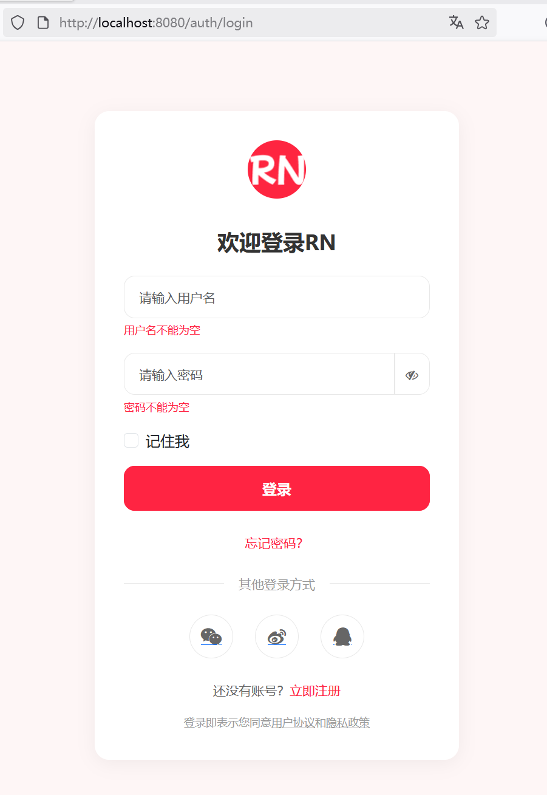
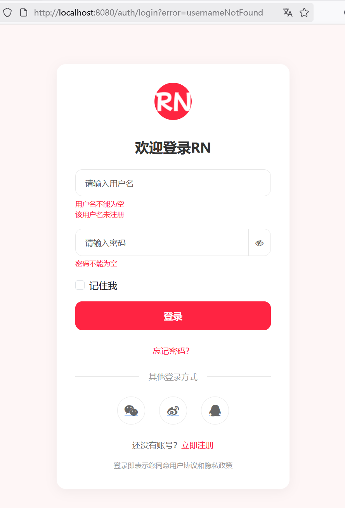
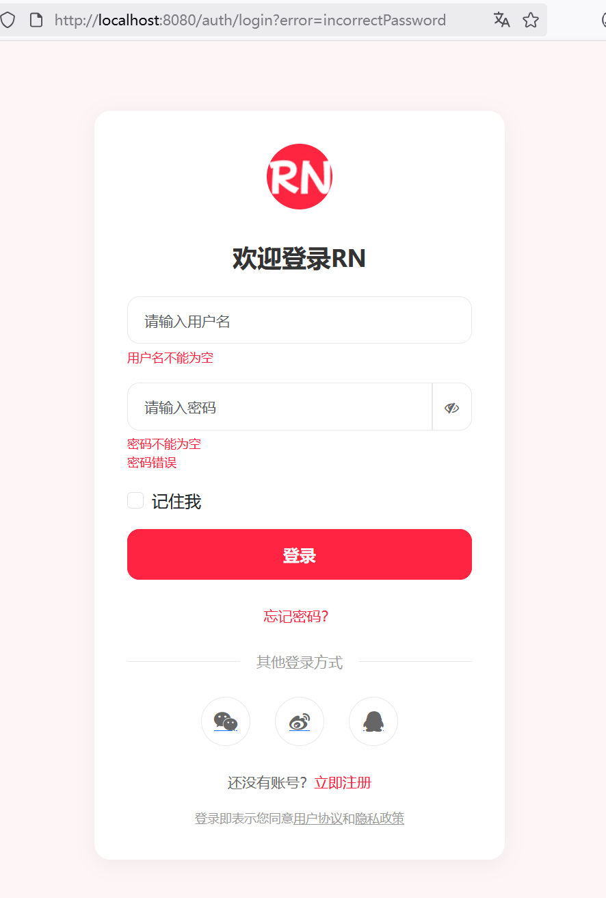
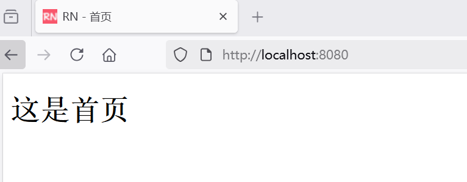

## 5.6 实现登录信息的验证

1. 实现 UserDetailsService 接口，从数据库中加载用户信息并封装成 UserDetails 对象
2. 使用 BCryptPasswordEncoder 对用户输入的密码和数据库中存储的加密密码进行比对
3. 若认证成功，将用户信息存入 Spring Security 的上下文；若失败，返回相应的错误信息


### 实现 UserDetailsService 接口

原有的登录处理是在`@PostMapping("/login") public String processLogin() `方法中处理，但使用了formLogin自定义表单之后，实际的登录处理逻辑改为了的 UserDetailsService 接口实现类处理。

```java
package com.waylau.rednote.config;

import com.waylau.rednote.common.ExceptionType;
import com.waylau.rednote.entity.User;
import com.waylau.rednote.repository.UserRepository;
import org.springframework.beans.factory.annotation.Autowired;
import org.springframework.security.core.userdetails.UserDetails;
import org.springframework.security.core.userdetails.UserDetailsService;
import org.springframework.security.core.userdetails.UsernameNotFoundException;
import org.springframework.stereotype.Service;

import java.util.Collections;
import java.util.Optional;

/**
 * UserDetailsServiceImpl UserDetailsService实现
 *
 * @author <a href="https://waylau.com">Way Lau</a>
 * @version 2025/08/17
 **/
@Service
public class UserDetailsServiceImpl implements UserDetailsService {
    @Autowired
    private UserRepository userRepository;

    @Override
    public UserDetails loadUserByUsername(String username) throws UsernameNotFoundException {
        // 根据用户名查询用户，判定用户是否存在
        Optional<User> optionalUser = userRepository.findByUsername(username);
        if (!optionalUser.isPresent()) {
            // 抛出用户不存在的异常
            throw new UsernameNotFoundException(ExceptionType.USERNAME_NOT_FOUND);
        }

        User user = optionalUser.get();

        // 将User转为UserDetails对象
        return org.springframework.security.core.userdetails.User
                .withUsername(user.getUsername())
                .password(user.getPassword())
                .disabled(false)
                .authorities(Collections.emptyList())
                .build();
    }
}
```


### 自定义 AuthenticationProvider

自定义 AuthenticationProvider，用于处理在登录失败时，区分区分是用户名不存在还是密码错误引发的异常。

```java
package com.waylau.rednote.config;

import com.waylau.rednote.common.ExceptionType;
import org.springframework.security.authentication.AuthenticationProvider;
import org.springframework.security.authentication.BadCredentialsException;
import org.springframework.security.authentication.UsernamePasswordAuthenticationToken;
import org.springframework.security.core.Authentication;
import org.springframework.security.core.AuthenticationException;
import org.springframework.security.core.userdetails.UserDetails;
import org.springframework.security.core.userdetails.UserDetailsService;
import org.springframework.security.crypto.password.PasswordEncoder;

/**
 * CustomAuthenticationProvider 自定义AuthenticationProvider
 *
 * @author <a href="https://waylau.com">Way Lau</a>
 * @version 2025/08/17
 **/
public class CustomAuthenticationProvider implements AuthenticationProvider {

    private final UserDetailsService userDetailsService;
    private final PasswordEncoder passwordEncoder;

    public CustomAuthenticationProvider(UserDetailsService userDetailsService, PasswordEncoder passwordEncoder) {
        this.userDetailsService = userDetailsService;
        this.passwordEncoder = passwordEncoder;
    }

    @Override
    public Authentication authenticate(Authentication authentication) throws AuthenticationException {
        String username = authentication.getName();
        String password = (String) authentication.getCredentials();

        UserDetails userDetails = userDetailsService.loadUserByUsername(username);

        // 用户不存在则抛出异常
        if (userDetails == null) {
            throw new BadCredentialsException(ExceptionType.USERNAME_NOT_FOUND);
        }

        // 密码不匹配则抛出异常
        if (!passwordEncoder.matches(password, userDetails.getPassword())) {
            throw new BadCredentialsException(ExceptionType.INCORRECT_PASSWORD);
        }

        return new UsernamePasswordAuthenticationToken(userDetails, password, userDetails.getAuthorities());
    }

    @Override
    public boolean supports(Class<?> authentication) {
        return authentication.equals(UsernamePasswordAuthenticationToken.class);
    }
}
```


### 修改WebSecurityConfig注入AuthenticationProvider


```java
package com.waylau.rednote.config;

import org.springframework.beans.factory.annotation.Autowired;
import org.springframework.context.annotation.Bean;
import org.springframework.context.annotation.Configuration;
import org.springframework.security.config.Customizer;
import org.springframework.security.config.annotation.web.builders.HttpSecurity;
import org.springframework.security.config.annotation.web.configuration.EnableWebSecurity;
import org.springframework.security.core.userdetails.UserDetailsService;
import org.springframework.security.crypto.bcrypt.BCryptPasswordEncoder;
import org.springframework.security.crypto.password.PasswordEncoder;
import org.springframework.security.web.SecurityFilterChain;

/**
 * WebSecurityConfig 安全配置
 *
 * @author <a href="https://waylau.com">Way Lau</a>
 * @version 2025/08/16
 **/
@Configuration
@EnableWebSecurity
public class WebSecurityConfig {

    @Autowired
    private UserDetailsService userDetailsService;
    
    // ...为节约篇幅，此处省略非核心内容

    @Bean
    public CustomAuthenticationProvider authenticationProvider() {
        return new CustomAuthenticationProvider(userDetailsService, passwordEncoder());
    }
}
```


### 错误信息在登录界面展示


登录失败之后，会重定向到`/auth/login`，并会携带错误信息，因此需要修改`@GetMapping("/login")public String showLoginForm()`方法如下：


```java
/**
 * 显示登录页面
 */
@GetMapping("/login")
public String showLoginForm(Model model,
                            @RequestParam(required = false) String error,
                            @Valid @ModelAttribute("user") UserLoginDto loginDto,
                            BindingResult bindingResult) {
    /*model.addAttribute("user", new UserLoginDto());*/
    model.addAttribute("user", loginDto);

    // 处理用户名未注册的错误
    if (LoginErrorType.USERNAME_NOT_FOUND.equals(error)) {
        bindingResult.rejectValue("username", null, "该用户名未注册");

        return "login-form";
    }

    // 处理密码错误
    if (LoginErrorType.INCORRECT_PASSWORD.equals(error)) {
        bindingResult.rejectValue("password", null, "密码错误");

        return "login-form";
    }

    return "login-form";
}
```


上述代码：


* 请求error用于指示不同的错误类型
* 通过BindingResult将错误信息返回给了前台展示。

### 初始化首页


为了验证访问首页是否会被权限拦截，在`src/main/resources/templates`目录下创建index.html文件，内容如下：


```html
<!DOCTYPE html>
<html lang="en">
<head>
    <meta charset="UTF-8">
    <meta name="viewport" content="width=device-width, initial-scale=1.0">
    <title>RN - 首页</title>
</head>
<body>
<h1>这是首页</h1>
</body>
</html>
```


### 运行测试

首先，访问首页地址：<http://localhost:8080>。此时，权限系统发挥作用，页面被重定向到了登录界面，如下5-4图所示。





先输入一个未注册的用户名进行登录，如下5-5图所示，界面给出了错误提示“该用户名未注册”。





接着，输入一个已注册的用户名进行登录，但是输入错误的密码，如下5-6图所示，界面给出了错误提示“密码错误”。





最终，输入正确的用户名和密码进行登录，如下5-7图所示，界面重定向到了首页。


