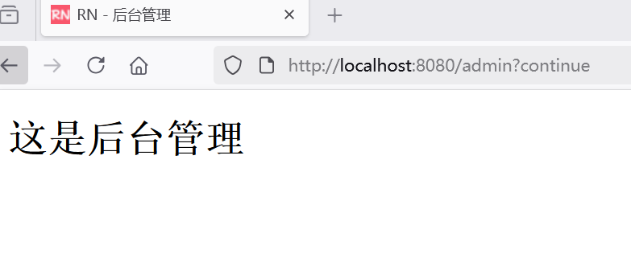
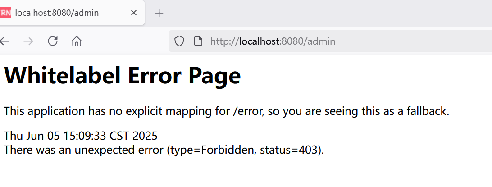
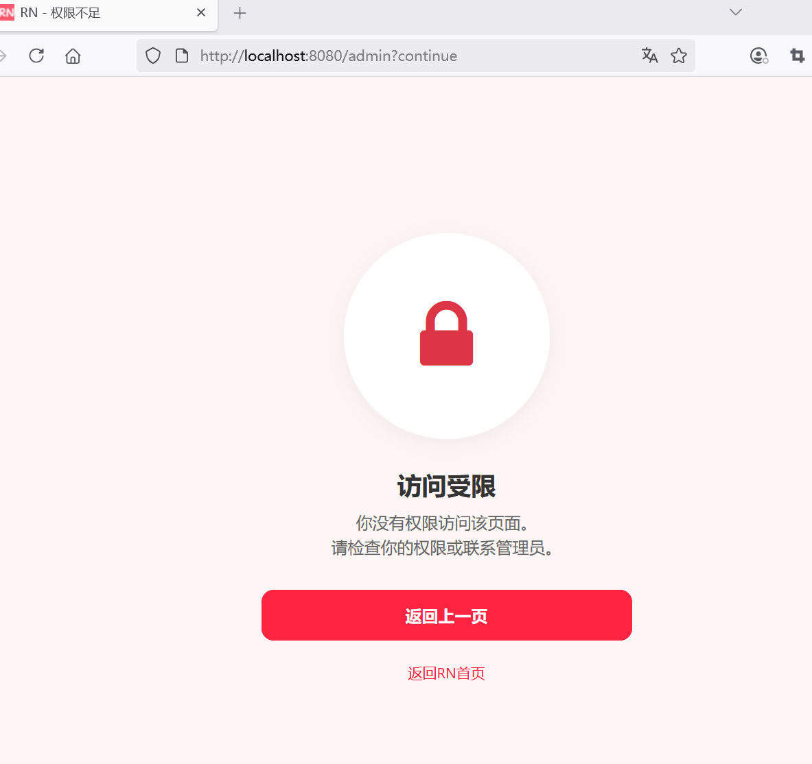

## 5.7 掌握按照角色权限控制的实现技巧

本节示例将展示如何使用 Spring Security 实现细粒度的权限控制。

1. 根据用户角色配置不同的访问权限
2. 使用 @PreAuthorize 注解或 hasRole 方法进行细粒度的权限控制
3. 错误控制器来处理 403 错误请求

分离关注点：将管理员账号与普通用户分离存储

### 初始化后台管理界面

admin.html：

```html
<!DOCTYPE html>
<html lang="en" xmlns:th="http://www.thymeleaf.org">
<head>
    <meta charset="UTF-8">
    <meta name="viewport" content="width=device-width, initial-scale=1.0">
    <title>RN - 后台管理</title>
</head>
<body>
<body>

<h1>这是后台管理</h1>

</body>
</body>
</html>
```


当访问地址：<http://localhost:8080/admin>，会跳转到登录界面执行登录，登录成功后会重定向到后台管理界面，如下图5-8所示。





我们希望后台管理界面只允许管理员登录，而如果是普通用户登录的，则不允许访问。如何实现?


### 根据用户角色配置不同的访问权限


修改WebSecurityConfig，在authorizeHttpRequests中增加如下配置：

```java
@Bean
public SecurityFilterChain filterChain(HttpSecurity http) throws Exception {
    http
            // 启用CSRF防护
            .csrf(Customizer.withDefaults())
            .authorizeHttpRequests(authorize -> authorize
                    // 允许指定资源的请求不需要认证
                    .requestMatchers("/auth/register", "/auth/login", "/css/**", "/js/**", "/fonts/**", "/images/**", "/favicon.ico").permitAll()
                    .requestMatchers("/error/**").permitAll()
                    // 允许ADMIN角色的用户访问 /admin/** 的资源
                    .requestMatchers("/admin/**").hasRole("ADMIN")
                    // 允许ADMIN、USER角色的用户访问 /user/** 的资源
                    .requestMatchers("/user/**").hasAnyRole("ADMIN", "USER")
                    // 其他请求需求认证
                    .anyRequest().authenticated()
            )
            // ...为节约篇幅，此处省略非核心内容
    ;
    return http.build();
}
```

上述代码

* `/admin/**"`资源允许ADMIN角色访问
* `/user/**"`资源允许ADMIN或者USER角色访问


当访问地址：<http://localhost:8080/admin>，会跳转到登录界面执行登录，使用普通用户登录成功后会看到如下错误界面，如下图5-9所示。





从上述报错信息“status=403”可以获知，是没有权限。

那么如何能够更加友好地提示“没有权限访问”呢？


### 仿小红书403错误页面实现

下面是一个基于 Spring Security 6.5、Thymeleaf 和 Bootstrap 实现的仿小红书风格的 403 错误页面。这个页面会在用户访问受保护资源而权限不足时显示，提供友好的提示和操作按钮。


403-error.html页面放置在`src/main/resources/templates`目录下，内容如下：


```html
<!DOCTYPE html>
<html lang="en" xmlns:th="http://www.thymeleaf.org">

<head>
    <meta charset="UTF-8">
    <meta name="viewport" content="width=device-width, initial-scale=1.0">
    <title>RN - 权限不足</title>
    <!-- 引入 Bootstrap CSS -->
    <!--<link href="https://cdn.jsdelivr.net/npm/bootstrap@5.3.6/dist/css/bootstrap.min.css"
          th:href="@{/css/bootstrap.min.css}" rel="stylesheet">-->
    <!-- 替换为BootCDN -->
    <link href="https://cdn.bootcdn.net/ajax/libs/bootstrap/5.3.6/css/bootstrap.min.css"
          th:href="@{/css/bootstrap.min.css}" rel="stylesheet">

    <!-- 引入 Font Awesome -->
    <!--<link href="https://cdn.jsdelivr.net/npm/font-awesome@4.7.0/css/font-awesome.min.css"
          th:href="@{/css/font-awesome.min.css}" rel="stylesheet">-->
    <!-- 替换为BootCDN -->
    <link href="https://cdn.bootcdn.net/ajax/libs/font-awesome/4.7.0/css/font-awesome.min.css"
          th:href="@{/css/font-awesome.min.css}" rel="stylesheet">

    <!-- 自定义样式-->
    <style>
        body {
            background-color: #fef6f6;
            font-family: -apple-system, BlinkMacSystemFont, "Segoe UI", Roboto, Helvetica, Arial, sans-serif;
        }

        .error-container {
            max-width: 400px;
            margin: 0 auto;
            padding: 40px 20px;
            text-align: center;
        }

        .error-icon {
            font-size: 80px;
            color: #ff2442;
            margin-bottom: 20px;
        }

        .error-title {
            font-size: 24px;
            font-weight: 700;
            color: #333;
            margin-bottom: 10px;
        }

        .error-message {
            font-size: 16px;
            color: #666;
            margin-bottom: 30px;
        }

        .btn-primary {
            background-color: #ff2442;
            border-color: #ff2442;
            border-radius: 12px;
            padding: 12px;
            font-size: 16px;
            font-weight: 600;
            transition: all 0.3s ease;
            width: 100%;
        }

        .btn-primary:hover,
        .btn-primary:focus {
            background-color: #e61e3a;
            border-color: #e61e3a;
            box-shadow: 0 4px 12px rgba(255, 36, 66, 0.2);
        }

        .back-home {
            margin-top: 20px;
            font-size: 14px;
            color: #999;
        }

        .back-home a {
            color: #ff2442;
            text-decoration: none;
        }

        .back-home a:hover {
            text-decoration: underline;
        }

        .error-image {
            width: 200px;
            height: 200px;
            margin: 0 auto 30px;
            background-color: #fff;
            border-radius: 50%;
            display: flex;
            align-items: center;
            justify-content: center;
            box-shadow: 0 4px 20px rgba(0, 0, 0, 0.05);
        }

        .error-image img {
            width: 120px;
            height: 120px;
        }
    </style>
</head>
<body class="d-flex align-items-center min-vh-100 py-4">
<div class="container">
    <div class="error-container">
        <!-- 错误图标 -->
        <div class="error-image">
            <i class="fa fa-lock fa-5x text-danger"></i>
        </div>

        <!-- 错误标题 -->
        <h2 class="error-title">访问受限</h2>

        <!-- 错误信息 -->
        <p class="error-message">
            你没有权限访问此页面。<br>
            请检查你的权限或联系管理员。
        </p>

        <!-- 返回按钮 -->
        <button class="btn btn-primary" onclick="goBack()">返回上一页</button>

        <!-- 跳转到首页 -->
        <p class="back-home">
            <a href="/" th:href="@{/}">返回RN首页</a>
        </p>
    </div>
</div>

<!-- Bootstrap JS -->
<!--<script src="https://cdn.jsdelivr.net/npm/bootstrap@5.3.6/dist/js/bootstrap.bundle.min.js"
        th:src="@{/js/bootstrap.bundle.min.js}"></script>-->
<!-- 替换为BootCDN -->
<script src="https://cdn.bootcdn.net/ajax/libs/bootstrap/5.3.6/js/bootstrap.bundle.min.js"
        th:src="@{/js/bootstrap.bundle.min.js}"></script>

<script>
    // 返回按钮点击事件
    function goBack() {
        window.history.back();
    }
</script>
</body>
</html>
```


这个 403 错误页面具有以下特点：

1. **视觉风格**：
   - 采用小红书标志性的红色作为主色调
   - 圆润的边角设计和简洁的布局
   - 清晰的视觉层次和留白

2. **功能特点**：
   - 明确的错误提示信息
   - 返回上一页按钮
   - 返回首页链接
   - 响应式设计，适配各种设备

3. **交互体验**：
   - 按钮悬停效果
   - 返回上一页的 JavaScript 功能
   - 平滑的视觉过渡

###  403 错误页面集成到 Spring Security

要将此 403 错误页面集成到 Spring Security 中，需要在安全配置中添加以下内容：

```java
@Bean
public SecurityFilterChain filterChain(HttpSecurity http) throws Exception {
    http
            // 启用CSRF防护
            .csrf(Customizer.withDefaults())
            .authorizeHttpRequests(authorize -> authorize
                     // ...为节约篇幅，此处省略非核心内容
                    .requestMatchers("/error/**").permitAll()
                     
                    // ...为节约篇幅，此处省略非核心内容
             )

            // 异常处理
            .exceptionHandling(exception -> exception
                    // 指定403错误页面
                    .accessDeniedPage("/error/403")
            )
    ;
    return http.build();
}
```

### 错误控制器来处理 403 错误请求

同时，需要添加一个错误控制器来处理 `/error/403` 请求：

```java
package com.waylau.rednote.controller;

import org.springframework.stereotype.Controller;
import org.springframework.web.bind.annotation.GetMapping;
import org.springframework.web.bind.annotation.RequestMapping;

/**
 * ErrorController 错误控制器
 *
 * @author <a href="https://waylau.com">Way Lau</a>
 * @version 2025/08/17
 **/
@Controller
@RequestMapping("/error")
public class ErrorController {
    /**
     * 返回403错误页面
     */
    @GetMapping("/403")
    public String accessDenied() {
        return "403-error";
    }
}
```

这样，当用户访问受保护资源而权限不足时，就会显示这个精心设计的 403 错误页面，如下图5-10所示。




