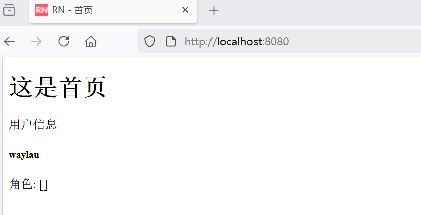
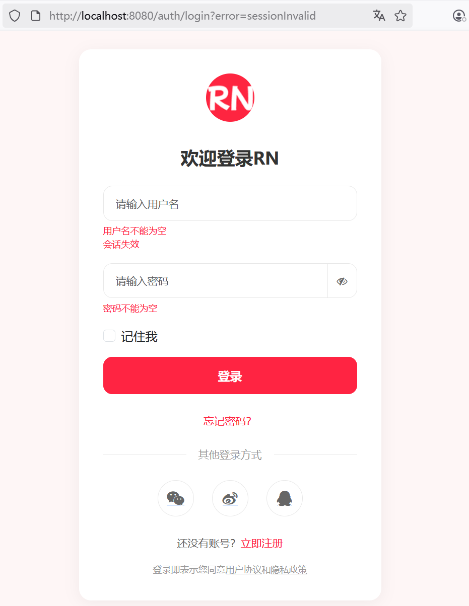
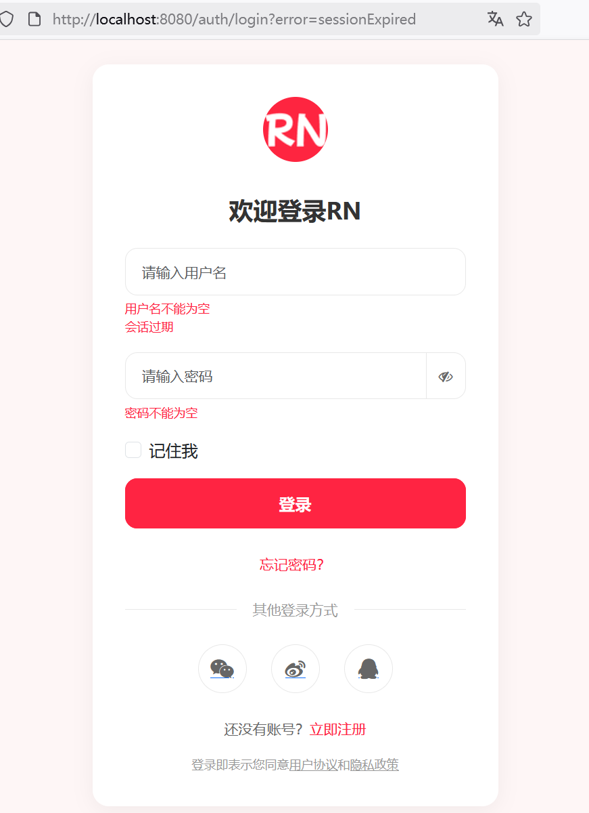

## 5.8 掌握Spring Security的会话管理机制


Spring Security 提供了强大而灵活的会话管理功能，包括会话超时控制、并发会话管理、会话固定攻击防护等特性。下面我将详细介绍这些功能及其实现方式。

包括

1. 介绍 Spring Security 的会话管理机制，会话超时、并发会话控制等
2. 在配置类中设置会话管理的相关参数
3. 在前端页面中显示用户的登录状态，显示用户名、提供退出登录按钮
4. 使用 Thymeleaf 的表达式获取 Spring Security 上下文中的用户信息


### Spring Security 会话管理机制详解

#### 会话创建策略
Spring Security 提供四种会话创建策略：
- `ALWAYS`：始终创建会话
- `NEVER`：从不主动创建会话，但会使用已存在的会话
- `IF_REQUIRED`：默认策略，仅在需要时创建会话
- `STATELESS`：无状态会话，不使用任何会话存储

#### 会话超时
- 可通过 `server.servlet.session.timeout` 配置全局会话超时时间
- 也可在 Security 配置中单独设置安全会话超时

#### 并发会话控制
- 限制同一用户的并发登录数量
- 当达到最大登录数时，可以选择阻止新登录或踢掉旧会话
- 可配置会话过期后的跳转页面

#### 会话固定攻击防护
- 自动检测并防止会话固定攻击
- 默认策略是在用户登录后创建新会话


### 会话管理配置示例

修改SecurityConfig，增加会话管理相关配置：

```java
import org.springframework.security.config.http.SessionCreationPolicy;
import org.springframework.security.core.session.SessionRegistry;
import org.springframework.security.core.session.SessionRegistryImpl;

@Bean
public SecurityFilterChain filterChain(HttpSecurity http) throws Exception {
    http

          // ...为节约篇幅，此处省略非核心内容

          // 会话管理
          .sessionManagement(session -> session
                    // 会话创建策略
                    .sessionCreationPolicy(SessionCreationPolicy.IF_REQUIRED)
                    // 访问无效会话时，重定向到指定URL
                    .invalidSessionUrl("/auth/login?error=" + SESSION_INVALID)
                    // 同一用户最大会话数
                    .maximumSessions(1)
                    // 访问过期会话时，重定向到指定URL
                    .expiredUrl("/auth/login?error=" + SESSION_EXPIRED)
                    // false表示允许新登录，踢掉旧会话，旧会话会过期
                    .maxSessionsPreventsLogin(false)
                    // 会话注册表
                    .sessionRegistry(sessionRegistry())
            )
    ;

    return http.build();
}

// 会话注册表 Bean
@Bean
public SessionRegistry sessionRegistry() {
    return new SessionRegistryImpl();
}
```

其中，

* `invalidSessionUrl` 和 `expiredUrl` 是用于处理会话（Session）相关问题的两个不同配置项，它们分别针对不同的会话失效场景，被重定向到指定的URL。
* `SessionRegistry` 是 Spring Security 中一个核心接口，用于跟踪和管理用户会话。它在并发会话控制、会话信息查询和用户状态监控等场景中发挥着重要作用。


### SessionRegistry 详解

#### 核心接口定义
```java
public interface SessionRegistry {
    // 获取所有已登录用户的 Principal
    List<Object> getAllPrincipals();
    
    // 获取特定用户的所有活动会话
    List<SessionInformation> getAllSessions(Object principal, boolean includeExpiredSessions);
    
    // 根据会话 ID 获取会话信息
    SessionInformation getSessionInformation(String sessionId);
    
    // 当会话被创建时调用
    void registerNewSession(String sessionId, Object principal);
    
    // 当会话被销毁时调用
    void removeSessionInformation(String sessionId);
    
    // 刷新特定会话的最后访问时间
    void refreshLastRequest(String sessionId);
}
```

#### 主要实现类

- `SessionRegistryImpl`：默认的内存实现，适用于单节点应用
- 在分布式环境中，需要自定义实现（如基于 Redis 或数据库）


`SessionRegistryImpl` 内部维护两个核心数据结构：
- `ConcurrentHashMap<Object, Set<String>> principals`：
  - 键：用户的 Principal 对象（通常是 `UserDetails`）
  - 值：该用户的所有活动会话 ID 集合

- `ConcurrentHashMap<String, SessionInformation>` sessionIds：
  - 键：会话 ID
  - 值：对应的 `SessionInformation` 对象，包含：
    - 会话 ID
    - 用户 Principal
    - 创建时间
    - 最后访问时间
    - 是否过期标志

####  工作流程

1. 用户登录时，`registerNewSession()` 被调用，记录会话信息
2. 每次请求时，`refreshLastRequest()` 被调用，更新最后访问时间
3. 会话过期或用户注销时，`removeSessionInformation()` 被调用
4. 通过 `getAllSessions()` 可以获取特定用户的所有会话，实现并发控制

 
### `invalidSessionUrl` 和 `expiredUrl` 的区别


在Spring Security中，`invalidSessionUrl` 和 `expiredUrl` 是用于处理会话（Session）相关问题的两个不同配置项，它们分别针对不同的会话失效场景：

#### 1. `invalidSessionUrl`
- **作用**：当用户尝试访问一个**无效的会话**时，会被重定向到指定的URL。
- **触发场景**：
  - 用户手动删除了Cookie中的`JSESSIONID`（或其他会话标识符）。
  - 会话因某些原因被标记为无效（如服务器重启后未持久化的会话丢失）。


#### 2. `expiredUrl`
- **作用**：当会话**超时**（即会话过期）时，用户会被重定向到指定的URL。
- **触发场景**：
  - 会话配置了超时时间（如通过`server.servlet.session.timeout`），且用户在超时时间内未与服务器交互。


通过合理配置这两个选项，可以为用户提供更清晰的会话失效提示（如区分“会话超时”和“会话无效”）。


### 会话超时配置


在 `application.properties` 中设置全局会话超时时间：


```properties
# 10分钟超时
server.servlet.session.timeout=10m  
```

### 错误信息提示


会话过期或者会话失效场景，被重定向到登录界面。为了能更好的区分这两种场景，需要做错误信息提示：

```java
@GetMapping("/login")
public String showLoginForm(Model model,
                            @RequestParam(required = false) String error,
                            @Valid @ModelAttribute("user") UserLoginDto loginDto,
                            BindingResult bindingResult) {
    // ...为节约篇幅，此处省略非核心内容

    // 处理会话失效
    if (LoginErrorType.SESSION_INVALID.equals(error)) {
        bindingResult.rejectValue("username", null, "会话失效");

        return "login-form";
    }

    // 处理会话过期
    if (LoginErrorType.SESSION_EXPIRED.equals(error)) {
        bindingResult.rejectValue("username", null, "会话过期");

        return "login-form";
    }

    return "login-form";
}
```

在LoginErrorType中增加这两类常量


```java
public class LoginErrorType {
    // ...为节约篇幅，此处省略非核心内容

    public static final String SESSION_INVALID = "sessionInvalid";
    public static final String SESSION_EXPIRED = "sessionExpired";
}
```

### 使用 Thymeleaf 获取用户信息

Thymeleaf 提供了 `sec` 命名空间来方便地访问 Spring Security 上下文：


```html
<html lang="en" xmlns:th="http://www.thymeleaf.org"
    xmlns:sec="http://www.thymeleaf.org/extras/spring-security">
    ```

#### 获取用户名
```html
<span sec:authentication="name">用户名</span>
```

#### 获取用户角色
```html
<div sec:authorize="hasRole('ADMIN')">
    这部分内容只有管理员能看到
</div>

<div sec:authorize="hasAnyRole('ADMIN', 'USER')">
    这部分内容管理员和普通用户能看到
</div>
```


#### 判断用户是否已登录
```html
<div sec:authorize="isAuthenticated()">
    欢迎回来，<span sec:authentication="name">用户名</span>
</div>
```

#### 完整示例：显示用户信息卡片


修改index.html内容如下：

```html
<!DOCTYPE html>
<html lang="en" xmlns:th="http://www.thymeleaf.org"
      xmlns:sec="http://www.thymeleaf.org/extras/spring-security">
<head>
    <meta charset="UTF-8">
    <meta name="viewport" content="width=device-width, initial-scale=1.0">
    <title>RN - 首页</title>
</head>
<body>
<h1>这是首页</h1>

<!-- 登录用户信息 -->
<div class="card" sec:authorize="isAuthenticated()">
    <div class="card-header">
        用户信息
    </div>
    <div class="card-body">
        <dive class="row">
            <div class="col-md-9">
                <h5 class="card-title" sec:authentication="name"></h5>
                <p class="card-text">角色： <span sec:authentication="principal.authorities">[角色]</span></p>
            </div>
        </dive>
    </div>

    <div sec:authorize="hasRole('ADMIN')">
        这部分内容只有管理员能看到
    </div>

    <div sec:authorize="hasAnyRole('ADMIN', 'USER')">
        这部分内容管理员和普通用户能看到
    </div>
</div>
</body>
</html>
```


登录之后访问首页，效果如下图5-11所示。





等到会话失效之后，再次登录首页，效果如下图5-12所示，被重定向了到登录界面。





如下图5-13所示是会话过期的被重定向了到登录界面的效果。





**注**：`invalidSessionUrl` 和 `expiredUrl` 同时配置时，会话过期的场景也可能被会话失效所覆盖。调测`expiredUrl`时，可以先去除掉`invalidSessionUrl` 配置。


### 关键配置总结

1. **会话超时配置**：
   - 在 `application.properties` 中设置全局超时
   - 通过 `invalidSessionUrl` 设置会话失效跳转页面

2. **并发会话控制**：
   - 使用 `maximumSessions()` 设置最大会话数
   - 通过 `expiredUrl()` 设置会话过期跳转页面
   - 配置 `sessionRegistry()` 跟踪会话

3. **前端集成**：
   - 使用 `sec:authorize` 判断权限
   - 通过 `sec:authentication` 获取用户信息


通过这些配置，你可以实现一个安全且用户体验良好的会话管理系统，包括会话超时提醒、并发登录控制和用户状态显示等功能。