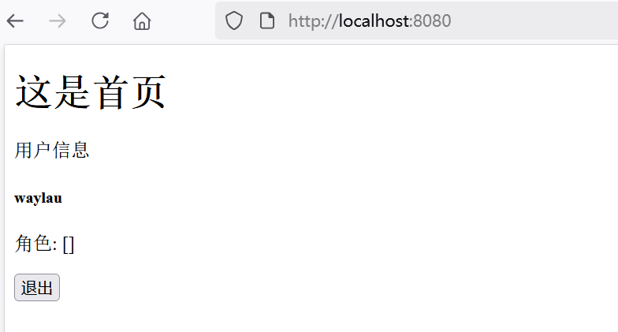
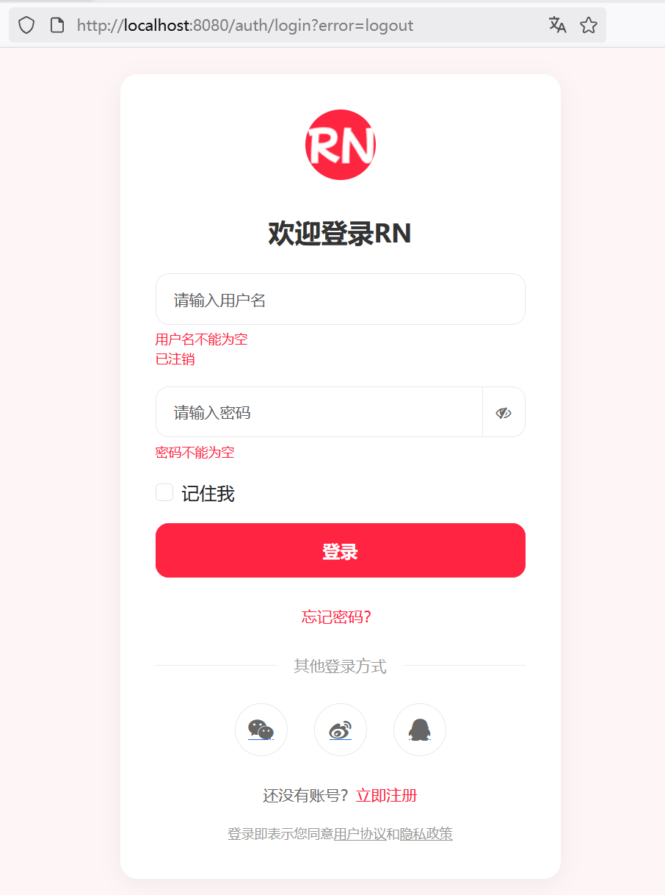

## 5.9 掌握退出登录的实现技巧

在Spring Security中，退出登录（Logout）功能可以通过配置`HttpSecurity`的`logout`方法来实现。以下是一个基于Spring Security 6.5的完整示例，展示如何配置退出登录功能。


### 配置`SecurityFilterChain`


修改SecurityConfig，增加退出登录相关配置：

```java
@Bean
public SecurityFilterChain filterChain(HttpSecurity http) throws Exception {
    http

          // ...为节约篇幅，此处省略非核心内容

          // 注销
            .logout(logout -> logout
                    // 清理会话
                    .invalidateHttpSession( true)
                    // 清理认证信息
                    .clearAuthentication(true)
                    // 用户访问此URL时，交由Spring Security处理注销逻辑
                    .logoutUrl("/logout")
                    // 注销成功后，重定向到指定URL
                    .logoutSuccessUrl("/auth/login?error=" + LOGOUT)
                    // 删除会话Cookie
                    .deleteCookies("JSESSIONID")

            )
        )

    return http.build();
}
```

关键配置说明：

- **`invalidateHttpSession(true)`**：清除会话。
- **`clearAuthentication("/logout")`**：清除认证信息。
- **`logoutUrl("/logout")`**：指定触发退出登录的URL。用户访问此URL时，Spring Security会自动处理退出逻辑。
- **`logoutSuccessUrl("/auth/login?error=logout")`**：退出成功后重定向的URL。通常用于显示退出成功的提示信息。
- **`deleteCookies("JSESSIONID")`**：删除客户端Cookie中的会话ID。`JSESSIONID`是Tomcat默认的会话Cookie名称，根据实际使用的服务器可能不同。


### 创建退出登录的链接

修改Index.html页面，添加一个退出登录的按钮：

```html
<!-- 注销 -->
<form action="/logout" th:action="@{/logout}" method="post">
    <button type="submit" class="btn btn-outline-success">退出</button>
</form>
```

### 处理退出成功后的页面

退出登录之后，被重定向到登录界面，需要做错误信息提示：

```java
@GetMapping("/login")
public String showLoginForm(Model model,
                            @RequestParam(required = false) String error,
                            @Valid @ModelAttribute("user") UserLoginDto loginDto,
                            BindingResult bindingResult) {
    // ...为节约篇幅，此处省略非核心内容

    // 检查用户是否已注销
    if (LoginErrorType.LOGOUT.equals(error)) {
        bindingResult.rejectValue("username", null, "已注销");
        return "login-form";
    }

    return "login-form";
}
```

在LoginErrorType中增加LOGOUT常量：


```java
public class LoginErrorType {
    // ...为节约篇幅，此处省略非核心内容

    public static final String LOGOUT = "logout";
}
```

### 完整流程

1. 用户访问受保护的资源（如`/`），需要登录。
2. 用户登录成功后，访问主页或其他受保护页面。
3. 用户点击退出登录链接（`/logout`）。
4. Spring Security处理退出逻辑：
   - 使会话无效。
   - 删除会话Cookie。
   - 重定向到`/auth/login?error=logout`页面。


登录之后访问首页，效果如下图5-14所示。





如下图5-15所示是退出登录后被重定向了到登录界面的效果。



